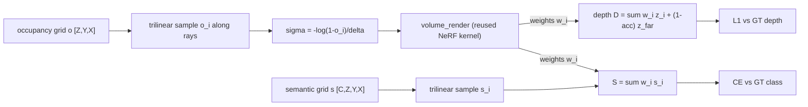

# A11.5d - 3D occupancy prediction

A semantic 3D occupancy predictor holds a voxel grid where each cell carries an occupancy
probability and a class. Supervising it is volume rendering run backward: rays cast into the grid
accumulate occupancy into a rendered depth and a rendered semantic vector, and 2-D supervision
(depth, class) pulls the 3-D field into agreement. This is how RenderOcc and OccNeRF train an
occupancy field without 3-D voxel labels, reusing the same alpha-compositing kernel from the NeRF
assignment.

Build the predictor and its rendering supervision: pillar extrusion that lifts a BEV feature map
to a voxel volume, the per-voxel classifier, the inverse-frequency class weighting and weighted
cross-entropy that counter the free-class imbalance, the occupied-class mIoU metric, and the
differentiable renderer that turns the occupancy grid into per-ray depth and semantics.

Required reading before starting:
- Pan et al. 2024, "RenderOcc: Vision-Centric 3D Occupancy Prediction with 2D Rendering
  Supervision", [arXiv:2309.09502](https://arxiv.org/abs/2309.09502).
- Tian et al. 2023, "Occ3D: A Large-Scale 3D Occupancy Prediction Benchmark for Autonomous
  Driving", [arXiv:2304.14365](https://arxiv.org/abs/2304.14365).

## Lecture notes

### Why occupancy

A self-driving stack needs to know which 3-D regions are occupied and by what, including
categories a 3-D object detector never enumerates: construction debris, an overturned cart, an
animal, the irregular overhang of a truck bed. A bounding-box detector answers "where are the
known object types"; occupancy answers "which volumes of space are filled", which is the question
a planner actually needs to avoid collisions. The output is a voxel grid where each cell carries an
occupancy state and, in the semantic variant, a class.

Two lines of work converged on this formulation. Monocular 3-D semantic scene completion
(MonoScene, Cao and de Charette 2021, [arXiv:2112.00726](https://arxiv.org/abs/2112.00726)) showed
a single image could be lifted to a dense semantic voxel volume by projecting 2-D features along
their lines of sight and completing the unseen geometry with a 3-D network. Multi-camera surround
occupancy (SurroundOcc, Wei et al. 2023, [arXiv:2303.09551](https://arxiv.org/abs/2303.09551))
extended this to the full camera rig and described how dense occupancy labels are produced: by
aggregating multi-frame lidar sweeps into a fused point cloud and voxelizing it, an imperfect and
expensive process. The Occ3D benchmark standardized this into a 200x200x16-voxel, 18-class task
over nuScenes and Waymo, and occupancy became a named subfield.

The label-availability constraint motivates the rendering-supervision path. Voxel labels are costly
to produce, and nuScenes-mini has none. RenderOcc and OccNeRF (Zhang et al. 2023,
[arXiv:2312.09243](https://arxiv.org/abs/2312.09243)) sidestep the missing 3-D labels: supervise
the voxel field with 2-D depth and 2-D semantic maps only, by rendering the field along camera rays
and comparing the rendered depth and semantics to the 2-D ground truth. No 3-D label is required,
only the per-pixel depth and class a camera already provides (or a foundation segmentation model
predicts).

### The NeRF and occupancy duality

The mechanism is volume rendering inverted. NeRF integrates a known density field along a ray to
produce a pixel; occupancy estimates the field by matching what that integration produces against
2-D observations. The discretized emission-absorption renderer from the NeRF assignment is reused
unchanged.

Recall the discretized volume rendering integral on $N$ samples along a ray with segment lengths
$\delta_i$. With density $\sigma_i$ at sample $i$, the segment opacity is

$$\alpha_i = 1 - e^{-\sigma_i \delta_i},$$

the transmittance up to sample $i$ is the exclusive product $T_i = \prod_{j<i}(1 - \alpha_j)$ (with
$T_0 = 1$), and the compositing weight is $w_i = T_i \alpha_i$. Transmittance is the fraction of
light that reaches sample $i$ without being absorbed earlier; opacity is the fraction absorbed in
one segment. A quantity $q_i$ defined per sample (color in NeRF, here depth or a class vector)
composites to $\sum_i w_i q_i$.

The segment opacity $\alpha_i = 1 - e^{-\sigma_i \delta_i}$ is the occupancy probability of that
segment. A solid voxel absorbs the ray ($\alpha \to 1$); empty space passes it ($\alpha \to 0$). So
an occupancy probability and a NeRF density are two encodings of the same quantity, related by
inverting the opacity equation. Given a sampled occupancy $o \in [0, 1)$, the density that
reproduces it over a segment of length $\delta$ is

$$\sigma = -\frac{\log(1 - o)}{\delta}, \qquad \text{so} \qquad 1 - e^{-\sigma \delta} = o.$$

Clamp $1 - o$ to a small floor before the log. With this bridge the NeRF kernel composites the
occupancy field unchanged: sample occupancy along each ray, convert to density, run the renderer
for the weights $w_i$, and accumulate.

Rendered depth is $D = \sum_i w_i z_i + (1 - \sum_i w_i)\, z_{\text{far}}$. The leftover term sends
miss rays (those that never accumulate opacity) to the far plane, matching the analytic ground
truth where a miss ray's depth is $z_{\text{far}}$. Rendered semantics are $S = \sum_i w_i s_i$,
where $s_i$ is the trilinearly sampled per-class logit vector at sample $i$; semantics composite
separately from the kernel's RGB-shaped color path.



#### Trilinear sampling and the axis order

The voxel grid is sampled with `grid_sample`, the trilinear-interpolation substrate. The grid is
fed as $[N, C, Z, Y, X]$, which `grid_sample` reads as $[N, C, D, H, W]$, so its depth axis $D$ is
the voxel $Z$, its height $H$ is $Y$, its width $W$ is $X$. The catch is that `grid_sample`'s
coordinate tensor orders the last dimension as $(g_x, g_y, g_z)$ mapping to the $(W, H, D) = (X, Y,
Z)$ axes, the reverse of the volume's axis order. Normalize each sample point's metric coordinate
to $[-1, 1]$ over its axis bounds and stack in the $(g_x, g_y, g_z)$ order:

$$g_x = 2\frac{p_x - x_0}{x_1 - x_0} - 1,\quad g_y = 2\frac{p_y - y_0}{y_1 - y_0} - 1,\quad g_z = 2\frac{p_z - z_0}{z_1 - z_0} - 1.$$

align_corners=False matches the voxel-center convention, where center $i$ of an $S$-cell axis over
$[a, b]$ sits at $a + (i + 0.5)(b - a)/S$. A wrong stack order silently transposes the field: with
$Z=8$ and $Y=X=32$ a $(g_z, g_y, g_x)$ stack still broadcasts to a valid-but-garbage sample, so the
depth loss would never converge for a reason that looks like a tuning problem.

### The voxel grid and the class-imbalance core

A voxel feature volume $[B, C, Z, Y, X]$ (channels first, $Z$ the depth/height axis) goes through a
per-voxel classifier (two 1x1x1 3-D convolutions with a ReLU between) to class logits $[B,
n_{\text{classes}}, Z, Y, X]$. Class 0 is free (unoccupied); classes 1 and up are occupied
categories.

Free voxels dominate. In a real Occ3D grid roughly 90-95% of voxels are free, and the rarest
occupied classes can be 10,000 times less frequent than the free class. An unweighted cross-entropy
minimizes by predicting free everywhere, scoring 95% voxel accuracy while detecting nothing. This is
the free-class collapse.

Inverse-frequency weighting counters it. Weight class $c$ by $1/(\text{count}_c + \varepsilon)$,
then normalize so the weights have mean 1 (equivalently, sum to $n_{\text{classes}}$). The free
class, the most frequent, gets the smallest weight; rare classes get the largest. The normalization
is scale-only and does not change the ordering. The class-weighted loss uses the weighted-mean
reduction

$$\mathcal{L} = \frac{\sum_v w_{t_v}\, \ell_v}{\sum_v w_{t_v}},$$

where $\ell_v$ is the per-voxel cross-entropy and $w_{t_v}$ is the weight of voxel $v$'s target
class. This matches a weighted `F.cross_entropy` exactly. The plain $\sum_v w_{t_v}\ell_v / N$
reduction differs by a factor $\sum w / N$ and would not match.

Inverse-frequency weighting is the simplest mitigation. Focal loss (down-weighting easy, confident
examples to focus gradient on hard ones) and the Lovasz-softmax loss (a differentiable surrogate
that directly optimizes IoU) are the standard stronger alternatives.

#### mIoU and why RayIoU replaced it

The occupancy metric is mean intersection-over-union over the occupied classes. For class $c$,
$\text{IoU}_c = |pred{=}c \cap target{=}c| / |pred{=}c \cup target{=}c|$, and the mean is taken over
occupied classes only; the free class is excluded so the metric is not dominated by the free
voxels. A class absent from both prediction and target (an empty union) is excluded from the mean,
the standard mIoU convention.

Voxel-level mIoU has a flaw the field later corrected. It penalizes the exact depth at which an
occupied surface sits along a ray: a prediction one voxel too near or too far along the line of
sight scores zero IoU on those voxels even though the rendered depth is almost right, and the
penalty depends on the voxel discretization. The fully-sparse occupancy predictor SparseOcc (Liu et
al. 2023, [arXiv:2312.17118](https://arxiv.org/abs/2312.17118)) introduced RayIoU to fix this: it
evaluates along query rays (the same rays a renderer casts) and scores whether the first occupied
hit lands within a depth tolerance, removing the depth-axis inconsistency of voxel mIoU. Occupied-
class mIoU is the simpler dense metric, but RayIoU is the 2026 evaluation standard.

### Lifting BEV features to voxels

The voxel features come from a bird's-eye-view feature map (from Lift-Splat-Shoot's
depth-distribution splatting or BEVFormer's query-pull attention), a $[B, C, Y, X]$ tensor that has
collapsed the height axis. Pillar extrusion restores it: a 1x1 convolution $\text{Conv2d}(C, C
n_z, 1)$ makes each BEV cell predict a per-height feature distribution, then a reshape from $[B, C
n_z, Y, X]$ to $[B, C, n_z, Y, X]$ spreads it over $Z$. The convolution learns how to distribute a
BEV cell's feature over height; it is a learnable height distribution, not a bare repeat of the same
vector at every height.

Flat BEV throws away height structure, which is the limitation the tri-perspective view addresses.
TPVFormer (Huang et al. 2023, [arXiv:2302.07817](https://arxiv.org/abs/2302.07817)) keeps the BEV
plane plus two perpendicular planes (front and side), so a 3-D point queries all three and recovers
the height information a single BEV plane cannot represent.

### Where this goes

Production occupancy in 2026 is sparse: SparseOcc and its successors discard the more than 90% of
voxels that are empty and run convolution and attention only on the occupied set, which is the only
way the full-resolution grid fits and runs in real time. The dense voxel grid plus NeRF-density
renderer here is the foundational mechanism the sparse methods optimize away, not the current state
of the art. Two further directions: Gaussian occupancy (GaussianOcc, 2025) swaps the NeRF density
renderer for 3-D Gaussian splatting, representing occupancy as a set of anisotropic Gaussians
rendered by the splatting rasterizer instead of a dense voxel field; and 4-D occupancy world models
(Drive-OccWorld) predict future occupancy volumes, turning the static grid into a forecasting
target.

## The assignment

Fill these holes, in order. Each is one `NotImplementedError` with a matching test; the docstring in each file gives the signature, shapes, and constraints.

1. [`bev_to_voxel()`](occupancy.py) in `occupancy.py`
2. [`OccupancyHead.forward()`](occupancy.py) in `occupancy.py`
3. [`inverse_frequency_weights()`](occupancy.py) in `occupancy.py`
4. [`weighted_ce_loss()`](occupancy.py) in `occupancy.py`
5. [`occupancy_iou()`](occupancy.py) in `occupancy.py`
6. [`render_occupancy_rays()`](occupancy.py) in `occupancy.py`

### Running and validating

Activate the environment (`conda activate nanovision`), then:

```
make test     A=a11_5d_occupancy   # run the tests against the top-level files (the holes)
make verify   A=a11_5d_occupancy   # run the same tests against the reference solution/
make viz      A=a11_5d_occupancy   # render the figures from the reference solution
make viz-mine A=a11_5d_occupancy   # render the figures from your own code (holes filled)
```

`make test` runs the suite in `assignments/a11_5d_occupancy/tests/` against the top-level
`occupancy.py`, red until the holes are filled and green once correct. `make verify` runs the
identical suite against the reference `solution/` by setting `NANOVISION_IMPL=solution`, so it is
green from the start and shows the target. Run the tests in this order:
`test_bev_to_voxel`, `test_occupancy_head`, `test_loss`, `test_render_supervision`,
`test_forbidden_imports`.

What you should see when you run this. The grid is deliberately tiny: $Z=8$, $Y=32$, $X=32$,
$n_{\text{classes}}=4$ (free plus 3 occupied), about 8,000 voxels. `test_loss` measures the
free-class collapse: a single linear `Conv3d(C, n_classes, 1)` classifier (no deep head, so it
cannot memorize the labels) is trained from a shared init, once unweighted and once with
inverse-frequency weighting, and scored by occupied-class recall rather than IoU. With a linear
classifier, weighting trades precision for recall (it over-predicts the rare classes, inflating the
IoU union), so recall isolates the teaching point, that the rare class is detected at all. The
measured unweighted recall is about 0.19 and weighted recall about 0.76, a gap of about 0.57.
`test_render_supervision` overfits the rendering path to a mean depth error around 0.22 m (under the
0.3 m threshold) with per-ray semantic accuracy 1.0 on hit rays.

`make viz` writes the occupancy slices and the rendered depth to `out/`. The per-voxel occupancy on
hit rays stays around 0.15-0.30 rather than saturating above 0.5: depth-only supervision drives the
renderer to a diffuse low-opacity cloud whose compositing-weight centroid lands at the correct
depth, so the field never needs a hard surface to reach the right depth. The accumulated ray opacity
still separates hit rays (around 0.97) from miss rays (around 0.02) cleanly, and the test checks
that opacity as the occupancy signal.

These are toy artifacts on an 8,000-voxel grid; a real Occ3D grid is 200x200x16 over 18 classes,
roughly 46 MB of labels per sample as a dense array. The dense grid here isolates the mechanism and
says nothing about production accuracy, which uses a sparse layout, a denser sample budget,
multi-view consistency, and a TV or entropy regularizer to sharpen the surface.

## Further reading

- Cao and de Charette 2021, MonoScene, [arXiv:2112.00726](https://arxiv.org/abs/2112.00726), the
  single-image lift to a dense semantic voxel volume.
- Huang et al. 2023, TPVFormer, [arXiv:2302.07817](https://arxiv.org/abs/2302.07817), the BEV plane
  plus two perpendicular planes to recover height.
- Wei et al. 2023, SurroundOcc, [arXiv:2303.09551](https://arxiv.org/abs/2303.09551), multi-camera
  surround occupancy and how dense labels are derived from fused lidar.
- Tian et al. 2023, Occ3D, [arXiv:2304.14365](https://arxiv.org/abs/2304.14365), the standardized
  voxel-occupancy benchmark.
- Pan et al. 2024, RenderOcc, [arXiv:2309.09502](https://arxiv.org/abs/2309.09502), 2-D rendering
  supervision of a 3-D voxel field.
- Zhang et al. 2023, OccNeRF, [arXiv:2312.09243](https://arxiv.org/abs/2312.09243), NeRF-style
  rendering supervision without lidar labels.
- Liu et al. 2023, SparseOcc, [arXiv:2312.17118](https://arxiv.org/abs/2312.17118), fully sparse
  occupancy and the RayIoU metric.
