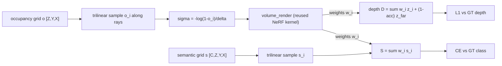

# 3D occupancy prediction

You build a semantic 3D occupancy predictor and supervise it the way RenderOcc and OccNeRF do:
by rendering the voxel grid back to 2D with the same alpha-compositing kernel from the NeRF
assignment, run backward. The grid holds a per-voxel occupancy probability and per-voxel class
logits; rays cast into it accumulate occupancy into a rendered depth and a rendered semantic
vector; the 2D supervision (depth, class) pulls the 3D field into agreement.

## Motivation

A self-driving stack needs to know which 3D regions are occupied and by what, including
categories a 3D object detector never enumerates: construction debris, an overturned cart, an
animal, the irregular overhang of a truck bed. A bounding-box detector answers "where are the
known object types"; occupancy answers "which volumes of space are filled", which is the question
a planner actually needs to avoid collisions. The output is a voxel grid where each cell carries
an occupancy state and, in the semantic variant, a class.

Two lines of work converged on this formulation. Monocular 3D semantic scene completion
(MonoScene, [arXiv 2112.00726](https://arxiv.org/abs/2112.00726)) showed a single image could be
lifted to a dense semantic voxel volume by projecting 2D features along their lines of sight and
completing the unseen geometry with a 3D network. Multi-camera surround occupancy
(SurroundOcc, [arXiv 2303.09551](https://arxiv.org/abs/2303.09551)) extended this to the full
camera rig and described how dense occupancy labels are produced at all: by
aggregating multi-frame LiDAR sweeps into a fused point cloud and voxelizing it, an imperfect and
expensive process. The Occ3D benchmark
([arXiv 2304.14365](https://arxiv.org/abs/2304.14365)) standardized this into a
200x200x16-voxel, 18-class task over nuScenes and Waymo, and occupancy became a named subfield.

The label-availability constraint motivates the rendering-supervision path. nuScenes-mini has no
Occ3D voxel labels (Occ3D targets the full nuScenes and Waymo splits, not the mini subset), and
voxel labels are costly to produce anywhere. RenderOcc
([arXiv 2309.09502](https://arxiv.org/abs/2309.09502), ICRA 2024) and OccNeRF
([arXiv 2312.09243](https://arxiv.org/abs/2312.09243)) sidestep the missing 3D labels: supervise
the voxel field with 2D depth and 2D semantic maps only, by rendering the field along camera rays
and comparing the rendered depth/semantics to the 2D ground truth. No 3D label is required, only
the per-pixel depth and class a camera already provides (or a foundation segmentation model
predicts). This is the path the toy here takes, with synthetic boxes whose analytic ray-box
depths stand in for the 2D supervision.

## The NeRF and occupancy duality

The mechanism is volume rendering inverted. NeRF integrates a known density field along a ray to
produce a pixel; occupancy estimates the field by matching what that integration produces against
2D observations. The discretized emission-absorption renderer from the NeRF assignment is reused
verbatim.

Recall the discretized volume rendering integral on $N$ samples along a ray with segment lengths
$\delta_i$. With density $\sigma_i$ at sample $i$, the segment opacity is

$$\alpha_i = 1 - e^{-\sigma_i \delta_i},$$

the transmittance up to sample $i$ is the exclusive product $T_i = \prod_{j<i}(1 - \alpha_j)$
(with $T_0 = 1$), and the compositing weight is $w_i = T_i \alpha_i$. Transmittance is the
fraction of light that reaches sample $i$ without being absorbed earlier; opacity is the fraction
absorbed in one segment. A quantity $q_i$ defined per sample (color in NeRF, here depth or a class
vector) composites to $\sum_i w_i q_i$.

The segment opacity $\alpha_i = 1 - e^{-\sigma_i \delta_i}$ is the occupancy probability of that
segment. A solid voxel absorbs the ray ($\alpha \to 1$); empty space passes it ($\alpha \to 0$).
So an occupancy probability and a NeRF density are two encodings of the same quantity, related by
inverting the opacity equation. Given a sampled occupancy $o \in [0, 1)$, the density that
reproduces it over a segment of length $\delta$ is

$$\sigma = -\frac{\log(1 - o)}{\delta}, \qquad \text{so} \qquad 1 - e^{-\sigma \delta} = o.$$

Clamp $1 - o$ to a floor (`1e-6`) before the log. With this bridge the NeRF kernel composites the
occupancy field unchanged. `render_occupancy_rays` samples occupancy along each ray, converts to
density, calls the reused `volume_render` for the weights $w_i$, and accumulates:

- Rendered depth $D = \sum_i w_i z_i + (1 - \sum_i w_i)\, z_{\text{far}}$. The leftover term sends
  miss rays (those that never accumulate opacity) to the far plane, matching the analytic GT where
  a miss ray's depth is $z_{\text{far}}$.
- Rendered semantics $S = \sum_i w_i s_i$, where $s_i$ is the trilinearly sampled per-class logit
  vector at sample $i$. Semantics composite separately from the kernel's color path, which is
  RGB-shaped; the color argument to `volume_render` is a zeros dummy and only its weights are used.

### Trilinear sampling and the axis order

The voxel grid is sampled with `F.grid_sample`, the trilinear-interpolation substrate. The grid is
fed as `[N, C, Z, Y, X]`, which `grid_sample` reads as `[N, C, D, H, W]`, so its depth axis D is
the voxel Z, its height H is Y, its width W is X. The catch is that `grid_sample`'s coordinate
tensor orders the last dimension as $(g_x, g_y, g_z)$ mapping to the $(W, H, D) = (X, Y, Z)$ axes,
the reverse of the volume's axis order. Normalize each sample point's metric coordinate to
$[-1, 1]$ over its axis bounds and stack in the $(g_x, g_y, g_z)$ order:

$$g_x = 2\frac{p_x - x_0}{x_1 - x_0} - 1,\quad g_y = 2\frac{p_y - y_0}{y_1 - y_0} - 1,\quad g_z = 2\frac{p_z - z_0}{z_1 - z_0} - 1.$$

`align_corners=False` matches the voxel-center convention (`config.voxel_centers`), where center
$i$ of an $S$-cell axis over $[a, b]$ sits at $a + (i + 0.5)(b - a)/S$. A wrong stack order
silently transposes the field: with $Z=8$ and $Y=X=32$ a $(g_z, g_y, g_x)$ stack still broadcasts
to a valid-but-garbage sample, so the depth loss would never converge for a reason that looks like
a tuning problem. Pin the order.

## The voxel grid and the class-imbalance core

A voxel feature volume `[B, C, Z, Y, X]` (channels first, Z the depth/height axis) goes through a
per-voxel classifier (`OccupancyHead`, two 1x1x1 3D convolutions with a ReLU between) to class
logits `[B, n_classes, Z, Y, X]`. Class 0 is free (unoccupied); classes 1 and up are occupied
categories.

Free voxels dominate. In a real Occ3D grid roughly 90-95% of voxels are free, and the rarest
occupied classes can be ~10,000 times less frequent than the free class. An unweighted
cross-entropy minimizes by predicting free everywhere, scoring ~95% voxel accuracy while detecting
nothing. This is the free-class collapse.

Inverse-frequency weighting counters it. Weight class $c$ by $1/(\text{count}_c + \varepsilon)$,
then normalize so the weights have mean 1 (equivalently, sum to `n_classes`). The free class, the
most frequent, gets the smallest weight; rare classes get the largest. The normalization is
scale-only and does not change the ordering. The class-weighted loss uses the weighted-mean
reduction

$$\mathcal{L} = \frac{\sum_v w_{t_v}\, \ell_v}{\sum_v w_{t_v}},$$

where $\ell_v$ is the per-voxel cross-entropy and $w_{t_v}$ is the weight of voxel $v$'s target
class. This matches `F.cross_entropy(logits, target, weight=weights)` exactly. The plain
$\sum_v w_{t_v}\ell_v / N$ reduction differs by a factor $\sum w / N$ and would not match;
`test_loss.py` asserts exact equality against `F.cross_entropy`, so the reduction must be the
weighted mean.

Inverse-frequency weighting is the simplest mitigation. Focal loss (down-weighting easy, confident
examples to focus gradient on hard ones) and the Lovasz-softmax loss (a differentiable surrogate
that directly optimizes IoU) are the standard stronger alternatives; both are named here, not
built.

`test_loss.py` measures the collapse. A single linear `Conv3d(C, n_classes, 1)` classifier (no
deep head, so capacity cannot memorize the labels) is trained for a short budget from a shared
init, once with unweighted cross-entropy and once with inverse-frequency-weighted cross-entropy.
The contrast is measured by occupied-class recall, not IoU. With a linear classifier, weighting
trades precision for recall: it over-predicts the rare classes, so its false-positive count
inflates the IoU union and the occupied IoU can sit below the unweighted run even though the rare
classes are now detected. Recall isolates the teaching point, that the rare class is detected at
all. Measured, unweighted recall is ~0.19 and weighted recall ~0.76, a gap of ~0.57.

### mIoU and why RayIoU replaced it

The occupancy metric is mean intersection-over-union over the occupied classes. For class $c$,
$\text{IoU}_c = |pred{=}c \cap target{=}c| / |pred{=}c \cup target{=}c|$, and the mean is taken
over occupied classes only; the free class is excluded so the metric is not dominated by the
~95% free voxels. A class absent from both prediction and target (an empty union) is excluded from
the mean, the standard mIoU convention.

Voxel-level mIoU has a flaw the field later corrected. It penalizes the exact depth at which an
occupied surface sits along a ray: a prediction one voxel too near or too far along the line of
sight scores zero IoU on those voxels even though the rendered depth is almost right, and the
penalty is inconsistent because it depends on voxel discretization. The fully-sparse occupancy
predictor SparseOcc ([arXiv 2312.17118](https://arxiv.org/abs/2312.17118), ECCV 2024) introduced
RayIoU to fix this: it evaluates along query rays (the same rays a renderer casts) and scores
whether the first occupied hit lands within a depth tolerance, removing the depth-axis
inconsistency of voxel mIoU. The toy uses occupied-class mIoU because it is the simpler dense
metric, but RayIoU is the 2026 evaluation standard.

## Lifting BEV features to voxels

Where do the voxel features come from? A bird's-eye-view feature map (from lift-splat-shoot's
depth-distribution splatting or BEVFormer's query-pull attention) is a `[B, C, Y, X]` tensor that
has collapsed the height axis. Pillar extrusion restores it: `bev_to_voxel` applies a provided
`Conv2d(C, C * n_z, 1)` so each BEV cell predicts a per-height feature distribution, then reshapes
`[B, C*n_z, Y, X]` to `[B, C, n_z, Y, X]`. The convolution learns how to spread a BEV cell's
feature over Z; it is a learnable height distribution, not a bare repeat of the same vector at
every height. Tests feed random BEV features, so this is the documented connector to the BEV
assignments, not a code dependency on them.

Flat BEV throws away height structure, which is the limitation the tri-perspective view addresses.
TPVFormer ([arXiv 2302.07817](https://arxiv.org/abs/2302.07817)) keeps the BEV plane plus two
perpendicular planes (front and side), so a 3D point queries all three and recovers the height
information a single BEV plane cannot represent. It is described here, not built.

## Reach and limits of the toy

The grid is deliberately tiny: $Z=8$, $Y=32$, $X=32$, `n_classes=4` (free plus 3 occupied),
about 8,000 voxels. A real Occ3D grid is 200x200x16 over 18 classes, roughly 46 MB of labels per
sample as a dense array, two orders of magnitude past memory comfort once batched. The dense grid
here is the mechanism isolator, not the production layout.

A toy this size does not override what scale established. Production occupancy in 2026 is sparse:
SparseOcc and its successors discard the >90% of voxels that are empty and run convolution and
attention only on the occupied set, which is the only way the full-resolution grid fits and runs
in real time. The dense voxel grid plus NeRF-density renderer built here is the foundational
mechanism the sparse methods optimize away, not the current state of the art. Two further
directions: Gaussian occupancy (GaussianOcc, 2025) swaps the NeRF density renderer for 3D Gaussian
splatting, representing occupancy as a set of anisotropic Gaussians rendered by the splatting
rasterizer instead of a dense voxel field; and 4D occupancy world models (Drive-OccWorld) predict
future occupancy volumes, turning the static grid into a forecasting target.

The toy's measured numbers reflect the tiny scale. The rendering-supervision overfit reaches a
mean depth error around 0.22 m (under the 0.3 m threshold), with per-ray semantic accuracy of 1.0
on hit rays. The per-voxel occupancy on hit rays stays around 0.15-0.30 rather than saturating
above 0.5: depth-only supervision drives the renderer to a diffuse low-opacity cloud whose
compositing-weight centroid lands at the correct depth, so the field never needs a hard surface to
reach the right depth. The rendering integral expresses the accumulated ray opacity directly; it
separates hit rays (~0.97) from miss rays (~0.02) cleanly, and the test checks that opacity as the
occupancy signal. A real system uses a denser sample budget, multi-view
consistency, and a TV or entropy regularizer to sharpen the surface.

## What you implement

Six holes in `occupancy.py`:

- `bev_to_voxel` - pillar extrusion: the provided 1x1 conv to `C*n_z` channels, reshaped to
  `[B, C, n_z, Y, X]`.
- `OccupancyHead.forward` - the two-conv per-voxel classifier to `[B, n_classes, Z, Y, X]` logits.
- `inverse_frequency_weights` - per-class weights $\propto 1/(\text{count} + \varepsilon)$,
  normalized to mean 1.
- `weighted_ce_loss` - class-weighted cross-entropy with the weighted-mean reduction that matches
  `F.cross_entropy(weight=)`.
- `occupancy_iou` - mean occupied-class IoU, free excluded, empty-union classes excluded.
- `render_occupancy_rays` - trilinear sampling with the pinned axis order, the density bridge, the
  reused `volume_render` for the weights, and the depth/semantics accumulation with the
  leftover-transmittance depth term.

The alpha compositing comes from `nanovision.volume.volume_render` (the NeRF kernel), not a
re-implementation; the forbidden-imports scan rejects a hand-rolled `cumprod`/`cumsum` of
$(1 - \alpha)$ inside `occupancy.py`. `F.grid_sample` and `F.affine_grid` are allowed.

Run the tests in this order: `test_bev_to_voxel.py`, `test_occupancy_head.py`, `test_loss.py`,
`test_render_supervision.py`, `test_forbidden_imports.py`.

## References

- MonoScene: Monocular 3D Semantic Scene Completion, [arXiv 2112.00726](https://arxiv.org/abs/2112.00726). Single-image lift to a dense semantic voxel volume.
- TPVFormer: Tri-Perspective View for Vision-Based 3D Semantic Occupancy Prediction, [arXiv 2302.07817](https://arxiv.org/abs/2302.07817). BEV plus two perpendicular planes to recover height.
- SurroundOcc: Multi-Camera 3D Occupancy Prediction for Autonomous Driving, [arXiv 2303.09551](https://arxiv.org/abs/2303.09551). Multi-camera surround occupancy and how dense labels are derived from fused LiDAR.
- Occ3D: A Large-Scale 3D Occupancy Prediction Benchmark for Autonomous Driving, [arXiv 2304.14365](https://arxiv.org/abs/2304.14365). The standardized voxel-occupancy benchmark.
- RenderOcc: Vision-Centric 3D Occupancy Prediction with 2D Rendering Supervision, [arXiv 2309.09502](https://arxiv.org/abs/2309.09502). Supervise a 3D voxel field with 2D depth and semantics only.
- OccNeRF: Advancing 3D Occupancy Prediction in LiDAR-Free Environments, [arXiv 2312.09243](https://arxiv.org/abs/2312.09243). NeRF-style rendering supervision without LiDAR labels.
- SparseOcc: Fully Sparse 3D Occupancy Prediction, [arXiv 2312.17118](https://arxiv.org/abs/2312.17118). Fully sparse occupancy and the RayIoU metric.
