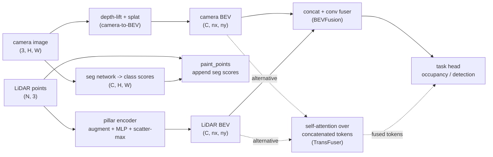

# A11.5f - Multi-modal sensor fusion (LiDAR + camera)

A camera image and a LiDAR point cloud carry complementary information, and a driving perception
stack wants both. This assignment builds the three places the two modalities meet: PointPainting,
which decorates each LiDAR point with the image class score at its pixel; a PointPillars-lite LiDAR
encoder that turns the cloud into a bird's-eye-view (BEV) feature map, where BEV is the ego-centric
top-down grid the stack plans in; and the BEVFusion core, which channel-concatenates the camera and
LiDAR BEV maps on one grid and mixes them with a small convolution. A fourth hole builds the
TransFuser attention block, self-attention over the two token sets concatenated, as a contrast to
the fixed concat.

Build those four pieces: the point-painting projection, the pillar encoder with its scatter-max
pool, the concat-and-conv fuser, and the attention fuser. The camera branch reuses the
depth-lift-and-splat camera-to-BEV path and the shared BEV grid taught earlier, and the projection
reuses the camera rig and pinhole primitives.

Required reading before starting:
- Vora, Lang, Helou, Beijbom 2020, "PointPainting: Sequential Fusion for 3D Object Detection",
  [arXiv:1911.10150](https://arxiv.org/abs/1911.10150) (point-level fusion).
- Lang et al. 2019, "PointPillars: Fast Encoders for Object Detection from Point Clouds",
  [arXiv:1812.05784](https://arxiv.org/abs/1812.05784) (the LiDAR BEV branch).
- Liu et al. 2022, "BEVFusion: Multi-Task Multi-Sensor Fusion with Unified Bird's-Eye View
  Representation", [arXiv:2205.13542](https://arxiv.org/abs/2205.13542) (the feature-level fuser
  built here).
- Prakash, Chitta, Geiger 2021, "Multi-Modal Fusion Transformer for End-to-End Autonomous Driving",
  [arXiv:2104.09224](https://arxiv.org/abs/2104.09224) (the attention fuser).

## Lecture notes

### Where the two modalities meet

A camera image is dense and semantic. Every pixel has a color, and a segmentation network reads a
class and appearance off it, so the image says what an object is. The image does not carry metric
depth: a single pixel is a ray, and the distance along it is unknown from one frame.

A LiDAR point cloud is the opposite. Each return is a metric 3-D point, accurate to a few
centimeters, so the cloud says exactly where surfaces are. It does not carry class: a point
is a coordinate with at most a reflectance value, and a car surface and a wall surface return the
same kind of point. The cloud is also sparse. Range measurements thin out with distance, so a far
object is a handful of points.

Autonomous-driving perception fuses the two so the result has both metric geometry and class. The
question the assignment is organized around is where in the pipeline the fusion happens, because
that choice sets what each modality can still fix about the other. Three answers, in order of how
early they meet:

- Point level (early). Decorate the raw LiDAR points with image information before any LiDAR
  network runs. This is PointPainting.
- Feature level (mid). Run a camera branch and a LiDAR branch separately, each to a BEV feature
  map, then combine the two maps. This is BEVFusion.
- Attention level (mid, learned). Same two branches, but combine their features with a transformer
  attention block that mixes tokens across modalities. This is TransFuser.

### PointPainting: point-level fusion

PointPainting is the earliest meeting point. Run an image semantic-segmentation network to get a
per-pixel vector of class scores, project each LiDAR point into the image, and append the class
scores at that pixel to the point. A point that was $[x, y, z]$ (or $[x, y, z, r]$ with reflectance
$r$) becomes $[x, y, z, s_1, \dots, s_C]$ for $C$ classes. The decorated cloud then feeds any
LiDAR detector unchanged.

The projection is the lidar-to-camera-to-image chain from the camera rig: transform the ego-frame
point into the camera frame with the extrinsic, then apply the pinhole intrinsics to get a pixel
$(u, v)$. A point behind the camera (camera-frame $z \le 0$) or landing outside the image gets the
zero vector, the background class, rather than a wrapped-around or clamped pixel.

Two design points matter. First, append the soft score vector, not the hard argmax label. The score
keeps the segmentation network's uncertainty, so a point on an ambiguous boundary carries a spread
of class evidence the detector can weigh, and gradients (in an end-to-end variant) have somewhere to
go. Second, the design is sequential: the segmentation network runs, then the detector runs on its
output. That makes it simple to attach to an existing detector, and it caps the fusion at the
quality of the 2-D segmentation, since a point painted with a wrong class is decorated with wrong
evidence.

In a real multi-camera rig a point is painted by the one camera whose field of view it falls into,
so the rig picks a camera per point. This toy is single-camera, so every in-front, in-image point is
painted from the same image and the rest get background.

### The LiDAR branch: PointPillars-lite

The LiDAR branch turns the raw cloud into a BEV feature map so it lands on the same grid the camera
branch uses. PointPillars does this without any 3-D convolution. Group the points into pillars,
which are BEV grid cells extruded infinitely in $z$, so every point falls in exactly one pillar by
its $(x, y)$.

Each point is augmented from its raw coordinates to nine features
$[x, y, z, x_c, y_c, z_c, x_p, y_p, r]$. Here $(x_c, y_c, z_c)$ is the point minus the mean of all
points in its pillar, the offset from the pillar's point cluster center, and $(x_p, y_p)$ is the
offset from the point to the geometric center of its pillar cell. The cluster offset tells the
network how the point sits relative to the local surface, and the cell offset tells it where the
point sits inside the cell. A per-point MLP maps the nine features to $C$ channels, and then a
per-pillar pool over the points in each pillar gives one $C$-vector per pillar, scattered into the
BEV grid.

The pool is a max over the points in the pillar, not a sum, and the reason is the fusion lesson
below. A sum grows with the number of points in the pillar, so a pillar with more returns produces a
larger-magnitude feature. A LiDAR-only head could then read object class off point density, since a
solid vehicle surface returns more points than empty space, and it would learn to call any dense
pillar a vehicle. Max pooling takes the strongest response per channel regardless of point count, so
the pooled feature does not encode how many points were present, and that density shortcut is
closed. That forces the toy's LiDAR branch to rely on real geometry, and it lets the toy below be
built so that density alone does not separate a vehicle from clutter.

### BEVFusion: feature-level fusion

BEVFusion is the core built here. Both branches produce a feature map on the same BEV grid: the
camera branch through the depth-lift-and-splat camera-to-BEV path, which predicts a per-pixel depth
distribution, pushes each pixel feature out into 3-D along it, and splats the result into BEV
pillars; the LiDAR branch through the pillar encoder above. Fuse them by concatenating the two maps
along the channel axis and running a small convolutional encoder over the stack.

The convolution mixes the two sources per cell, so the fused feature at a BEV cell carries LiDAR
geometry, whether the cell is occupied and at what range, together with camera semantics, which
class occupies it. That unified BEV feature is task-agnostic: it feeds a detection head, a
segmentation head, or a map head without changing the fusion.

State the paper's contribution accurately, because "fusion is a concatenation" undersells it. The hard
part was not the concat. It was the camera-to-BEV view transform, whose pooling step was the latency
bottleneck of the whole model. BEVFusion precomputes the frustum-to-BEV index mapping and reduces
each BEV interval in one pass, which made that pooling roughly 40x faster and made running a full
camera branch alongside the LiDAR branch practical. The concat-and-conv fuser is deliberately
simple; the engineering that mattered made the camera branch cheap enough to fuse at all.

The near-simultaneous Liang et al. 2022 paper, also titled "BEVFusion"
([arXiv:2205.13790](https://arxiv.org/abs/2205.13790)), reached a similar unified-BEV design
independently. The MIT version (Liu et al., [arXiv:2205.13542](https://arxiv.org/abs/2205.13542)) is
the one built here.



### TransFuser: attention fusion

TransFuser is the contrast. It was built for end-to-end driving in the CARLA simulator, where a
single network reads sensors and outputs the route, but the fusion block is the part that matters
here. The
image goes through a convolutional stem, and the LiDAR is rasterized into a BEV pseudo-image, a
2-bin height histogram of the point cloud (one channel for points below a height threshold, one
above), which also goes through a conv stem. At several resolution stages of the two stems, the
feature maps are flattened into tokens, where a token is one spatial location's feature vector, and
the image tokens and LiDAR tokens are concatenated into one set. A single transformer
self-attention block runs over the union, so every image token can attend to every LiDAR token and
the reverse. The tokens are then split back into the two streams and residual-added, and the stems
continue.

The mechanism is self-attention over the concatenated token set, not query/key-value
cross-attention between two fixed roles. Every token is a query, a key, and a value in the same
block, and the modality split only decides how the outputs are routed back. The PAMI extension
([arXiv:2205.15997](https://arxiv.org/abs/2205.15997)) carries the same fusion block into a larger
driving model.

This assignment isolates that block and drops the rest of the driving pipeline, in particular the
auto-regressive waypoint decoder that turns fused features into a route. The build is the
concatenate-attend-split-residual step alone. The contrast with BEVFusion is the point of building
both: BEVFusion combines the two maps with a fixed channel concatenation, so the mixing pattern is
whatever the following convolution learns over adjacent channels, while TransFuser learns an
all-to-all token mixing where any location in one modality can pull from any location in the other.

### The measured lesson

The toy is built so that neither modality alone recovers vehicle occupancy, which forces the fused
head to actually use both. The camera BEV feature localizes a vehicle only to its lateral column: a
camera pixel is a BEV ray of unknown range, so the depth ambiguity smears the vehicle along the
forward axis and the camera can say which column holds a vehicle but not how far down it. The LiDAR
feature cannot separate a vehicle blob from a clutter blob, because the toy gives them matched
geometry and matched point density, so even scatter-max, which ignores raw density, sees two blobs
that look the same. Only the camera's class score tells the two apart.

A camera-only head, a LiDAR-only head, and a fused head are trained on 12 toy scenes and evaluated
on 8 held-out scenes, scored by mean vehicle-occupancy IoU (intersection over union of predicted and
true occupied cells). Measured across 8 parameter initializations:

| head | held-out IoU (seed 0) | across 8 inits |
|------|-----------------------|----------------|
| camera-only | 0.169 | 0.17 - 0.18 |
| LiDAR-only | 0.349 | 0.26 - 0.38 |
| fused | 0.500 | 0.49 - 0.72 |

The fused head beat both single-modality heads on every one of the 8 initializations, by at least
+0.31 IoU over camera-only and at least +0.15 over LiDAR-only. The camera head is pinned low by the
depth ambiguity it cannot resolve, and the LiDAR head is pinned by the vehicle-versus-clutter
confusion it cannot resolve; the fused head clears both because the camera's class score fills the
LiDAR's class gap and the LiDAR's geometry fills the camera's depth gap.

This toy deliberately amplifies each modality's failure mode so a small model on
a handful of scenes shows the effect cleanly. At real scale, diverse data softens both failures: a
camera detector recovers usable depth from context and object size, and a LiDAR detector separates
many objects on geometry alone. The gap between single and fused is smaller and messier there than
this table. The reason fusion helps carries over, not these IoU values. Camera semantics
fill LiDAR's class ambiguity and LiDAR geometry fills the camera's depth holes, and that is the
literature-backed motivation the toy is built to make visible, not an artifact of the toy.

### Connections

The camera branch here reuses the depth-lift-and-splat camera-to-BEV path and the shared BEV grid,
so the fused map lands on the same grid the camera-only and LiDAR-only branches use. The
attention-based camera-to-BEV transform, BEVFormer's BEV queries pulling from projected image
features, is the query-pull alternative to lift-splat's depth-push for that same branch. The
point-painting projection uses the camera rig and the pinhole and SE(3) primitives, the same
projection chain the camera-to-BEV transforms use. The TransFuser block is the transformer
self-attention taught earlier, applied to a concatenated set of image and LiDAR tokens instead of a
single sequence.

Forward, the LiDAR geometry the pillar branch relies on is the same geometry that point-cloud
registration works with: aligning two clouds by iterative closest point (ICP) in the classical-SLAM
module operates on the raw metric points this branch pools into pillars.

## The assignment

Fill these holes, in order. Each is one `NotImplementedError` with a matching test; the docstring
in each file gives the signature, shapes, and constraints.

1. [`paint_points()`](fusion.py) in `fusion.py` - PointPainting: project each ego point into the
   camera, drop behind-camera (camera-frame z <= 0) and out-of-image points, gather the C-dim seg
   score at the pixel, and concatenate it as `[x, y, z, s_1..s_C]`.
2. [`LidarPillarEncoder.forward()`](fusion.py) in `fusion.py` - augment each point to nine
   features `[x, y, z, xc, yc, zc, xp, yp, r]`, run the per-point MLP, then scatter-MAX (not a
   sum) into each BEV pillar.
3. [`BEVFuser.forward()`](fusion.py) in `fusion.py` - channel-concatenate the camera and LiDAR BEV
   maps and run the conv fuser.
4. [`TransFuserBlock.forward()`](transfuser.py) in `transfuser.py` - concatenate the camera and
   LiDAR token sets, run one self-attention block over the union, split back, and residual-add to
   each stream.

`fusion.py` and `transfuser.py` are assignment-local (imported by bare name). They reuse
`pillar_index` and `cumsum_pool` from A11.5b via `nanovision.lift_splat`, the pinhole/SE(3)
primitives via `nanovision.geometry`, and the attention block via `nanovision.transformer`. The
`FusionConfig`, the `bev_fusion_scene` generator, `compare.py` (the three-head comparison), and
`viz.py` are provided.

### Running and validating

Activate the environment (`conda activate nanovision`), then:

```
make test     A=a11_5f_sensor_fusion   # run the tests against the top-level files (the holes)
make verify   A=a11_5f_sensor_fusion   # run the same tests against the reference solution/
make viz      A=a11_5f_sensor_fusion   # render the figures from the reference solution
make viz-mine A=a11_5f_sensor_fusion   # render the figures from your own code (holes filled)
```

`make test` runs the suite in `assignments/a11_5f_sensor_fusion/tests/` against the top-level
`fusion.py` and `transfuser.py`, red until the holes are filled and green once correct.
`make verify` runs the identical suite against the reference `solution/` by setting
`NANOVISION_IMPL=solution`, so it is green from the start and shows the target.
