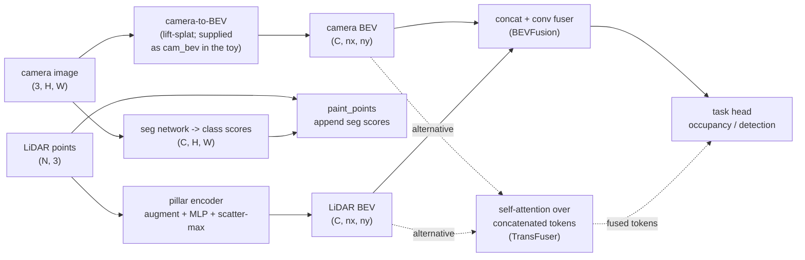

# A11.5f - Multi-modal sensor fusion (LiDAR + camera)

A camera image and a LiDAR point cloud carry complementary information, and a driving perception
stack wants both. This assignment builds the three places the two modalities meet: PointPainting,
which decorates each LiDAR point with the image class score at its pixel; a PointPillars-lite LiDAR
encoder that turns the cloud into a bird's-eye-view (BEV) feature map, where BEV is the ego-centric
top-down grid the stack plans in; and the BEVFusion core, which channel-concatenates the camera and
LiDAR BEV maps on one grid and mixes them with a small convolution. A fourth hole builds the
TransFuser attention block, self-attention over the two token sets concatenated, as a contrast to
the fixed concat.

Build those four pieces: the point-painting projection, the pillar encoder with its scatter-max
pool, the concat-and-conv fuser, and the attention fuser. They all land on the ego-centric BEV grid
defined in the camera-geometry assignment, and the projection reuses the pinhole and SE(3)
primitives. The camera BEV feature map that a real stack produces with the depth-lift-and-splat
view transform is supplied ready-made by the toy scene here, so the four holes are the fusion
mechanisms and nothing else.

Required reading before starting:
- Vora, Lang, Helou, Beijbom 2020, "PointPainting: Sequential Fusion for 3D Object Detection",
  [arXiv:1911.10150](https://arxiv.org/abs/1911.10150) (point-level fusion).
- Lang et al. 2019, "PointPillars: Fast Encoders for Object Detection from Point Clouds",
  [arXiv:1812.05784](https://arxiv.org/abs/1812.05784) (the LiDAR BEV branch).
- Liu et al. 2022, "BEVFusion: Multi-Task Multi-Sensor Fusion with Unified Bird's-Eye View
  Representation", [arXiv:2205.13542](https://arxiv.org/abs/2205.13542) (the feature-level fuser
  built here).
- Prakash, Chitta, Geiger 2021, "Multi-Modal Fusion Transformer for End-to-End Autonomous Driving",
  [arXiv:2104.09224](https://arxiv.org/abs/2104.09224) (the attention fuser).

## Lecture notes

### Where the two modalities meet

A camera image is dense and semantic. Every pixel has a color, and a segmentation network reads a
class and appearance off it, so the image says what an object is. The image does not carry metric
depth: a single pixel is a ray, and the distance along it is unknown from one frame.

A LiDAR point cloud is the opposite. Each return is a metric 3-D point, accurate to a few
centimeters, so the cloud says exactly where surfaces are. It does not carry class: a point
is a coordinate with at most a reflectance value, and a car surface and a wall surface return the
same kind of point. The cloud is also sparse. Range measurements thin out with distance, so a far
object is a handful of points.

Autonomous-driving perception fuses the two so the result has both metric geometry and class. The
question the assignment is organized around is where in the pipeline the fusion happens. Fuse
early and the LiDAR network sees image evidence while it is still forming its own features, at the
cost of inheriting every image error before anything downstream can weigh it. Fuse late and each
branch is trained and debugged on its own, but neither branch gets to use the other's evidence
while deciding what to encode. Three answers, in order of how early the two meet:

- Point level (early). Decorate the raw LiDAR points with image information before any LiDAR
  network runs. This is PointPainting.
- Feature level (mid). Run a camera branch and a LiDAR branch separately, each to a BEV feature
  map, then combine the two maps. This is BEVFusion.
- Attention level (mid, learned). Same two branches, but combine their features with a transformer
  attention block that mixes tokens across modalities. This is TransFuser.

### Class scores from an image

Both PointPainting and the camera side of the fuser start from a semantic segmentation network: a
network that predicts a class at every pixel, so its output for an $H \times W$ image is a
$(C, H, W)$ tensor for $C$ classes rather than one label for the whole picture. Nothing in this
assignment builds or trains one, and the toy generates its scores directly, so the architecture
does not matter here. The form of the output does.

The network emits $C$ unbounded real numbers per pixel, the logits $z_1, \dots, z_C$, and a softmax
turns them into a score vector

$$s_c = \frac{e^{z_c / T}}{\sum_{k=1}^{C} e^{z_k / T}} .$$

Every $s_c$ is positive and the $C$ of them sum to 1, so the vector is a probability distribution
over classes at that pixel. The temperature $T$ divides all the logits together and controls how
peaked that distribution is: $T = 1$ is the plain softmax, $T > 1$ pulls it toward uniform, and
$T \to 0$ drives it to a one-hot vector on the largest logit. A confident vehicle pixel gives
something like $(0.02, 0.98)$, an ambiguous boundary pixel something like $(0.5, 0.5)$, and the gap
between those two cases is the information a hard label would discard.

The toy uses $C = 2$, index 0 background and index 1 vehicle, and builds `seg_scores` to be an
imperfect signal rather than a copy of the answer: it blurs the vehicle mask with a 3x3 average,
adds Gaussian noise to both logits, and runs the softmax at $T = 1.5$. A painted point therefore
carries evidence with a margin, not a clean label.

### Point-level fusion with PointPainting

PointPainting is the earliest meeting point. Run the image segmentation network to get the
per-pixel score vectors above, project each LiDAR point into the image, and append the score vector
at that pixel to the point. A point that was $[x, y, z]$ (or $[x, y, z, r]$ with reflectance $r$)
becomes $[x, y, z, s_1, \dots, s_C]$. The decorated cloud then feeds any LiDAR detector unchanged,
which is the whole appeal: the detector's input grows by $C$ channels and nothing else about it
changes.

The projection is the lidar-to-camera-to-image chain from the camera rig: transform the ego-frame
point into the camera frame with the extrinsic $T_{\text{cam} \leftarrow \text{ego}}$, then apply
the pinhole intrinsics to get a pixel $(u, v)$, rounded to the nearest integer for the lookup. A
point behind the camera (camera-frame $z \le 0$) or landing outside $[0, W) \times [0, H)$ gets the
all-zero vector rather than a wrapped-around or clamped pixel.

All-zero is not the same as background. Any vector the softmax produces sums to 1, so an all-zero
vector cannot come from the segmenter at all, and a network downstream can read it as "this point
was never seen by a camera" instead of "this point was seen and found to be background". The
distinction matters as soon as the rig has blind spots, which every real rig does.

The choice that matters is appending the soft score vector rather than the hard argmax
label. Argmax throws away the margin, collapsing $(0.51, 0.49)$ and $(0.02, 0.98)$ to the
same label, so the detector has no way to discount a point the segmenter was unsure about. Argmax
is also piecewise constant in the logits, so its derivative is zero wherever it is defined: an
end-to-end variant that backpropagates the detector's loss into the segmentation network would get
no gradient through a hard label, while the soft vector passes one straight back.

The second design choice is that the pipeline is sequential. The segmentation network runs, then
the detector runs on its output, with no joint training required. That makes it simple to attach to
an existing detector, and it caps the fusion at the quality of the 2-D segmentation, since a point
painted with a wrong class is decorated with wrong evidence and the detector has no independent
image access to overrule it.

In a real multi-camera rig a point is painted by the one camera whose field of view it falls into,
so the rig picks a camera per point. This toy is single-camera, so every in-front, in-image point is
painted from the same image and the rest get zeros.

### Encoding an unordered point set

The LiDAR branch has to turn a variable-size, unordered set of points into one fixed-size feature
per BEV cell, and unordered is the constraint that shapes the architecture. A point cloud has no
canonical row order: the same physical surface arrives as a different permutation of the same $N$
rows on the next sweep, so a function whose value changes when the rows are shuffled is reading an
artifact of the scanner's firing sequence. The encoder must be permutation invariant,

$$f(p_1, \dots, p_N) = f(p_{\pi(1)}, \dots, p_{\pi(N)}) \quad \text{for every permutation } \pi .$$

One construction gives that for free. Apply the same map $h$ to each point independently, then
reduce the results with an operation that does not care about order:

$$f(\{p_i\}) = \rho\Big(\textstyle\bigoplus_{i=1}^{N} h(p_i)\Big),$$

where $\bigoplus$ is a symmetric reduction such as a sum, a mean, or a coordinate-wise max, and
$\rho$ is whatever comes afterward. Permuting the inputs permutes the arguments of $\bigoplus$,
which by symmetry leaves the result alone, and $\rho$ never sees the order. PointNet (Qi et al.
2017, [arXiv:1612.00593](https://arxiv.org/abs/1612.00593)) is this construction with $h$ a
multi-layer perceptron and $\bigoplus$ a coordinate-wise max, and the pillar and voxel encoders in
the driving stack are variations on it.

A multi-layer perceptron (MLP) is a stack of affine maps with a pointwise nonlinearity between
them. The one here is $\text{Linear}(9 \to 32) \to \text{ReLU} \to \text{Linear}(32 \to C)$,
applied to one point's 9-vector at a time with the same weights for every point. "Per-point MLP"
means exactly that weight sharing: the map has no access to the other points, so nothing about the
ordering can leak into it, and a pillar with 3 points and a pillar with 300 run the same map.

The choice of $\bigoplus$ is not free, because the reductions differ in what they let through. A
sum grows with the number of points: duplicate every point in a pillar and the pooled vector
doubles. A coordinate-wise max does not, and it is invariant to more than duplication - adding any
point whose features fall below the running maximum in every channel leaves the pooled vector
exactly unchanged. Whether that invariance is wanted depends on whether point count is signal or
shortcut, and the pillar encoder is where it bites.

### The LiDAR branch and PointPillars

The LiDAR branch turns the raw cloud into a BEV feature map so it lands on the same grid the camera
branch uses. PointPillars does this without any 3-D convolution. Group the points into pillars,
which are BEV grid cells extruded infinitely in $z$, so every point falls in exactly one pillar by
its $(x, y)$ and the whole cloud is partitioned by a single floor-divide.

Each point is augmented from its raw coordinates to nine features
$[x, y, z, x_c, y_c, z_c, x_p, y_p, r]$. Here $(x_c, y_c, z_c)$ is the point minus the mean of all
points in its pillar, the offset from the pillar's point cluster center, and $(x_p, y_p)$ is the
offset from the point to the geometric center of its pillar cell, which for cell $(i, j)$ sits at
ego coordinates $x_{\min} + (i + \tfrac{1}{2})\,\text{res}$ and
$y_{\min} + (j + \tfrac{1}{2})\,\text{res}$ with zero-based $i, j$. The cluster offset tells the
network how the point sits relative to the local surface, and the cell offset tells it where the
point sits inside the cell, which the quantized pillar index has thrown away. The last feature $r$
is reflectance, the return intensity a real LiDAR reports; the toy has no intensity, so it is a
constant 1.0 and the slot is kept only so the layout matches the paper.

The per-point MLP maps the nine features to $C$ channels, and a per-pillar coordinate-wise max over
the points in each pillar gives one $C$-vector per pillar, scattered into the BEV grid. That is the
PointNet construction of the previous section with the set restricted to one pillar.

PointPillars uses the coordinate-wise max, and this toy's construction shows what a sum would cost.
Point counts vary by more than an order of magnitude between cells: each vehicle or clutter blob
drops 40 points into a single cell, while the ground sprinkle is 80 points spread over the whole
8x16 grid, under one point per cell on average. A sum-pooled feature therefore has a magnitude that
separates blob cells from ground cells on its own, and a single linear layer reading that magnitude
gets occupancy right without the MLP ever having to describe any geometry. That shortcut is a dead
end for the actual task, because the toy gives vehicle and clutter blobs the same point count:
magnitude says "something is here" and can never say which of the two it is. Max pooling removes
the shortcut rather than hoping the optimizer ignores it. The pooled vector is the per-channel
maximum, unchanged by how many points contributed, so the branch has to encode the geometry it was
given, and the vehicle-versus-clutter decision is left where only the camera can make it.

The pool is a scatter reduction, the same shape of operation as the pillar pooling in the
depth-lift-and-splat view transform: given an $(M, C)$ array of values and an $(M,)$ array of bin
indices, reduce all the rows sharing a bin into one output row. A sum can be undone by subtraction,
which is what lets `cumsum_pool` compute it by sorting the points by bin and differencing a running
total. A running maximum cannot be undone that way, so the scatter-max here is a `scatter_reduce`
with `amax` and `include_self=False`. That flag keeps the zero-initialized output tensor out of the
reduction, so a pillar whose features are all negative pools to its own maximum instead of to the
initial 0, while a pillar with no points is never touched and stays at 0. `cumsum_pool` is still
used in this branch, for the per-pillar coordinate mean the cluster offset needs, which is a sum
divided by a count.

### Feature-level fusion with BEVFusion

BEVFusion is the core built here. A BEV feature map is a $(C, n_x, n_y)$ tensor: one $C$-vector per
grid cell, holding whatever the branch that wrote it learned to say about that patch of ground. The
camera branch reaches one through the depth-lift-and-splat view transform, which predicts a
per-pixel depth distribution, pushes each pixel feature out into 3-D along it, and splats the
result into BEV pillars; the LiDAR branch reaches one through the pillar encoder above. Because the
two land on the same grid with the same cell size in the same ego frame, cell $(i, j)$ in one map
and cell $(i, j)$ in the other describe the same square meter of road. The fuser needs nothing
beyond that alignment, and the whole module keeps one grid definition to guarantee it. In this
assignment the camera map is not computed at all: the toy scene hands over a 2-channel class-score
BEV map with a built-in depth smear, so `BEVFuser` is exercised on the same inputs a real camera
branch would give it without a camera branch having to be trained first.

Fusion is then a channel concatenation followed by a small convolutional encoder. The concatenation
stacks the two vectors at each cell into one $(C_{\text{cam}} + C_{\text{lidar}})$-vector; nothing
is combined yet, the two sources are just laid side by side in one tensor. The convolution combines
them: each output channel is a learned linear function of every input channel over a 3x3
neighborhood, followed by a ReLU, so a unit can respond to a conjunction across the two sources.
"LiDAR says this cell is occupied and the camera says the class here is vehicle" is a positive
weight on both groups of channels and a bias set so that neither group alone clears the threshold.
`BEVFuser` is two such 3x3 layers and a 1x1 projection to the unified channel count.

The unified feature is task-agnostic. It feeds a detection head, a segmentation head, or a map head
without the fusion changing, where a head is the last few layers that turn a shared feature into
one task's output - here a 1x1 convolution mapping the fused channels to a single occupancy logit
per cell. Keeping the fusion below the heads lets one BEV backbone serve several tasks at once.

The concatenation is not where the paper's difficulty was. The camera-to-BEV view transform was,
and specifically its pooling step, which was the latency bottleneck of the whole model. Every
camera pixel produces one point per depth bin, so the number of frustum points to reduce is the
feature-map size times the depth-bin count times the number of cameras, every frame. BEVFusion
precomputes the frustum-point-to-BEV-cell index mapping, which is fixed as long as the intrinsics
and extrinsics are, and reduces each BEV cell's interval of the sorted point list in one pass. That
made the pooling roughly 40x faster and made running a full camera branch alongside the LiDAR
branch practical. The concat-and-conv fuser is deliberately simple; the engineering that mattered
made the camera branch cheap enough to fuse at all.

The near-simultaneous Liang et al. 2022 paper, also titled "BEVFusion"
([arXiv:2205.13790](https://arxiv.org/abs/2205.13790)), reached a similar unified-BEV design
independently. The MIT version (Liu et al., [arXiv:2205.13542](https://arxiv.org/abs/2205.13542)) is
the one built here.



### Self-attention over two token sets

The alternative to a fixed concatenation is to let the network decide, per location, how much of
the other modality to read. That is what attention does, and the TransFuser fusion block is one
ordinary self-attention block applied to an unusual input: the two modalities' tokens laid end to
end in a single sequence.

Recall the mechanism from the transformer encoder. A set of $S$ tokens, each a $d$-vector, is
projected three ways into queries $Q$, keys $K$, and values $V$, all $(S, d)$. Token $i$'s output is
a weighted average of all $S$ values, with weights from a softmax over the scaled dot products
between its query and every key:

$$\text{Attn}(Q, K, V) = \operatorname{softmax}\!\Big(\frac{Q K^\top}{\sqrt{d}}\Big) V .$$

Row $i$ of that softmax is a distribution over the $S$ tokens, saying how much token $i$ reads from
each one, and the $\sqrt{d}$ keeps the dot products from growing with the dimension and driving the
softmax to a one-hot.

Now feed it the concatenation. With $S_c$ camera tokens stacked on top of $S_l$ LiDAR tokens, each
of $Q$, $K$, $V$ splits into a camera half and a LiDAR half, and the score matrix has four blocks:

$$\tfrac{1}{\sqrt{d}}\begin{bmatrix}Q_c K_c^\top & Q_c K_l^\top \\ Q_l K_c^\top & Q_l K_l^\top\end{bmatrix}$$

The two off-diagonal blocks are the cross-modal terms, every camera token scoring every LiDAR token
and the reverse, so a single attention layer covers both directions at once. The two diagonal
blocks keep the within-modality mixing each stream would have done on its own.

The softmax runs across each full row, over the union of both key sets, and that is what a
two-stream cross-attention design does not reproduce. A camera token's weights on camera keys and
on LiDAR keys are normalized together, so they compete for one unit of attention mass: a camera
token that finds a strongly matching LiDAR key takes weight away from its camera neighbors, and one
that finds nothing useful across the modality boundary spends nearly all its weight within its own.
How much cross-modal reading happens is decided per token by the content. Cross-attention with
camera as query and LiDAR as key and value normalizes over LiDAR keys only, so every camera token
spends all of its attention on LiDAR whether or not anything there is relevant, and a second block
is needed for the other direction.

Two more properties follow from how the block is configured here. It runs with no positional
encoding, so it is permutation equivariant: shuffle the input tokens and the output tokens come out
shuffled the same way, with nothing else changed. Nothing in the attention knows that one token
sits to the left of another, or that the first $S_c$ rows are the camera ones; the split point
matters only because the outputs are routed back to different streams. And the fusion is residual,
meaning the block's output for each half is added onto that half's input rather than replacing it.
Each stream keeps its own features and picks up a cross-modal correction on top, and a stream that
gains nothing from the other modality can drive its correction to near zero and lose nothing.

### Attention fusion with TransFuser

TransFuser is the contrast. It was built for end-to-end driving in CARLA, the open-source driving
simulator used as a closed-loop benchmark, where one network reads the sensors and emits the route
the car then follows. The image goes through a convolutional stem, and the LiDAR is rasterized into
a BEV pseudo-image: the points are histogrammed into BEV cells in two height bins, one channel
counting the points below a height threshold and one the points above, which turns the cloud into a
2-channel image a conv stem can consume. At several resolution stages of the two stems, the feature
maps are flattened into tokens - one token per spatial location, carrying that location's channel
vector - and the image tokens and LiDAR tokens are concatenated into the single set the attention
block of the previous section runs over. The outputs are split back at the camera/LiDAR boundary,
added onto their own streams, and the stems continue at the next resolution.

This assignment isolates that block and drops the rest of the driving pipeline, in particular the
waypoint decoder: a small recurrent network that emits the route one waypoint at a time, each
prediction fed back in as the input for the next, which is what auto-regressive means. The build is
the concatenate-attend-split-residual step alone.

Building both fusers puts the two mixing patterns side by side. BEVFusion combines the two maps at
matching cells, so a fused cell sees the other modality at its own location plus whatever the 3x3
convolution reaches around it; the pattern is fixed by the geometry and the kernel size, and it
only works because the branches were already brought onto a common grid. TransFuser learns an
all-to-all token mixing where any location in one modality can pull from any location in the other,
which needs no common grid, at the cost of an $S \times S$ score matrix and no built-in notion of
which locations correspond to each other.

The PAMI extension ([arXiv:2205.15997](https://arxiv.org/abs/2205.15997)) carries the same fusion
block into a larger driving model.

### The toy and what it isolates

The toy scene is built so that neither modality alone recovers vehicle occupancy, which forces a
fused head to actually use both. One forward camera looks down ego $+x$ over an 8x16 BEV grid,
$x \in [0, 8]$ m forward and $y \in [-8, 8]$ m lateral at 1 m cells, and each scene holds three
vehicle blobs and three clutter blobs.

The two blob kinds are matched on everything the LiDAR can see. They are drawn from the same
spatial distribution and share one point generator, so each contributes 40 points spread through
the same cell footprint and the same height range. Geometry and density are identical, which means
even a scatter-max pool that ignores raw count sees two blobs that look the same. They differ only
in image color, one rendered in a color the segmenter reads as vehicle and one in a color it reads
as background.

The camera feature is degraded the other way. `cam_bev` places the vehicle score not at the vehicle
cell but over the entire forward column at the vehicle's lateral position, standing in for the fact
that a camera pixel back-projects to a BEV ray of unknown range. The camera says which lateral
column holds a vehicle and says nothing about how far down that column it sits. Vehicle and clutter
blobs are placed in disjoint lateral columns, so the smeared vehicle score never lands on a clutter
cell and the two failure modes stay independent.

The ground truth is vehicle occupancy, three cells out of the grid's 128, so a head that predicts
nothing at all already gets about 98% of cells right. Accuracy is useless on a target that sparse.
The score is intersection over union (IoU): the number of cells where prediction and ground truth
are both occupied, divided by the number where either is. Predicting nothing scores 0, predicting
everything scores $3/128$, and only a prediction that hits the occupied cells and few others scores
high. The training loss handles the same imbalance by weighting the positive class 30x in the
binary cross-entropy.

Two reference scores follow from the construction alone, before training anything. The vehicle
score covers a full 8-cell forward column at each vehicle's lateral position, so a camera head that
fires wherever that score appears predicts about 24 cells, hits 3, and lands near
$3/24 = 0.125$; picking fewer cells per column trades recall for precision with nothing in the
input to say which cell in the column is the right one. The LiDAR evidence marks 6 blob cells with
nothing to separate the 3 vehicles from the 3 clutter, so a head that fires on every blob predicts
6 cells, hits 3, and lands near $3/6 = 0.5$. A fused head has both pieces, and nothing in the
construction stops it short of 1.

### The measured lesson

A camera-only head, a LiDAR-only head, and a fused head are trained on 12 toy scenes and evaluated
on 8 held-out scenes, each 400 full-batch Adam steps at learning rate $10^{-2}$ on the weighted
binary cross-entropy above. The camera head is a three-layer conv net over `cam_bev`, the LiDAR
head is the pillar encoder plus a 1x1 convolution, and the fused head is the pillar encoder plus
`BEVFuser` plus a 1x1 convolution. Measured across 8 parameter initializations:

| head | held-out IoU (seed 0) | across 8 inits |
|------|-----------------------|----------------|
| camera-only | 0.169 | 0.17 - 0.18 |
| LiDAR-only | 0.349 | 0.26 - 0.38 |
| fused | 0.500 | 0.49 - 0.72 |

The fused head beat both single-modality heads on every one of the 8 initializations, by at least
+0.31 IoU over camera-only and at least +0.15 over LiDAR-only. Neither single-modality head escapes
the reference score its evidence implies: the camera head sits just above the 0.125 of firing on
every cell in a vehicle column, having learned little more than that, and the LiDAR head sits below
the 0.5 of firing on every blob, since which blobs it fires on has to generalize to scenes it never
saw. Both are what a head running out of evidence looks like. It extracts what its input holds and
then stops, because the missing piece is missing from the input and more training cannot put it
back. The camera head is pinned by a depth ambiguity it cannot resolve and the LiDAR head by a
vehicle-versus-clutter confusion it cannot resolve; the fused head clears both, because the
camera's class score fills the LiDAR's class gap and the LiDAR's geometry fills the camera's depth
gap.

This toy deliberately amplifies each modality's failure mode so a small model on a handful of
scenes shows the effect cleanly. At real scale, diverse data softens both failures: a camera
detector recovers usable depth from context and object size, and a LiDAR detector separates many
objects on geometry alone. The gap between single and fused is smaller and messier there than this
table. What carries over is the reason fusion helps, not these IoU values. Camera semantics fill
LiDAR's class ambiguity and LiDAR geometry fills the camera's depth holes, and that is the
literature-backed motivation the toy is built to make visible, not an artifact of the toy.

### Connections

The BEV grid here is the ego-centric grid defined in the camera-geometry assignment, unchanged, so
the camera-only, LiDAR-only, and fused maps are all indexed the same way and cell $(i, j)$ means
the same square meter in each. From the lift-splat view transform this branch reuses `pillar_index`
and `cumsum_pool` directly, the flat $i \cdot n_y + j$ pillar indexing and the sort-and-difference
sum pool. The camera BEV map that lift-splat would produce is supplied by the toy scene rather than
computed, with an exaggerated forward smear standing in for the depth ambiguity, so the measurement
isolates the fusion mechanisms from the quality of the camera branch. BEVFormer's BEV
queries, which pull from projected image features instead of pushing features out along a predicted
depth, are the alternative way to fill that same camera map.

The point-painting projection uses the camera rig and the pinhole and SE(3) primitives, the same
projection chain both camera-to-BEV transforms use. The TransFuser block is the transformer
self-attention block taught earlier, run on a concatenated set of image and LiDAR tokens instead of
a single sequence, with its positional encoding turned off.

Forward, the LiDAR geometry the pillar branch relies on is the same geometry that point-cloud
registration works with: aligning two clouds by iterative closest point (ICP) in the classical-SLAM
module operates on the raw metric points this branch pools into pillars.

## The assignment

Fill these holes, in order. Each is one `NotImplementedError` with a matching test; the docstring
in each file gives the signature, shapes, and constraints.

1. [`paint_points()`](fusion.py) in `fusion.py` - PointPainting: project each ego point into the
   camera, drop behind-camera (camera-frame z <= 0) and out-of-image points, gather the C-dim seg
   score at the pixel, and concatenate it as `[x, y, z, s_1..s_C]`.
2. [`LidarPillarEncoder.forward()`](fusion.py) in `fusion.py` - augment each point to nine
   features `[x, y, z, xc, yc, zc, xp, yp, r]`, run the per-point MLP, then scatter-MAX (not a
   sum) into each BEV pillar.
3. [`BEVFuser.forward()`](fusion.py) in `fusion.py` - channel-concatenate the camera and LiDAR BEV
   maps and run the conv fuser.
4. [`TransFuserBlock.forward()`](transfuser.py) in `transfuser.py` - concatenate the camera and
   LiDAR token sets, run one self-attention block over the union, split back, and residual-add to
   each stream.

`fusion.py` and `transfuser.py` are assignment-local (imported by bare name). They reuse
`pillar_index` and `cumsum_pool` from the lift-splat view transform via `nanovision.lift_splat`,
the pinhole/SE(3) primitives via `nanovision.geometry`, and the attention block via
`nanovision.transformer`. The
`FusionConfig`, the `bev_fusion_scene` generator, `compare.py` (the three-head comparison), and
`viz.py` are provided.

### Running and validating

Activate the environment (`conda activate nanovision`), then:

```
make test     A=a11_5f_sensor_fusion   # run the tests against the top-level files (the holes)
make verify   A=a11_5f_sensor_fusion   # run the same tests against the reference solution/
make viz      A=a11_5f_sensor_fusion   # render the figures from the reference solution
make viz-mine A=a11_5f_sensor_fusion   # render the figures from your own code (holes filled)
```

`make test` runs the suite in `assignments/a11_5f_sensor_fusion/tests/` against the top-level
`fusion.py` and `transfuser.py`, red until the holes are filled and green once correct.
`make verify` runs the identical suite against the reference `solution/` by setting
`NANOVISION_IMPL=solution`, so it is green from the start and shows the target.

The suite checks the output shapes of all four mechanisms; the painting geometry against the
geometry primitives directly (an in-frame point gets exactly the score at its projected pixel, a
behind-camera point and an out-of-image point both get zeros and keep their coordinates); float64
gradchecks of `BEVFuser` and `TransFuserBlock` (`torch.autograd.gradcheck` compares the analytic
backward pass against finite differences of the forward pass, and needs double precision for the
comparison to mean anything); an end-to-end overfit of the fused pipeline on one scene, which is a
composition and differentiability check rather than evidence about fusion; the held-out
fusion-beats-single comparison, with its margins floored well below the measured gap; and a static
scan blocking perception libraries and external scatter kernels, so the pool is plain torch and the
projection is the course geometry. One test exercises the two branches on real nuScenes data and
skips cleanly when `NUSCENES_DATAROOT` is unset or the devkit is missing.

`make viz` runs from the reference solution, so it works on a fresh checkout before any hole is
filled. It writes `fusion_bev.png` and `fusion_iou.png` to `out/` rather than opening a window,
using matplotlib's headless Agg backend so it behaves the same over SSH, in WSL, and in CI with no
display. The first figure shows one held-out scene as ground truth next to the camera-only,
LiDAR-only, and fused predictions; the second is a bar chart of the three held-out mean IoUs.
Expect the camera panel to light up whole forward columns, the LiDAR panel to fire on the clutter
blobs as well as the vehicles, and the fused panel to keep the vehicle cells. `make viz-mine` runs
the same script against your own code once the holes are filled, since it trains the three heads.
Add `SHOW=1` to also open the figures in a window when a display is available.
