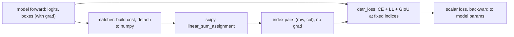
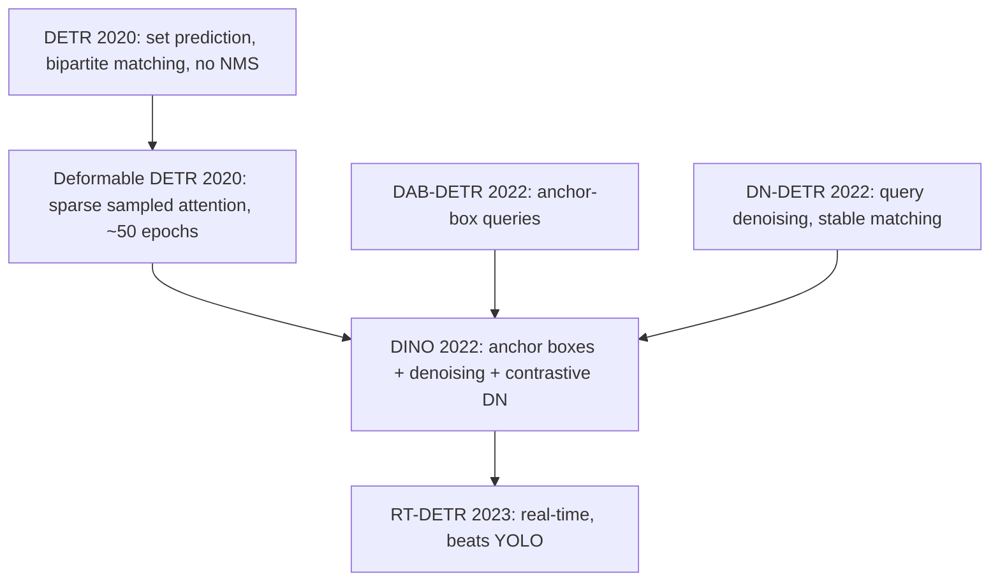

# A11 - detection and segmentation as set prediction

Object detection asks a model to output a set of objects: for each one, a class and a
bounding box. The set has no canonical order (the three cars in an image are not numbered),
and its size changes from image to image. For years detectors sidestepped both problems with
a fixed scaffold of anchors and a hand-built deduplication step. DETR (DEtection
TRansformer, [Carion et al., 2020](https://arxiv.org/abs/2005.12872)) removed that scaffold
by training directly against the set: predict a fixed number of slots, match them one-to-one
to the ground-truth objects, and let the matching loss do the work that anchors and
non-maximum suppression used to do.

This assignment builds the matching mechanism and the set-prediction loss on a tiny toy
(colored squares on a black background). You implement generalized IoU, the Hungarian
matching cost, and the loss. The ViT backbone, the query decoder, and the output heads are
provided, because the lesson is the matcher and the loss, not the plumbing.

## The pre-DETR detection pipeline and its scaffolding

A detector has to turn a dense feature map into a variable-length list of objects. Before
DETR, the dominant answer was anchors: tile the image with a fixed grid of reference boxes
at several scales and aspect ratios (thousands to hundreds of thousands of them), and for
each anchor predict whether an object is centered there, which class, and a small offset that
refines the anchor into the final box. Faster R-CNN, RetinaNet, and the YOLO family are all
variants of this idea.

Anchors create two problems that the pipeline then has to clean up. First, many anchors near
a true object all fire, so the raw output holds several overlapping boxes per object.
Non-maximum suppression (NMS) removes the duplicates: sort boxes by confidence, keep the
highest, delete every remaining box whose IoU with it exceeds a threshold, repeat. NMS is a
greedy, non-differentiable post-process with its own threshold to tune, and it sits outside
the network, so the model is never trained against the duplicates it produces. Second,
training needs a rule that says which anchor is responsible for which object. That rule is
also hand-built: assign each ground-truth box to the anchors whose IoU with it exceeds a
threshold, mark the rest as background, and accept the class imbalance (most anchors are
background) with focal loss or hard-negative mining.

DETR's claim is that both pieces, the anchors and the NMS, are scaffolding you can remove if
you train the model to emit the set directly.

## Set prediction needs a permutation-invariant loss

Suppose the model outputs $N$ slots (DETR uses 100; this toy uses 10), each a (class, box)
prediction, and the image contains $M \le N$ objects. The loss must compare an ordered list
of $N$ predictions to an unordered set of $M$ ground-truth objects. If you paired prediction
$i$ with ground-truth $i$ by index, you would be punishing the model for emitting the right
objects in the wrong slot order, which is a meaningless target: the objects have no order.

The fix is to find the best assignment first, then compute the loss against that assignment.
Pad the ground truth to size $N$ with a special no-object class $\varnothing$, so both sides
have $N$ elements, and search over permutations $\sigma$ of the predictions for the one that
minimizes a matching cost:

$$\hat{\sigma} = \arg\min_{\sigma}\ \sum_{i=1}^{N} \mathcal{C}_{\text{match}}\big(y_i,\ \hat{y}_{\sigma(i)}\big)$$

where $y_i$ is the $i$-th ground-truth object (real or $\varnothing$) and $\hat{y}_{\sigma(i)}$
is the prediction assigned to it. This is a bipartite matching between $N$ predictions and $N$
padded targets. Because $\varnothing$ targets contribute a constant to the cost regardless of
which slot they land on, the search effectively assigns the $M$ real objects to $M$ distinct
predictions and leaves the rest as no-object.

## Bipartite matching and the Hungarian algorithm

A bipartite matching pairs each element of one set with a distinct element of another to
minimize total cost. With a square cost matrix $C[i, j]$ (cost of assigning prediction $i$ to
target $j$), the optimal one-to-one assignment is the linear assignment problem, solved
exactly in $O(n^3)$ by the Hungarian algorithm (Kuhn, 1955). You do not implement it; SciPy's
`scipy.optimize.linear_sum_assignment` is the solver, the same one the flow-matching
assignment used for optimal-transport coupling.

The greedy alternative, for each target pick its lowest-cost prediction independently, can
assign the same prediction to two targets, which is not a valid one-to-one matching. The
matcher test is built exactly on this gap: two ground-truth objects sit at the same location,
one query is closest to both, so per-column argmin double-assigns that single query, while the
Hungarian solution is forced to give the second object to the next-cheapest query.

### The cost is not the loss

DETR keeps two separate quantities, and conflating them is the common mistake:

The matching cost $\mathcal{C}_{\text{match}}$ decides which prediction is compared to which
ground-truth object. It is computed once per training step, detached to numpy, and fed to the
Hungarian solver. It produces a set of integer index pairs. No gradient flows through it: the
assignment indices are constants in the backward pass.

The training loss is the differentiable objective computed after the assignment is fixed. It
takes the index pairs as given and computes a loss that the model's parameters are updated
against.

The Hungarian assignment never needs a gradient because its output is a discrete choice of
indices, and you cannot backpropagate through $\arg\min$ over permutations anyway. The errors
to avoid are trying to differentiate through the matcher and reusing the cost as the loss. In
the code the two quantities are two files: `matcher.py` runs under `torch.no_grad()` and
returns index tensors; `loss.py` takes those indices and returns a scalar with
`requires_grad=True`.

The cost uses three terms with the DETR weights $\lambda_{\text{cls}}=1$, $\lambda_{L1}=5$,
$\lambda_{\text{giou}}=2$:

$$\mathcal{C}[i, j] = \lambda_{\text{cls}}\,\big(-p_i[c_j]\big)
  + \lambda_{L1}\,\lVert b_i - b_j \rVert_1
  + \lambda_{\text{giou}}\,\big(-\mathrm{GIoU}(b_i, b_j)\big)$$

where $p_i = \mathrm{softmax}(\text{logits}_i)$ and $c_j$ is target $j$'s class. The class
term is the negative predicted probability of the true class, so a query that already assigns
high probability to the right class is cheap. The L1 term is the absolute difference of the
cxcywh box coordinates. The GIoU term rewards box overlap.

## Generalized IoU

Intersection-over-union, $\mathrm{IoU} = |A \cap B| / |A \cup B|$, is the standard box-overlap
score, but it is zero for any two disjoint boxes regardless of how far apart they are. A loss
or cost built only on IoU is flat across all non-overlapping configurations, so it gives no
gradient to pull a far-off prediction toward the target. Generalized IoU
([Rezatofighi et al., 2019](https://arxiv.org/abs/1902.09630)) fixes this by subtracting the
fraction of the smallest enclosing box $C$ that the union does not cover:

$$\mathrm{GIoU}(A, B) = \mathrm{IoU}(A, B) - \frac{|C \setminus (A \cup B)|}{|C|}
  = \mathrm{IoU} - \frac{|C| - |A \cup B|}{|C|}$$

where $C$ is the smallest axis-aligned box containing both $A$ and $B$. When the boxes
coincide, $|C| = |A \cup B|$ and GIoU = IoU = 1. As the boxes move apart, $|C|$ grows while
the union stays fixed, so the penalty grows and GIoU keeps decreasing toward its lower bound,
approaching $-1$ for boxes that are far apart relative to their size. GIoU is therefore in
$(-1, 1]$ and gives a usable gradient even when the boxes do not overlap, which is why both
the matching cost and the box loss use it.

Two implementation points the tests check. The intersection width and height must be clamped
to be non-negative before multiplying, or two disjoint boxes produce a negative "intersection
area" and a wrong score. And a small $\varepsilon = 10^{-7}$ goes in both denominators (the
IoU union and $|C|$) so a zero-area degenerate box does not divide by zero. `generalized_iou`
is differentiable, so the same function is reused in the loss.

## The set-prediction loss

After the matcher fixes the assignment, the loss has three parts, summed with the same DETR
weights (class 1, L1 5, GIoU 2):

Classification is a cross-entropy over all $N$ queries. Each matched query's target is its
ground-truth class; each unmatched query's target is the no-object class at index
`num_classes`. With $N = 10$ slots and 1-2 objects per image, most queries are no-object, so
the no-object term would dominate and the model would collapse to predicting no-object
everywhere. DETR downweights it with a class weight vector: a length-$(C{+}1)$ vector that is
$1$ for the real classes and `eos_coef` $= 0.1$ for the no-object class, passed straight to
`F.cross_entropy(weight=...)`. This is the standard class-imbalance reweighting, not a
post-hoc scaling of the unmatched queries' loss after the fact.

The box L1 and the GIoU loss ($1 - \mathrm{GIoU}$) are computed only on the matched (query,
ground-truth) pairs; unmatched queries have no box target. The class term is the one place the
cost and the loss differ: the cost uses the raw probability $-p[c]$, the loss uses
cross-entropy $-\log p[c]$. They carry the same information through a different function. The
L1 and GIoU terms are the identical function in both the cost and the loss.

## Object queries

DETR replaces anchors with object queries: $N$ learned embedding vectors, one per output slot,
that the decoder refines by self-attending among themselves and cross-attending to the image
features. A query is a learned slot, not a position on a grid. Over training, queries
specialize: in the original DETR, different queries learn to prefer different image regions
and object sizes, which is the learned analogue of the anchor grid. Here the decoder is a
stack of `TransformerBlock(causal=False, cross_attn=True)` layers, the same transformer block
used elsewhere in the course: the queries self-attend (bidirectionally, since the output set
has no order), then cross-attend to the ViT's patch tokens.

DAB-DETR ([Liu et al., 2022](https://arxiv.org/abs/2201.12329)) later made the query an
explicit 4-D anchor box $(x, y, w, h)$ that each decoder layer updates, which both speeds up
convergence and makes the query interpretable as a box prior rather than an opaque vector.

## Why NMS disappears

Because the matching is one-to-one, every ground-truth object is assigned to exactly one
query, and every other query is trained to predict no-object. The model is therefore trained
directly against producing two boxes for one object: if two queries both fire on the same
object, only one can be matched, and the other takes a no-object penalty. Duplicate
suppression moves from a post-process into the training objective, so no NMS is needed at
inference. This is the part of DETR that the toy here actually exercises in miniature, with
the caveat in the scope note below that 1-2 objects never stress it the way a crowded scene
would.

## DETR's convergence problem and the fixes

The original DETR worked but trained slowly: about 500 epochs on COCO, roughly ten times a
comparable Faster R-CNN schedule. The follow-up papers diagnosed why and fixed it, and that
lineage runs through most current detectors.

Deformable DETR ([Zhu et al., 2020](https://arxiv.org/abs/2010.04159)) traced much of the
slowness to global dense cross-attention, where every query attends to every pixel and the
attention map has to learn from scratch where to look. It replaced that with deformable
attention: each query attends to a small set of sampled key locations whose offsets are
predicted, so attention is local and sparse from the start. This cut training to about 50
epochs and handled small objects better through multi-scale features.

DN-DETR ([Li et al., 2022](https://arxiv.org/abs/2203.01305)) found a second cause: the
bipartite matching is unstable early in training, because which query matches which object
flips between epochs, so the targets a query chases keep changing. It added query denoising:
feed in ground-truth boxes with added noise as extra queries that bypass the matcher and are
trained to reconstruct the clean boxes, giving a stable auxiliary target that does not depend
on the (still noisy) matching.

DINO ([Zhang et al., 2022](https://arxiv.org/abs/2203.03605)) combined DAB-DETR's anchor-box
queries and DN-DETR's denoising into one model, added contrastive denoising (positive and
negative noised boxes so the model learns to reject near-duplicates) and mixed query
selection, and became the first DETR-family detector to top the COCO leaderboard. DAB-DETR and
DN-DETR are parallel early-2022 contributions that DINO unifies; the name DINO bundles
DeNoising and anchor boxes, so read this as a teaching arc, not a strict ancestry where one
descends from the other.

RT-DETR ([Zhao et al., 2023](https://arxiv.org/abs/2304.08069)) answered the last standing
objection, that DETR is too slow for real-time use, with an efficient hybrid encoder and a
real-time decoder that beats the YOLO models at comparable latency while keeping the
NMS-free, anchor-free design. Anchor-based YOLO remains the resource-constrained competitor;
RT-DETR removed the "you must use YOLO for speed" argument.

## Segmentation and open-vocabulary detection on the same paradigm

The query-plus-matching idea generalizes past boxes. Mask2Former
([Cheng et al., 2021](https://arxiv.org/abs/2112.01527)) keeps the object queries and the
bipartite matching but has each query predict a binary mask instead of a box, and adds masked
attention where each query attends only inside its current mask prediction. One architecture
then handles instance, semantic, and panoptic segmentation, which previously needed separate
designs.

Grounding DINO ([Liu et al., 2023](https://arxiv.org/abs/2303.05499)) adds a text backbone so
the detector is open-vocabulary: you give it a noun phrase and it detects the matching
objects, instead of a fixed class list. The language features guide the queries, so the model
detects rare or novel categories without retraining a closed classifier.

The Segment Anything line is a separate family. SAM
([Kirillov et al., 2023](https://arxiv.org/abs/2304.02643)) is a promptable segmentation
model: a point, box, or rough mask prompt produces an object mask, trained on a very large
mask dataset. SAM 2 ([Ravi et al., 2024](https://arxiv.org/abs/2408.00714)) extends this to
video with a streaming memory that tracks an object across frames. SAM 3 (Meta, released Nov
2025) and SAM 3.1 (Mar 2026) reportedly add concept prompts (a noun phrase or an exemplar
image patch rather than a single click) and multi-object tracking; no arXiv preprint id is
available for these, so treat those capability claims as reported by the release, not
established here. See Meta's SAM release page if citing them.

## Where this goes

The query-plus-bipartite-matching paradigm is now the dominant class for detection,
segmentation, tracking, and open-vocabulary grounding; anchor-based YOLO is the
resource-constrained competitor that still wins on the tightest latency budgets. In an
autonomous-driving perception stack, RT-DETR or a DINO variant runs as the production
detector, Grounding DINO covers rare or long-tail classes the closed detector was never
trained on, and SAM 2 or 3 sits in the annotation loop to cut labeling cost. The matcher and
loss you build here are the core of all of these.

## What the toy proves, and what it does not

The colored-squares toy is a mechanism demonstrator. It proves that the matcher, the loss, and
the model run end to end and overfit a tiny fixed set: the total loss falls from about 4.8 to
a floor near 0.1-0.25 and the matched predicted box centers land on the ground-truth centers
to well under 0.06 of the image side. It proves nothing else.

In particular it says nothing about convergence speed. The 500-epoch DETR-is-slow story and
the Deformable-DETR fix are about COCO, not four overfit images, so do not read the fast
overfit here as evidence about training efficiency at scale. It says nothing about NMS-free
behavior under real object density, because one or two well-separated squares never stress
duplicate suppression the way a crowded scene does. It says nothing about the ViT being a good
detection backbone, nor about any average-precision number. Those belong to the survey papers,
not to a 32x32 toy.

The remaining loss floor is itself a scale artifact worth naming. The model omits two pieces
of real DETR: per-decoder-layer re-injection of a 2D image positional encoding into the
cross-attention keys (here the only spatial signal is the ViT's single learned positional
embedding, added once), and per-layer auxiliary losses (a copy of the matching loss at every
decoder layer). And the ViT's 4-pixel patch stride bounds how finely a box can be localized at
32x32, so the GIoU term keeps a small residual that does not vanish. None of these change the
lesson, which is the cost-versus-loss separation and the one-to-one matching.

## Files

- `boxes.py` (holes): `box_xyxy_to_cxcywh`, `generalized_iou`. `box_cxcywh_to_xyxy` provided.
- `matcher.py` (hole): `HungarianMatcher.forward`, the cost matrix and Hungarian assignment.
- `loss.py` (hole): `detr_loss`, CE with the no-object downweight plus L1 and $1 - \mathrm{GIoU}$
  on matched pairs.
- `model.py` (provided): `DETR`, the ViT backbone, query decoder, and heads.
- `config.py`, `viz.py` (provided): hyperparameters and the overfit visualization.
- `nanovision.data.toy.detection_batch` (provided): the colored-squares detection toy.

Run the tests with the course environment's Python:
`NANOVISION_IMPL=solution python -m pytest assignments/a11_detection_segmentation/tests`.
