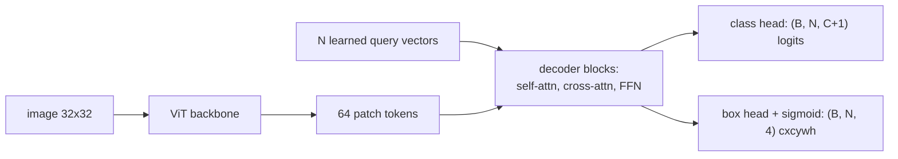
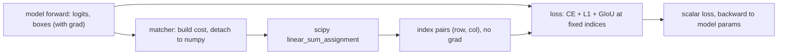
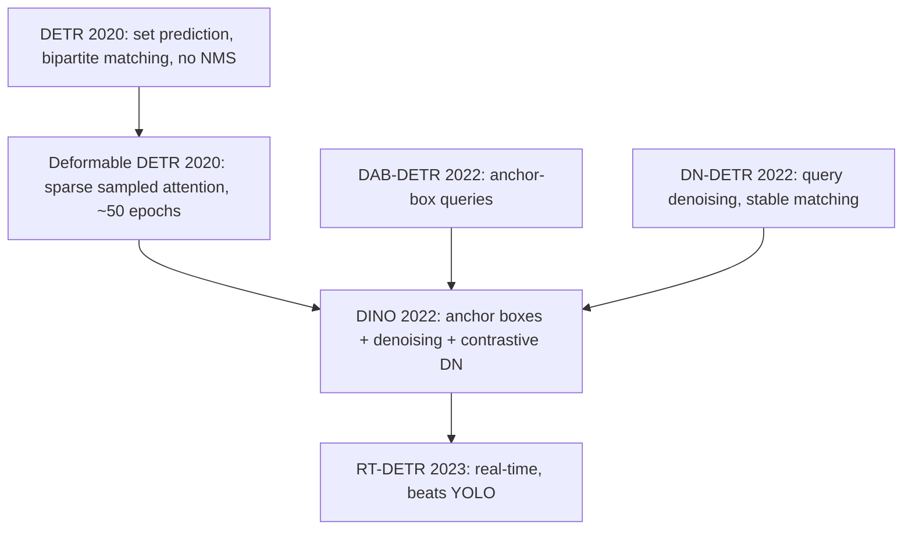

# A11 - detection and segmentation as set prediction

Object detection asks a model to output a set of objects: for each one, a class and a
bounding box. The set has no canonical order (the three cars in an image are not numbered),
and its size changes from image to image. For years detectors sidestepped both problems with
a fixed scaffold of anchors and a hand-built deduplication step. DETR (the detection
transformer) removed that scaffold by training directly against the set: predict a fixed
number of slots, match them one-to-one to the ground-truth objects, and let the matching loss
do the work that anchors and non-maximum suppression used to do.

Build the matching mechanism and the set-prediction loss on a tiny toy of colored squares on a
black background. The pieces to implement are the box-format conversion, generalized IoU, the
Hungarian matching cost, and the loss. The ViT backbone, the query decoder, and the output
heads are provided, because the lesson is the matcher and the loss, not the plumbing.

Required reading before starting:
- Carion et al. 2020, "End-to-End Object Detection with Transformers" (DETR),
  [arXiv:2005.12872](https://arxiv.org/abs/2005.12872).
- Rezatofighi et al. 2019, "Generalized Intersection over Union",
  [arXiv:1902.09630](https://arxiv.org/abs/1902.09630).

## Lecture notes

### Boxes and the two coordinate formats

An axis-aligned bounding box is four numbers, and detection code uses two different
conventions for those four numbers. The corner format, called xyxy, lists the top-left and
bottom-right corners $(x_0, y_0, x_1, y_1)$. The center format, called cxcywh, lists the
center and the extent $(c_x, c_y, w, h)$. The two are related by

$$(x_0, y_0, x_1, y_1) = \Big(c_x - \tfrac{w}{2},\ c_y - \tfrac{h}{2},\ c_x + \tfrac{w}{2},\ c_y + \tfrac{h}{2}\Big),$$

$$(c_x, c_y, w, h) = \Big(\tfrac{x_0 + x_1}{2},\ \tfrac{y_0 + y_1}{2},\ x_1 - x_0,\ y_1 - y_0\Big).$$

Both directions assume $w, h > 0$, which holds for real objects and for any box a network
emits through a sigmoid. All coordinates here are divided by the image side, so every number
lives in $[0, 1]$ and a box means the same thing at 32x32 as at 800x1200.

Each format suits a different job, which is why the code converts between them constantly.
Areas and overlaps are computed from corners, since intersecting two boxes is a coordinatewise
min and max on the corners. Regression heads emit cxcywh, since a sigmoid on each of the four
outputs keeps the box inside the image automatically, and since an L1 error on cxcywh separates
"the box is in the wrong place" from "the box is the wrong size", while an L1 error on corners
mixes the two into all four numbers. The toy dataset returns ground truth in cxcywh, the model
predicts cxcywh, and the overlap code converts to xyxy internally.

### Intersection over union

Two boxes have to be compared by a single number that is invariant to how big they are: a
5-pixel error on a 10-pixel object is a bad prediction, the same 5-pixel error on a 300-pixel
object is a good one. Intersection over union does that by dividing the shared area by the
total area covered:

$$\mathrm{IoU}(A, B) = \frac{|A \cap B|}{|A \cup B|}, \qquad |A \cup B| = |A| + |B| - |A \cap B|.$$

For axis-aligned boxes the intersection is a box itself, with corners
$\max(x_0^A, x_0^B), \max(y_0^A, y_0^B)$ and $\min(x_1^A, x_1^B), \min(y_1^A, y_1^B)$. When
the boxes are disjoint that "box" has negative width or negative height, and multiplying the
two negatives gives a positive area that is entirely fictional. So the width and height are
clamped at zero before multiplying:

$$|A \cap B| = \max\big(0,\ \min(x_1^A, x_1^B) - \max(x_0^A, x_0^B)\big) \cdot
              \max\big(0,\ \min(y_1^A, y_1^B) - \max(y_0^A, y_0^B)\big).$$

A worked case, in raw units rather than normalized ones so the arithmetic is readable. Let $A$
be the xyxy box $[0, 0, 2, 2]$ and $B$ the xyxy box $[1, 1, 3, 3]$. Each has area 4. Their
intersection is $[1, 1, 2, 2]$, area 1. The union is $4 + 4 - 1 = 7$. So
$\mathrm{IoU} = 1/7 \approx 0.143$: the boxes overlap in a corner, and IoU says so. This is the
exact pair the test suite checks.

IoU is scale-invariant, sits in $[0, 1]$, and equals 1 only for identical boxes. Its weakness
is the whole reason the generalized version below exists: it is exactly 0 for every disjoint
pair, whether the boxes are a pixel apart or on opposite sides of the image.

### Scoring a detector

A detector outputs boxes with confidence scores, and a scoring rule has to decide which of them
count as correct. The standard rule sorts all predicted boxes of one class by confidence,
highest first, and walks down the list. A prediction is a true positive if its IoU with an
unclaimed ground-truth box of the same class is at least a threshold, and that ground truth is
then marked claimed; otherwise the prediction is a false positive. Any ground-truth object that
no prediction claimed is a false negative. Sweeping down the ranked list gives a running
precision (fraction of accepted predictions that were correct) and recall (fraction of
ground-truth objects found), and plotting one against the other traces the precision-recall
curve. Average precision (AP) is
the area under that curve, a single number that rewards finding everything without flooding the
output with guesses. Mean average precision (mAP) averages AP over the classes.

The threshold matters, so benchmarks fix it. COCO, the standard detection benchmark (about
118,000 training images labeled with 80 everyday object categories), reports AP averaged over
ten IoU thresholds, from 0.50 to 0.95 in steps of 0.05, so a detector cannot score well by
producing loosely placed boxes. "AP on COCO" below always means that averaged number.

### The pre-DETR detection pipeline and its scaffolding

A detector has to turn a dense feature map into a variable-length list of objects. The feature
map is what a backbone produces: a convolutional network or a ViT reduces an $H \times W$ image
to a coarser grid, say $H/32 \times W/32$, where each cell holds a feature vector summarizing
the image content around that location. The grid is dense (every cell has a vector) and fixed
in size, while the answer is a list whose length varies per image.

Before DETR, the dominant bridge across that gap was anchors: tile the image with a fixed grid
of reference boxes at several scales and aspect ratios (thousands to hundreds of thousands of
them), and for each anchor predict whether an object is centered there, which class, and a
small offset that refines the anchor into the final box. Faster R-CNN does this in two stages,
a first network proposing regions and a second classifying and refining each crop. RetinaNet
and the YOLO family do it in one stage, reading class and offset straight off every anchor.
Anchors turn a variable-length output into a fixed-size one, at the price of predicting mostly
nothing: the overwhelming majority of anchors cover background.

That price shows up as two problems the pipeline then has to clean up. First, many anchors near
a true object all fire, so the raw output holds several overlapping boxes per object.
Non-maximum suppression (NMS) removes the duplicates: sort boxes by confidence, keep the
highest, delete every remaining box whose IoU with it exceeds a threshold, repeat. NMS is a
greedy, non-differentiable post-process with its own threshold to tune, and it sits outside
the network, so the model is never trained against the duplicates it produces.

Second, training needs a rule that says which anchor is responsible for which object. That rule
is also hand-built: assign each ground-truth box to the anchors whose IoU with it exceeds a
threshold, mark the rest as background, and then deal with the imbalance, because a hundred
thousand background anchors against a handful of positives means the background term drowns out
everything else. Two standard fixes exist. Hard-negative mining sorts the background anchors by
their loss and keeps only the worst-scoring ones, at some fixed ratio to the positives,
discarding the rest of the gradient. Focal loss (Lin et al. 2017) instead reweights every term
continuously: with $p_t$ the predicted probability of the correct answer for that anchor,

$$\mathrm{FL}(p_t) = -(1 - p_t)^{\gamma}\,\log p_t.$$

An easy background anchor has $p_t$ near 1, so $(1 - p_t)^\gamma$ is near zero and its
contribution nearly vanishes; a hard or misclassified anchor keeps almost its full
cross-entropy. The exponent $\gamma$ (2 in the paper) sets how sharply easy examples are
suppressed. Both fixes patch the same underlying issue: the anchor grid manufactures a huge
class imbalance that the loss then has to undo.

DETR's claim is that both pieces, the anchors and the NMS, are scaffolding that can be removed
by training the model to emit the set directly.

### The DETR model in one pass

Before the matcher, it helps to know exactly what comes out of the network, because the matcher
consumes it.

The backbone turns the image into tokens. In this build the ViT does it: at `img_size=32` with
`patch=4`, the image splits into an 8x8 grid of patches, so `forward_features` returns 64
feature vectors of width `vit_dim`. The original DETR used a ResNet backbone followed by a
transformer encoder over the flattened feature map; the ViT covers both jobs at once. These 64
vectors are the only thing the rest of the model ever sees of the image.

The output slots are object queries: $N$ learned embedding vectors (`num_queries`, 10 here; the
DETR paper uses 100), stored as ordinary model parameters and identical for every image. A
query is not a position on a grid and not a proposal derived from the image. It is a persistent
question the model asks of every image, and the image enters the query only through attention.
Because the queries start at different random values and are updated by gradient descent along
with everything else, they end up specializing: in the original DETR, different queries learn to
prefer different image regions and object sizes, which is the learned analogue of the anchor
grid.

The decoder refines those $N$ vectors through `dec_depth` transformer blocks. Each block runs
self-attention among the queries, then cross-attention against the patch tokens, then a
feed-forward. The self-attention is bidirectional, with no causal mask, because the output is a
set with no order, and it is how the slots coordinate: a query can see what the other queries
are converging on and move off an object another slot has already claimed. The cross-attention
is the only path from pixels to slots. It is the same attention operation as self-attention with
the inputs split: the attention queries come from the $N$ slot vectors, and the keys and values
come from the 64 patch tokens, so each slot reads out a weighted average of image features with
weights it computes itself.

Two heads read each refined slot vector. A linear layer produces `num_classes + 1` logits, the
real classes plus one extra no-object class at index `num_classes`. A three-layer MLP produces
4 numbers through a sigmoid, giving a cxcywh box in $[0, 1]$.



The model therefore always emits exactly $N$ (class, box) pairs, whatever the image contains.
The variable object count is handled entirely by letting most slots answer no-object.

### Set prediction needs a permutation-invariant loss

Suppose the model outputs $N$ slots, each a (class, box) prediction, and the image contains
$M \le N$ objects. The loss must compare an ordered list of $N$ predictions to an unordered
set of $M$ ground-truth objects. Pairing prediction $i$ with ground-truth $i$ by index would
punish the model for emitting the right objects in the wrong slot order, which is a
meaningless target, because the objects have no order.

The fix is to find the best assignment first, then compute the loss against that assignment.
Pad the ground truth to size $N$ with a special no-object class $\varnothing$, so both sides
have $N$ elements, and search over permutations $\sigma$ of the predictions for the one that
minimizes a matching cost:

$$\hat{\sigma} = \arg\min_{\sigma}\ \sum_{i=1}^{N} \mathcal{C}_{\text{match}}\big(y_i,\ \hat{y}_{\sigma(i)}\big)$$

where $y_i$ is the $i$-th ground-truth object (real or $\varnothing$) and $\hat{y}_{\sigma(i)}$
is the prediction assigned to it. This is a bipartite matching between $N$ predictions and $N$
padded targets. Because $\varnothing$ targets contribute a constant to the cost regardless of
which slot they land on, the search effectively assigns the $M$ real objects to $M$ distinct
predictions and leaves the rest as no-object.

### Bipartite matching and the Hungarian algorithm

A graph is bipartite when its nodes split into two groups and every edge runs between the
groups, never inside one. Predictions on one side, ground-truth objects on the other, an edge
for every possible pairing: that is the graph here. A matching picks a subset of edges so that
no node is used twice, and the problem is to pick the matching of least total cost given a cost
matrix $\mathcal{C}[i, j]$, the cost of assigning prediction $i$ to target $j$. This is the
linear assignment problem, and it is the same problem as data association in multi-target
tracking, where tracks have to be paired with detections frame by frame.

Enumerating permutations is hopeless ($n!$ of them), but the problem is not hard: the Hungarian
algorithm (Kuhn 1955) solves it exactly in $O(n^3)$. Its central observation is that subtracting
a constant from an entire row or an entire column of $\mathcal{C}$ leaves the optimal assignment
unchanged, because every complete assignment uses each row exactly once and each column exactly
once, so every candidate's total shifts by the same constant. The algorithm subtracts row minima
and then column minima, which makes all entries non-negative and puts at least one zero in every
row and column. If a set of zeros can be chosen with no two sharing a row or column, that
assignment costs zero in the reduced matrix, and no assignment in a non-negative matrix can cost
less than zero, so it is optimal in the original too. When no such set exists, the algorithm
covers the zeros with a minimum number of lines and subtracts again to create new ones,
repeating until it succeeds.
`scipy.optimize.linear_sum_assignment` is the standard implementation, the same solver the
optimal-transport coupling in flow matching used.

The tempting shortcut is greedy: for each target, take the prediction with the lowest cost in
that column. It can hand the same prediction to two targets, which is not a matching at all,
and even after patching that, it can be beaten. Take two targets and two predictions with

$$\mathcal{C} = \begin{bmatrix} 1 & 2 \\ 2 & 5 \end{bmatrix},$$

rows indexed by prediction, columns by target. Both columns have their minimum in row 0, so the
greedy rule assigns prediction 0 twice. The two valid assignments cost
$\mathcal{C}[0,0] + \mathcal{C}[1,1] = 6$ and $\mathcal{C}[0,1] + \mathcal{C}[1,0] = 4$, so the
optimum is 4, and it gives target 0 its second-choice prediction.
No local rule finds that; the choice for one target depends on what the choice costs the other.
Running the reduction on this matrix takes two steps. Subtracting the row minima 1 and 2, then
the column minima 0 and 1 of the result, gives

$$\begin{bmatrix} 1 & 2 \\ 2 & 5 \end{bmatrix}
  \ \longrightarrow\ \begin{bmatrix} 0 & 1 \\ 0 & 3 \end{bmatrix}
  \ \longrightarrow\ \begin{bmatrix} 0 & 0 \\ 0 & 2 \end{bmatrix},$$

and the zeros at $(0, 1)$ and $(1, 0)$ use each row and each column once, so they are the
optimal assignment. The constants removed sum to $1 + 2 + 0 + 1 = 4$, which is the optimal cost:
the reduction both finds the answer and proves it.

The detection version of that trap is two ground-truth objects at nearly the same place, with
one query sitting on both: per-column argmin double-assigns that query, while the Hungarian
solution is forced to give the second object to the next-cheapest query. That is the case the
matcher test is built from.

One difference between the equations above and the code. The $\varnothing$ padding that makes
the matching square is how the paper writes it; padding a cost matrix with a column of constants
does not change which real object goes to which prediction, so the implementation skips it. The
matcher builds a rectangular $(N, M)$ cost matrix, and `linear_sum_assignment` returns
$\min(N, M) = M$ index pairs. The $N - M$ queries that appear in no pair are the ones the loss
will train toward no-object.

#### The cost is not the loss

DETR keeps two separate quantities, and conflating them is the common mistake.

The matching cost $\mathcal{C}_{\text{match}}$ decides which prediction is compared to which
ground-truth object. It is computed once per training step, detached to numpy, and fed to the
Hungarian solver. It produces a set of integer index pairs. No gradient flows through it: the
assignment indices are constants in the backward pass.

The training loss is the differentiable objective computed after the assignment is fixed. It
takes the index pairs as given and computes a loss that the model's parameters are updated
against.

Detaching is not an optimization here, it is the only option. Autograd works by recording every
operation on a tensor into a graph and replaying it backwards; `.detach()`, or a trip through
numpy, cuts the tensor out of that graph so nothing behind it receives gradient. The matcher's
output is a set of integers. Nudge a predicted box by $10^{-6}$ and either the winning
assignment is unchanged, so the derivative of the indices with respect to the box is zero, or
the assignment flips to a different permutation, so the derivative does not exist. Zero almost
everywhere and undefined on the boundaries is not a usable gradient, which is the general
situation for $\arg\min$ over a discrete set. The errors to avoid are trying to differentiate
through the matcher and reusing the cost as the loss.



The cost uses three terms with the DETR weights $\lambda_{\text{cls}}=1$, $\lambda_{L1}=5$,
$\lambda_{\text{giou}}=2$:

$$\mathcal{C}[i, j] = \lambda_{\text{cls}}\,\big(-p_i[c_j]\big)
  + \lambda_{L1}\,\lVert b_i - b_j \rVert_1
  + \lambda_{\text{giou}}\,\big(-\mathrm{GIoU}(b_i, b_j)\big)$$

where $p_i = \mathrm{softmax}(\text{logits}_i)$ and $c_j$ is target $j$'s class. The softmax
turns the $C+1$ raw scores of slot $i$ into a probability vector,
$p_i[c] = e^{z_c} / \sum_k e^{z_k}$, so $p_i[c_j]$ is the probability that slot $i$ assigns to
target $j$'s class. The class term is its negative, so a query that already believes in the
right class is cheap. The L1 term is the sum of absolute differences of the four cxcywh
coordinates. The GIoU term rewards box overlap, and is defined next.

### Generalized IoU

The matching cost and the box loss both need an overlap score that keeps saying something useful
when the boxes miss each other entirely. Plain IoU does not: it is exactly 0 for every disjoint
pair, so a cost built on it is flat across all non-overlapping configurations and has zero
gradient there. Early in training every predicted box is somewhere random, so that flat region
is where the model actually lives, and it gets no signal about which direction the target is in.

Generalized IoU (Rezatofighi et al. 2019) restores the signal by charging for the empty space
between the boxes. Let $E$ be the smallest axis-aligned box containing both $A$ and $B$ (its
corners are the coordinatewise min of the top-left corners and max of the bottom-right ones; the
paper calls this box $C$, renamed here because $C$ is already the class count). Subtract the
fraction of $E$ that neither box covers:

$$\mathrm{GIoU}(A, B) = \mathrm{IoU}(A, B) - \frac{|E \setminus (A \cup B)|}{|E|}
  = \mathrm{IoU} - \frac{|E| - |A \cup B|}{|E|}.$$

Take the same pair as before, $A = [0, 0, 2, 2]$ and $B = [1, 1, 3, 3]$ in xyxy. The enclosing
box is $E = [0, 0, 3, 3]$, area 9, against a union of 7, so the penalty is $2/9$ and
$\mathrm{GIoU} = 1/7 - 2/9 = -5/63 \approx -0.079$. Slide $B$ away until the boxes are disjoint
and the union settles at $4 + 4 = 8$ while $|E|$ keeps growing, so the penalty climbs toward 1
and GIoU falls toward $-1$. Slide it back until the boxes coincide, $|E| = |A \cup B|$, so
$\mathrm{GIoU} = \mathrm{IoU} = 1$. GIoU therefore lives in $(-1, 1]$, agrees with IoU when the
boxes overlap heavily, and keeps a nonzero derivative with respect to the box coordinates even
when they do not touch, which is why both the matching cost and the box loss use it instead of
IoU.

Two implementation points matter. The intersection width and height must be clamped to be
non-negative before multiplying, as in the IoU section above, or two disjoint boxes produce a
positive fictional intersection and a wrong score. And a small $\varepsilon$ goes in both
denominators (the IoU union and $|E|$) so a zero-area degenerate box does not divide by zero.
The function is differentiable, so the same one is reused in the loss.

### Cross-entropy and the no-object imbalance

DETR meets a milder version of the imbalance that focal loss and hard-negative mining were built
for, and answers it with one line of plain weighted cross-entropy. Since that weight is the only
thing standing between the model and a degenerate solution, here is what the loss does term by
term.

For one prediction with probability vector $p$ over $C+1$ classes and correct class $c$, the
cross-entropy is $\ell = -\log p[c]$, the negative log-likelihood of the right answer. It is 0
when the model puts all its mass on $c$ and grows without bound as $p[c] \to 0$, so it punishes
confident mistakes far harder than uncertain ones. Averaged over a batch, it is the standard
classification objective.

A weighted cross-entropy attaches a per-class weight $w_c$ and computes a weighted average,
which is what `torch.nn.functional.cross_entropy(..., weight=w)` does with its default mean
reduction:

$$\mathcal{L} = \frac{\sum_n w_{y_n}\,\ell_n}{\sum_n w_{y_n}},$$

summing over the predictions $n$ with correct classes $y_n$. Setting one class's weight low
shrinks both how much its examples contribute and how much they count in the denominator.

Now count the terms in DETR. With $N = 10$ queries and an image holding 1 or 2 objects, at most
2 predictions have a real class and at least 8 have the no-object class: four background terms
per real one on a two-object image, nine on a one-object image. Unweighted, the cheapest way to
lower that average is to answer no-object for every slot, a degenerate solution the model finds
in a few steps and then sits in. The weight vector is length $C+1$, equal to 1 on the real
classes and `eos_coef` on the no-object class, which DETR sets to 0.1. On a two-object image the
8 background terms then carry total weight 0.8 against the 2 real terms' 2.0, and background no
longer decides the gradient.
The name `eos_coef` is inherited from sequence models, where the analogous class marks the end
of a sequence; here it is the no-object class and nothing else. This is ordinary class-imbalance
reweighting applied to the padded class, not a post-hoc rescaling of unmatched queries after
their loss is computed.

### The set-prediction loss

After the matcher fixes the assignment, the loss has three parts, summed with the same DETR
weights (class 1, L1 5, GIoU 2).

Classification is the weighted cross-entropy above, over all $N$ queries. Each matched query's
target is its ground-truth class; each unmatched query's target is the no-object class at index
`num_classes`. Every slot contributes, which is what trains the model to leave the extra slots
empty.

The box L1 and the GIoU loss ($1 - \mathrm{GIoU}$, so 0 for a perfect box and up to 2 for a
distant one) are computed only on the matched (query, ground-truth) pairs, averaged over those
pairs; unmatched queries have no box target, so there is nothing to compute for them. When an
image contributes no matched pairs at all, the box terms still have to be a zero derived from
the predictions rather than a bare constant, or the autograd graph comes apart.

The class term is the one place the cost and the loss differ: the cost uses the raw probability
$-p[c]$, the loss uses cross-entropy $-\log p[c]$. Both decrease as the model's belief in the
right class rises, so they rank a query's options identically, and they differ in scale. The raw
probability is confined to $[-1, 0]$, which keeps the class entry commensurate with the L1 and
GIoU entries sharing the cost matrix, so one term cannot swamp the assignment. The logarithm is
unbounded, which is what a training objective wants. The L1 and GIoU terms are the identical
function in both the cost and the loss.

### Why NMS disappears

Because the matching is one-to-one, every ground-truth object is assigned to exactly one
query, and every other query is trained to predict no-object. The model is therefore trained
directly against producing two boxes for one object: if two queries both fire on the same
object, only one can be matched, and the other takes a no-object penalty. Duplicate
suppression moves from a post-process into the training objective, so no NMS is needed at
inference.

### DETR's convergence problem and the fixes

The original DETR worked but trained slowly: about 500 epochs on COCO, roughly ten times a
comparable Faster R-CNN schedule. The follow-up papers diagnosed why and fixed it, and that
lineage runs through most current detectors.

Deformable DETR (Zhu et al. 2020, [arXiv:2010.04159](https://arxiv.org/abs/2010.04159)) traced
much of the slowness to global dense cross-attention, where every query attends to every patch
and the attention map has to learn from scratch where to look. It replaced that with deformable
attention: each query predicts a small number of 2D offsets from a reference point, samples the
feature map at exactly those locations by bilinear interpolation, and attends only to that
handful of samples. Attention is local and sparse from the first step, and its cost no longer
grows with the number of feature-map cells, which makes it affordable to run over several
feature maps at different resolutions at once so that small objects are read off a fine grid and
large ones off a coarse grid. This cut training to about 50 epochs and improved small-object
accuracy.

DAB-DETR (Liu et al. 2022, [arXiv:2201.12329](https://arxiv.org/abs/2201.12329)) attacked the
query itself. A learned vector is an opaque prior, and there is no way to say what a given query
is looking for. DAB-DETR makes each query an explicit 4-D anchor box $(x, y, w, h)$ that every
decoder layer reads and updates, so the query is a box hypothesis that gets refined layer by
layer, and the cross-attention can be restricted to the neighborhood of that box. Convergence
speeds up and the query becomes readable.

DN-DETR (Li et al. 2022, [arXiv:2203.01305](https://arxiv.org/abs/2203.01305)) found a second
cause: the bipartite matching is unstable early in training, because which query matches which
object flips between epochs, so the targets a query chases keep changing. It added query
denoising: feed in ground-truth boxes with added noise as extra queries that bypass the matcher
and are trained to reconstruct the clean boxes, giving a stable auxiliary target that does not
depend on the (still noisy) matching.

DINO (Zhang et al. 2022, [arXiv:2203.03605](https://arxiv.org/abs/2203.03605)) combined
DAB-DETR's anchor-box queries and DN-DETR's denoising into one model and added two pieces.
Contrastive denoising feeds each ground-truth box twice, once with small noise labeled as the
object and once with larger noise labeled no-object, so the model is trained to reject a box
that is close to right but not right, which is exactly the near-duplicate NMS used to delete.
Mixed query selection initializes the positional half of each query, its box, from the
highest-scoring encoder feature locations for the image at hand, while leaving the content half
learned, so the decoder starts from box hypotheses that already point somewhere plausible. DINO
was the first DETR-family detector to top the COCO leaderboard. DAB-DETR and DN-DETR are
parallel early-2022 contributions that DINO unifies; the name DINO bundles denoising and anchor
boxes, so read this as a teaching arc, not a strict ancestry where one descends from the other.

RT-DETR (Zhao et al. 2023, [arXiv:2304.08069](https://arxiv.org/abs/2304.08069)) answered the
last standing objection, that DETR is too slow for real-time use. Its encoder is hybrid: the
expensive self-attention runs only on the smallest, lowest-resolution feature map, and the other
scales are fused with cheap convolutions, which removes most of the encoder cost without giving
up multi-scale features. Paired with a decoder tuned for latency, it beats the YOLO models at
comparable speed while keeping the NMS-free, anchor-free design, and with no NMS there is no
suppression threshold left to retune per deployment. Anchor-based YOLO remains the
resource-constrained competitor; RT-DETR removed the "you must use YOLO for speed" argument.



### The three segmentation tasks

Segmentation replaces the box with a mask: a per-pixel binary image, 1 inside the object and 0
outside, at the resolution of the input or on a coarser grid that gets upsampled. Three tasks
sit under the word, and they differ in what a pixel label is allowed to say.

Semantic segmentation labels every pixel with a class and stops there. Three cars parked in a
row come out as one connected blob of "car" pixels, with no notion of how many cars there are.
Instance segmentation goes the other way: it returns a separate mask per object, each with a
class, and says nothing about the pixels that belong to no object. Panoptic segmentation asks
for both at once, and to do that it splits the classes in two. Countable classes, called things
(car, person, traffic light), get a class and an instance id per pixel. Uncountable classes,
called stuff (road, sky, vegetation), get a class only, since counting patches of sky is
meaningless. Every pixel gets exactly one label, so a panoptic output is a complete description
of the image with no overlaps and no gaps, which is what a planner downstream of a perception
stack usually wants.

Comparing two masks needs an overlap score, and IoU works directly on pixel sets: intersection
count over union count. The soft version used as a loss is the Dice coefficient,
$2|A \cap B| / (|A| + |B|)$, which for a predicted mask of per-pixel probabilities and a binary
target is differentiable and behaves like IoU. Mask losses are typically a per-pixel
cross-entropy plus a Dice term.

### Segmentation and open-vocabulary detection on the same paradigm

The query-plus-matching idea generalizes past boxes. Mask2Former (Cheng et al. 2021,
[arXiv:2112.01527](https://arxiv.org/abs/2112.01527)) keeps the object queries and the bipartite
matching and swaps the output: each query predicts a binary mask instead of a box, so the
matching cost swaps the L1 and GIoU terms for mask cross-entropy and Dice terms, evaluated on a
sample of points rather than every pixel to keep the cost matrix affordable. It also adds masked
attention, restricting each query's cross-attention to the pixels inside its own current mask
prediction, which keeps a query focused on one object instead of drifting across the image. One
architecture then handles instance, semantic, and panoptic segmentation, which previously needed
separate designs.

Grounding DINO (Liu et al. 2023, [arXiv:2303.05499](https://arxiv.org/abs/2303.05499)) changes
what the class head is. A standard detector has a closed vocabulary: the head is a $C$-way
classifier, and the label set is frozen at training time. An open-vocabulary detector replaces
that head with a similarity between the query's feature and a text embedding, in the same spirit
as the contrastive image-text embedding of CLIP, so the label set is whatever text is supplied
at inference. Grounding DINO adds a text backbone and fuses language features into the detector
at several points, so a noun phrase produces detections of the matching objects and rare or
novel categories need no retraining of a closed classifier.

The Segment Anything line is a separate family. SAM (Kirillov et al. 2023,
[arXiv:2304.02643](https://arxiv.org/abs/2304.02643)) is a promptable segmentation model: a
point, box, or rough mask prompt produces an object mask, trained on a very large mask
dataset. SAM 2 (Ravi et al. 2024, [arXiv:2408.00714](https://arxiv.org/abs/2408.00714))
extends this to video with a streaming memory, a running bank of features from the frames
already seen that the model attends to, so a mask propagates across frames instead of being
recomputed from nothing. SAM 3 (Meta, released Nov 2025) and SAM 3.1 (Mar 2026) reportedly add
concept prompts (a noun phrase or an exemplar image patch rather than a single click) and
multi-object tracking; no arXiv preprint is available for these, so treat those capability
claims as reported by the release, not established here.

### Where this goes

The query-plus-bipartite-matching paradigm is now the dominant class for detection,
segmentation, tracking, and open-vocabulary grounding; anchor-based YOLO is the
resource-constrained competitor that still wins on the tightest latency budgets. In an
autonomous-driving perception stack, RT-DETR or a DINO variant runs as the production
detector, Grounding DINO covers rare or long-tail classes the closed detector was never
trained on, and SAM 2 or 3 sits in the annotation loop to cut labeling cost. The matcher and
loss built here are the core of all of these.

## The assignment

Fill these holes, in order. Each is one `NotImplementedError` with a matching test; the docstring in each file gives the signature, shapes, and constraints.

1. [`box_xyxy_to_cxcywh()`](boxes.py) in `boxes.py`
2. [`generalized_iou()`](boxes.py) in `boxes.py`
3. [`HungarianMatcher.forward()`](matcher.py) in `matcher.py`
4. [`detr_loss()`](loss.py) in `loss.py`

### Running and validating

Activate the environment (`conda activate nanovision`), then:

```
make test     A=a11_detection_segmentation   # run the tests against the top-level files (the holes)
make verify   A=a11_detection_segmentation   # run the same tests against the reference solution/
make viz      A=a11_detection_segmentation   # render the figures from the reference solution
make viz-mine A=a11_detection_segmentation   # render the figures from your own code (holes filled)
```

`make test` is the command to run while working. It runs the suite in
`assignments/a11_detection_segmentation/tests/` against the top-level files (the ones with the
holes), and goes from red (the holes raise `NotImplementedError`) to green as the holes are
filled. `make verify` runs the identical suite against the reference `solution/` by setting
`NANOVISION_IMPL=solution`, so it is green from the start and shows the target. The goal is to
bring `make test` to the same green as `make verify`. (`test_forbidden_imports` passes with the
holes in place; the overfit test builds the real model, so it also surfaces any unfilled holes in
the transformer block and the ViT, which this model imports as its backbone.)

The data is `nanovision.data.toy.detection_batch`: solid colored squares on black, one or two per
32x32 image, placed without overlap, with the square's color as its class id and its exact extent
as the ground-truth box in normalized cxcywh.

The suite checks GIoU on an identical pair (1), a far-apart pair (in $(-1, 0)$), the
hand-computed $1/7 - 2/9$ value from the worked example above, the pairwise output shape, a
float64 gradcheck, and the cxcywh-xyxy round-trip; the matcher on a case where per-column argmin
double-assigns one query but Hungarian picks distinct queries, plus shapes, no-grad indices, and
the empty-gt case; the loss for a scalar with grad, a gradcheck at fixed indices, and that
raising `eos_coef` raises the classification loss while the box terms are unchanged; and an
overfit on the 4-image toy. A gradcheck is `torch.autograd.gradcheck`: it perturbs each input by
a small $\varepsilon$ in float64, compares the resulting finite-difference derivative against the
analytic gradient autograd produces, and fails if they disagree. It catches a backward pass that
is subtly wrong even when the forward value is right, which is why the inputs it is given are
chosen away from the min/max kinks in GIoU where the true derivative does not exist.

`make viz` renders the overfit visualization (matched predictions vs ground truth) from the
reference solution and writes PNGs to `out/` with matplotlib's headless Agg backend, so it
works over SSH, in WSL, and in CI with no display. `make viz-mine` renders the same from the
top-level code (needs the holes filled, since it trains a model). Add `SHOW=1` to also open
interactive windows.

What you should see when you run this. The overfit test runs 500 Adam steps on a 4-image toy,
about 15 seconds on CPU; the total loss falls from roughly 4.8 to a floor near 0.1-0.25, and
the matched predicted box centers land on the ground-truth centers to well under 0.06 of the
image side. The remaining floor is dominated by the GIoU term: the ViT's 4-pixel patch stride
bounds how finely a box can be localized at 32x32, so a small GIoU residual does not vanish.
The toy omits two real DETR pieces, per-decoder-layer re-injection of a 2D positional encoding
into the cross-attention keys and per-layer auxiliary losses, which also keeps the floor up.

These are toy artifacts on 32x32 images, and they confirm only that the matcher, the loss, and
the model run end to end and overfit a tiny fixed set. They say nothing about convergence speed
(the 500-epoch DETR-is-slow story is about COCO, not four overfit images), nothing about
NMS-free behavior under real object density (one or two well-separated squares never stress
duplicate suppression the way a crowded scene does), and nothing about average precision. Those
belong to the papers above, not to a 32x32 toy.

## References

- Carion et al. 2020, DETR, [arXiv:2005.12872](https://arxiv.org/abs/2005.12872).
- Rezatofighi et al. 2019, generalized IoU, [arXiv:1902.09630](https://arxiv.org/abs/1902.09630).
- Lin et al. 2017, focal loss (RetinaNet), [arXiv:1708.02002](https://arxiv.org/abs/1708.02002).
- Zhu et al. 2020, Deformable DETR, [arXiv:2010.04159](https://arxiv.org/abs/2010.04159).
- Liu et al. 2022, DAB-DETR, [arXiv:2201.12329](https://arxiv.org/abs/2201.12329).
- Li et al. 2022, DN-DETR, [arXiv:2203.01305](https://arxiv.org/abs/2203.01305).
- Zhang et al. 2022, DINO, [arXiv:2203.03605](https://arxiv.org/abs/2203.03605).
- Zhao et al. 2023, RT-DETR, [arXiv:2304.08069](https://arxiv.org/abs/2304.08069).
- Cheng et al. 2021, Mask2Former, [arXiv:2112.01527](https://arxiv.org/abs/2112.01527).
- Liu et al. 2023, Grounding DINO, [arXiv:2303.05499](https://arxiv.org/abs/2303.05499).
- Kirillov et al. 2023, SAM, [arXiv:2304.02643](https://arxiv.org/abs/2304.02643).
- Ravi et al. 2024, SAM 2, [arXiv:2408.00714](https://arxiv.org/abs/2408.00714).
- Kuhn 1955, "The Hungarian Method for the Assignment Problem".
