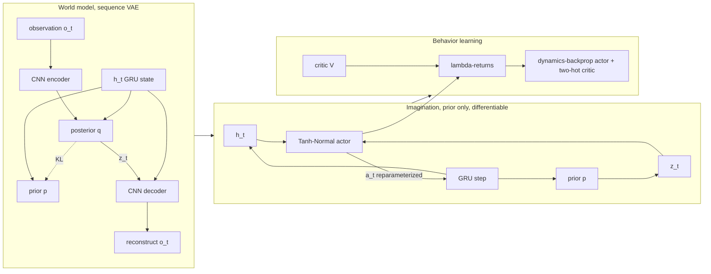

# A12 - world models (RSSM and DreamerV3)

A world model learns the environment's dynamics from observations and then trains a policy on
trajectories imagined inside that model, instead of on millions of real interactions. This
assignment builds the core of DreamerV3: a recurrent state-space model (RSSM) trained as a sequence
variational autoencoder (VAE), and a continuous actor-critic trained entirely on latent rollouts
imagined by that model, with the policy gradient flowing back through the differentiable dynamics
into the action.

This is the first assignment in the course that uses reinforcement learning, so the notes build the
vocabulary from the beginning: what a reward, a return, a value, a policy, and a policy gradient
are, before any of them is used to explain DreamerV3. On top of that they cover the
deterministic-plus-stochastic latent split, categorical latents and how to differentiate through a
discrete sample, the symlog and two-hot encodings that make one configuration work across reward
scales, the two weighted KL terms with free bits, lambda-returns, and the choice between the two
policy-gradient estimators.

Build the RSSM cell, the world-model ELBO, and the imagined actor-critic from scratch, then train a
continuous policy on dm_control cartpole-balance from 64x64 pixels. The policy never sees a real
frame during behavior learning; it learns to balance the pole inside imagination and then transfers
to the real environment. The mechanism tests run on CPU in seconds; the full training run needs a
GPU and is a separate multi-hour job.

Required reading before starting:
- Hafner, Pasukonis, Ba, Lillicrap 2023, "Mastering Diverse Domains through World Models"
  (DreamerV3), [arXiv:2301.04104](https://arxiv.org/abs/2301.04104).
- Hafner, Lillicrap, Ba, Norouzi 2019, "Dream to Control: Learning Behaviors by Latent Imagination"
  (Dreamer), [arXiv:1912.01603](https://arxiv.org/abs/1912.01603).
- Hafner, Lillicrap, Fischer, Villegas, Ha, Lee, Davidson 2018, "Learning Latent Dynamics for
  Planning from Pixels" (PlaNet), [arXiv:1811.04551](https://arxiv.org/abs/1811.04551).

## Lecture notes

### The reinforcement learning setup

Reinforcement learning (RL) is control of a plant whose dynamics are unknown, against a scalar
performance signal rather than a quadratic cost, with the state hidden behind a sensor. Its
vocabulary differs from the control literature's, and the rest of these notes uses it constantly, so
it is set out here first.

The *environment* is the system being controlled. Here it is the DeepMind Control Suite's
cartpole-balance task: a cart on a rail with a pole hinged on top, starting near upright. At each
discrete step the environment is in a state $s_t$, the *agent* applies an *action* $a_t$ (for
cartpole, one horizontal force in $[-1, 1]$), and the environment advances to $s_{t+1}$ and emits a
scalar *reward* $r_t$. cartpole-balance pays $r_t \in [0, 1]$ per environment step, close to 1 while
the pole is near vertical and the cart near the middle of the rail. That is a *dense* reward: every
single step carries usable signal, unlike a sparse task that pays only on eventual success. A run
from a reset to a fixed time limit is an *episode*, and this task has no early termination - the
pole cannot fall far enough to end the run.

The dynamics are assumed *Markov* in $s_t$: the distribution of $s_{t+1}$ and $r_t$ depends on
$s_t$ and $a_t$ and on nothing earlier. That is the same assumption a state-space model makes, and
it is why the whole problem can be phrased in terms of a state rather than a history.

A *policy* $\pi(a \mid s)$ is the controller: a distribution over actions given the state. It is a
distribution rather than a deterministic map for two reasons. Sampling from it is how the agent
tries actions it has not tried before, which is the only way it can discover that a different force
would have done better. And a distribution has a smooth dependence on its parameters, which a hard
argmax does not, so it can be improved by gradient descent.

What gets maximized is not the immediate reward but the *return*, the discounted sum of all future
rewards from step $t$ onward:

$$G_t = \sum_{k=0}^{\infty} \gamma^k\, r_{t+k}, \qquad \gamma \in [0, 1).$$

The *discount* $\gamma$ does two jobs. It keeps the sum finite over an unbounded horizon, and it
weights nearby rewards more than distant ones. The geometric weights sum to $1/(1-\gamma)$, which is
the useful reading of $\gamma$: it is an effective horizon in steps. This build uses
$\gamma = 0.997$, so the return looks roughly $1/(1 - 0.997) \approx 333$ steps ahead. The
objective of the whole exercise is to find a $\pi$ maximizing $\mathbb{E}_\pi[G_0]$.

The state $s_t$ is not what the agent gets to see. The observation $o_t$ is a $64\times64$ RGB
render of the scene, and a single frame fixes the cart position and pole angle but not their
velocities. This is a partially observed problem, and a memoryless policy $\pi(a \mid o_t)$ cannot
solve it. The standard fix is the same one a Bayes filter uses: maintain a running summary of every
observation and action so far that is sufficient to predict the future. In estimation that summary
is the *belief state*. Everything in the RSSM is machinery for learning one from pixels when no
analytic motion model is available.

Two families of method attack $\max_\pi \mathbb{E}[G_0]$. *Model-free* RL never writes down the
dynamics: it fits the policy, or a value function, directly from logged transitions
$(o_t, a_t, r_t, o_{t+1})$. *Model-based* RL fits a dynamics model first and then uses it to plan or
to train a policy. The figure of merit that separates them is *sample efficiency*, the number of
real environment steps needed to reach a given return. Model-free methods on pixels routinely need
tens or hundreds of millions of steps; a real robot cannot supply those. A model-based method pays
for real steps only to fit the model, and then generates as many extra steps as it likes for free.

Compared with what a classical controls background already supplies: given a known linear model and
a quadratic cost, LQR solves this problem in closed form, and MPC solves it online by rolling the
model forward and optimizing over an action sequence. RL is the case where the model is unknown, the
cost is an arbitrary scalar the designer picked, and the state arrives as an image. DreamerV3's
answer is close in spirit to MPC: learn the model from pixels, and then do the optimization inside
the learned model instead of the real world.

### Why model-based, and why latent

The obstacle for two decades was that learning an accurate dynamics model from high-dimensional
observations such as camera frames is hard, and small per-step errors compound over a rollout into a
useless prediction. Predicting the next $64\times64\times3$ frame directly means fitting 12288
numbers per step, most of which are irrelevant to control, and then feeding the model's own imperfect
output back in as the next input.

PlaNet (Hafner et al. 2018) made the prediction problem tractable by moving it into a compact latent
space and splitting the latent state into two parts. A deterministic recurrent state $h_t$, carried
by a gated recurrent unit (GRU, described two sections below), holds everything the past determined
for certain. A stochastic latent $z_t$ holds what is still uncertain at step $t$. A purely
stochastic recurrence is hard to optimize because every step's gradient has to pass through a random
sample; a purely deterministic one cannot represent "the agent might be behind either door." Running
both in parallel keeps the memory differentiable and still models uncertainty. This split is the
RSSM, and every model in the Dreamer family is built on it.

Dreamer (Hafner et al. 2019) added the second half: train an actor and a critic purely on
trajectories rolled out inside the learned model, with no environment steps during behavior
learning. Because the rollout lives in latent space, no pixel is decoded during policy training, and
thousands of short futures can be imagined per gradient step. Dreamer showed that imagined rollouts
alone are enough to learn competitive policies from images, and that for continuous control the
imagined return can be backpropagated through the differentiable dynamics into the action. This assignment is built
around that analytic policy gradient.

DreamerV2 (Hafner et al. 2020, "Mastering Atari with Discrete World Models",
[arXiv:2010.02193](https://arxiv.org/abs/2010.02193)) changed the latent from a Gaussian to a set of
categorical distributions and was the first model-based agent to reach human-level Atari. DreamerV3
then made the method work across very different domains (continuous control, Atari, Minecraft, with
rewards ranging from $[0, 1]$ to the hundreds) without per-task tuning. The pieces that let one
configuration generalize are the lesson here: categorical latents with the straight-through
estimator and a uniform mixture (unimix), the symlog transform with two-hot target encoding for
scale invariance, the two separately-weighted KL terms with free bits, and the choice of actor
gradient. DreamerV3 later collected the diamond in Minecraft from scratch, a long-standing
benchmark, which is the result that drew wide attention.

### The four-part loop

The diagram is a map of the pieces and the order they run in. Every label on it - posterior, prior,
KL, lambda-return, critic, Tanh-Normal actor - is defined in a section below.



The world model is trained on real sequences with the posterior, which sees each frame. Behavior is
trained on imagined sequences with the prior, with no frames and no decoder. For continuous control
the imagined rollout is kept differentiable end to end, so the gradient of the imagined return flows
back through the dynamics into the action.

### Prior and posterior as a learned Bayes filter

The words *prior* and *posterior* run through the whole assignment, and the fastest way in is the
Bayes filter, which alternates the same two steps.

A Bayes filter maintains a distribution over the hidden state given everything seen so far. Its
predict step pushes that distribution through the motion model to get $p(s_t \mid o_{1:t-1})$, the
belief before the new measurement arrives. Its update step folds in the new measurement to get
$p(s_t \mid o_{1:t})$, the belief after. In the Kalman filter those are the propagate and the
correct equations, and both are computed from a motion model and a measurement model that were
written down by hand.

The RSSM keeps that structure and learns both pieces instead. The *prior* $p(z_t \mid h_t)$ is the
predict step: given the recurrent summary of the past, what is the latent likely to be before
looking at the new frame. The *posterior* $q(z_t \mid h_t, o_t)$ is the update step: the same
question after looking. Three things differ from the Kalman case. Both distributions are small
neural networks rather than closed-form Gaussian updates. The latent has no assigned physical
meaning - nothing forces a coordinate of $z_t$ to be a pole angle - so the state is whatever is
convenient for predicting the future. And because neither is derived from a hand-written model,
nothing automatically makes the predict step agree with the update step; that agreement has to be
trained in, and it is trained in by penalizing the divergence between the two.

That penalty carries the entire assignment. During world-model training the posterior runs, because
real frames are available. During imagination only the prior runs, because there are no frames to
condition on. If the prior disagrees with the posterior, then an imagined rollout drifts into
latent states the decoder and the reward head were never trained on, and their predictions there are
arbitrary. Pushing the prior toward the posterior keeps imagined states inside the region the rest of
the model was actually fit on.

### The GRU

The deterministic half of the RSSM state is carried by a gated recurrent unit (Cho et al. 2014), a
recurrent layer with a learned, input-dependent blend between keeping the old state and replacing
it. Start from something more familiar. A first-order lag, or a complementary filter, updates a
running estimate as

$$h_t = \alpha\, h_{t-1} + (1 - \alpha)\, \tilde h_t,$$

a convex blend of the old state and a new candidate with a fixed scalar $\alpha$. The GRU is that
update with $\alpha$ promoted to a vector-valued function of the input and the current state:

$$u_t = \sigma\big(W_u [\,x_t,\, h_{t-1}\,]\big), \qquad
g_t = \sigma\big(W_g [\,x_t,\, h_{t-1}\,]\big),$$
$$\tilde h_t = \tanh\big(W [\,x_t,\, g_t \odot h_{t-1}\,]\big), \qquad
h_t = u_t \odot h_{t-1} + (1 - u_t) \odot \tilde h_t,$$

with $\sigma$ the logistic sigmoid, $\odot$ elementwise multiplication, and the bias terms dropped
for readability. The *update gate* $u_t$ lies in $(0, 1)$ per coordinate and decides, separately for
each coordinate and separately at each step, how much of the old value survives; $u_t \approx 1$
holds a coordinate constant for many steps, $u_t \approx 0$ overwrites it. The *reset gate* $g_t$
decides how much of the old state the candidate $\tilde h_t$ is even allowed to look at. ($g$ rather
than the usual $r$, which is already the reward here.) This is the polarity PyTorch's `nn.GRUCell`
uses.

Two properties matter. The gates are functions of the data, so the layer can hold one coordinate
steady while rewriting another - a learned, per-coordinate time constant rather than a fixed one.
And because $h_t$ depends on $h_{t-1}$ through an additive path with coefficient $u_t$ rather than
through a matrix product, the gradient of a loss at step $T$ with respect to $h_0$ picks up a factor
of roughly $\prod_t u_t$ instead of a product of Jacobians. When the gates stay near 1 that product
does not shrink, so gradients survive a long rollout. That is the whole reason a gated recurrence is
used here instead of a plain $h_t = \tanh(W[x_t, h_{t-1}])$.

### The RSSM cell

Each step runs the deterministic recurrence and then the stochastic latent:

$$h_t = \mathrm{GRU}\big(h_{t-1},\ W_{\text{in}}[\,z_{t-1},\ a_{t-1}\,]\big),\qquad
z_t \sim q(z_t \mid h_t, o_t)\ \text{(training)}\quad\text{or}\quad p(z_t \mid h_t)\ \text{(imagination)}.$$

$W_{\text{in}}$ is a single linear layer projecting the concatenated previous latent and previous
action down to the GRU's input width. $h_t$ is a plain deterministic vector, 512-wide here. $z_t$ is
a set of $n_{\text{cat}}$ categorical variables, each over $n_{\text{cls}}$ classes, flattened into
one $n_{\text{cat}} \cdot n_{\text{cls}}$ vector of stacked one-hots. The prior $p(z_t \mid h_t)$ is
a multilayer perceptron (MLP) from $h_t$ to the categorical logits; the posterior
$q(z_t \mid h_t, o_t)$ is an MLP from $[h_t, e_t]$, where $e_t$ is the CNN encoding of the
observation $o_t$. The full model state that every predictor conditions on is the concatenation
$[h_t, z_t]$. DreamerV3 uses $n_{\text{cat}} = n_{\text{cls}} = 32$, so $z_t$ is 1024-dimensional.
The action enters the GRU input alongside $z_{t-1}$; for cartpole it is a single continuous force
$a_{t-1} \in [-1, 1]$, and the same cell handles a discrete one-hot action when the task is
discrete.

Note the ordering inside one step: $h_t$ is advanced with the *previous* action and latent, and only
then are the prior and posterior read off $h_t$. The recurrence therefore never sees $o_t$ before
predicting from it, so the prior is a genuine one-step-ahead prediction.

### Logits, one-hot samples, and the straight-through estimator

A categorical distribution over $n_{\text{cls}}$ classes is parameterized by a vector of *logits*,
unnormalized real scores, one per class. The softmax turns them into probabilities,
$\mathbf{p}_c = e^{\ell_c} / \sum_{c'} e^{\ell_{c'}}$, and a draw from the distribution is written as
a *one-hot* vector: all zeros except a 1 in the sampled coordinate. Representing the draw this way
lets a downstream linear layer consume it as an ordinary vector.

Discrete latents are used here rather than a Gaussian because the categorical does not have to place
probability mass everywhere between two modes. A Gaussian latent asked to represent "the pole is
falling left or falling right" has to put mass on the interpolation between them; a set of
categoricals can put mass on exactly two settings and nothing in between. Replacing the Gaussian
latent with categoricals is the change DreamerV2 introduced.

The problem is that sampling a one-hot is not differentiable. Nudging a logit does not move the
sampled vector at all until the argmax flips, at which point it jumps; the derivative is zero almost
everywhere and undefined on the boundary. Backpropagation has nothing to work with.

The straight-through estimator sidesteps this by using different values in the forward and backward
passes. The forward pass uses the hard one-hot; the backward pass pretends the softmax probabilities
were used instead:

$$z = \mathrm{onehot}(\text{sample}),\qquad
z_{\text{ST}} = (z - \mathbf{p}).\mathrm{detach}() + \mathbf{p}.$$

`detach` marks a tensor as a constant for the gradient computation. The forward value of
$z_{\text{ST}}$ is exactly $z$, because the detached $-\mathbf{p}$ cancels the added $\mathbf{p}$
numerically. But the detached part contributes no derivative, so
$\partial z_{\text{ST}} / \partial \boldsymbol{\ell}$ equals $\partial \mathbf{p} / \partial
\boldsymbol{\ell}$, the softmax Jacobian. The result is a biased gradient - it is the gradient of a
different function than the one that ran forward - traded for a gradient that exists at all. In
practice the bias is small enough that it works, and the same trick appears in the VQ tokenizer's
codebook lookup.

DreamerV3 adds unimix, a small uniform mixture blended into every categorical before sampling:

$$\mathbf{p} = (1 - u)\,\mathrm{softmax}(\boldsymbol{\ell}) + \frac{u}{n_{\text{cls}}},\qquad u = 0.01.$$

This floors every class probability at $u / n_{\text{cls}}$. Two things follow. No logit can be
driven to $-\infty$, which would otherwise make $\log \mathbf{p}$ and the KL terms below blow up.
And every class keeps a little probability, so a class the model has written off can still be
sampled and get gradient. The straight-through gradient flows through this blended $\mathbf{p}$, not
through the raw softmax.

This one path keeps the imagined rollout differentiable: $z_t$ carries gradient into the
dynamics even though the value that actually propagates forward is a discrete sample.

### symlog and two-hot encoding

These two transforms let one fixed hyperparameter set work on a task paying rewards in $[0, 1]$ and
on a task paying rewards in the hundreds, with no per-task retuning. Both attack the same failure:
squared-error regression onto a scalar target has a loss and a gradient that scale with the target's
magnitude, so a learning rate tuned for one reward scale is wrong for another.

symlog compresses large magnitudes while staying close to the identity near zero, and has an exact
inverse symexp:

$$\mathrm{symlog}(x) = \mathrm{sign}(x)\,\ln(|x| + 1),\qquad
\mathrm{symexp}(x) = \mathrm{sign}(x)\,(e^{|x|} - 1).$$

It is a logarithm made to work on both signs and to pass through the origin with slope 1. A reward
of 1 maps to 0.69, a reward of 1000 maps to 6.9. Regressing in symlog space therefore turns a
thousandfold spread in reward magnitude into a tenfold spread in target magnitude.

Two-hot encoding replaces scalar regression with classification over a fixed set of $n_{\text{bins}}
= 255$ bins. A cross-entropy loss over bins has a gradient bounded by 1 in magnitude no matter how
wrong the prediction is, whereas the gradient of $(\hat y - y)^2$ grows linearly in the error, so a
single outlier target can dominate an update. The bins sit in symlog space,
$\text{bins} = \mathrm{linspace}(-20, 20, 255)$, indexed $b_0 < b_1 < \dots < b_{254}$. To encode a
target $y$, push it through symlog and split the result across the two bins it falls between, with
weights linear in the distance to each:

$$b_i \le \mathrm{symlog}(y) \le b_{i+1},\qquad
w_{i+1} = \frac{\mathrm{symlog}(y) - b_i}{b_{i+1} - b_i},\quad w_i = 1 - w_{i+1}.$$

The label is a length-255 vector, zero everywhere except those two adjacent entries, which sum to 1
- hence "two-hot", a one-hot with the mass split between two neighbors so that a target landing
between bin centers is represented exactly rather than rounded.

To decode a predicted bin distribution, take its expectation over the bin positions and apply symexp
once:

$$\hat y = \mathrm{symexp}\!\Big(\textstyle\sum_k \mathbf{p}_k\, b_k\Big).$$

The round-trip is exact for a clean two-hot label: by construction
$w_i b_i + w_{i+1} b_{i+1} = \mathrm{symlog}(y)$, and $\mathrm{symexp}(\mathrm{symlog}(y)) = y$.

Keeping the bins in symlog space also keeps the decode bounded. If instead the bins were placed at
$\mathrm{symexp}(\mathrm{linspace}(-20, 20, 255))$ in raw value space, the outer buckets would sit at
$\mathrm{symexp}(20) \approx 4.85 \times 10^8$, and any small softmax tail mass landing there would
dominate the expectation and blow up the decoded reward. With symlog bins the expectation is a
convex combination of numbers in $[-20, 20]$, so moving a stray probability mass $\epsilon$ onto an
extreme bin shifts it by at most $40\epsilon$; with value-space bins the same $\epsilon$ moves the
decoded value by up to $\epsilon \cdot 5 \times 10^8$. This matches the canonical DreamerV3 implementation, where the bins are
$\mathrm{linspace}(-20, 20, 255)$ and the distribution applies symlog on the way in and symexp on the
way out.

### KL divergence, nats, and the variational bound

The KL divergence between two distributions over the same finite set is

$$\mathrm{KL}[\,q \,\|\, p\,] = \sum_c q_c \,\ln \frac{q_c}{p_c}.$$

It is non-negative, zero exactly when $q = p$, and asymmetric: $\mathrm{KL}[q \| p] \ne
\mathrm{KL}[p \| q]$ in general, which is why the two KL terms DreamerV3 uses below are genuinely
different objectives and not a redundant pair. Because the log is natural, the units are
*nats*; one nat is $1/\ln 2 \approx 1.443$ bits. The coding reading is the useful one: if samples
from $q$ are encoded with a code designed for $p$, the KL is the expected number of extra nats per
sample the mismatch costs. A KL of 1 nat means the prior is off by about one and a half bits per
step, which is the level DreamerV3's free-bits floor deliberately tolerates.

Now the objective. The world model is a latent-variable model: it claims each observation was
generated by first drawing a latent $z$ and then rendering $o$ from it. Fitting it by maximum
likelihood needs $\log p(o) = \log \int p(o \mid z)\, p(z)\, dz$, an integral over every possible
latent, which is intractable. The variational trick introduces a second network $q(z \mid o)$, the
posterior, that guesses which $z$ produced this particular $o$, and uses it to build a computable
lower bound on the intractable quantity. Multiply and divide by $q$ and apply Jensen's inequality,
which says $\log \mathbb{E}[X] \ge \mathbb{E}[\log X]$ for the concave logarithm:

$$\log p(o) \;=\; \log \mathbb{E}_{q(z \mid o)}\!\left[\frac{p(o \mid z)\,p(z)}{q(z \mid o)}\right]
\;\ge\; \mathbb{E}_{q(z \mid o)}\big[\log p(o \mid z)\big] - \mathrm{KL}\big[\,q(z \mid o) \,\|\, p(z)\,\big].$$

The right-hand side is the evidence lower bound (ELBO). Both of its terms are computable: the first
is a reconstruction log-likelihood, the second a KL between two distributions the networks emit
directly. Maximizing the ELBO pushes up a quantity that never exceeds $\log p(o)$, and the gap
between them is exactly $\mathrm{KL}[q(z \mid o) \| p(z \mid o)]$, the error in the posterior's
guess. Fitting a model this way is a variational autoencoder.

Reading the two terms as losses to minimize: the negative log-likelihood of a Gaussian with fixed
variance is $-\log \mathcal{N}(o; \hat o, \sigma^2 I) = \frac{1}{2\sigma^2}\|o - \hat o\|^2 +
\text{const}$, so a squared-error reconstruction loss is a Gaussian likelihood in disguise. The
negative log-likelihood of a Bernoulli with probability $\hat c$ against a target $c \in \{0, 1\}$
is $-[c \ln \hat c + (1 - c)\ln(1 - \hat c)]$, the binary cross-entropy (BCE). The negative
log-likelihood of a categorical against a soft label $\mathbf{y}$ is $-\sum_k y_k \ln \hat p_k$, the
cross-entropy, which the two-hot loss computes.

### The world-model ELBO

Applying the bound per step to a sequence, with the conditional prior $p(z_t \mid h_t)$ standing in
for the fixed $p(z)$ above, and adding the reward and continuation heads as two further
observations to reconstruct, gives the loss the assignment implements:

$$\mathcal{L} = \underbrace{\big\| \hat o_t - \mathrm{symlog}(o_t) \big\|^2}_{\text{reconstruction}}
+ \underbrace{\mathcal{L}_{\text{reward}}}_{\text{two-hot cross-entropy}}
+ \underbrace{\mathcal{L}_{\text{cont}}}_{\text{Bernoulli BCE}}
+ \mathcal{L}_{\text{KL}},$$

averaged over batch and time. The reward head predicts $r_t$ as a two-hot distribution over the 255
bins; the continuation head predicts $c_t \in \{0, 1\}$, the flag that is 0 when the episode ended at
this step and 1 otherwise, as a Bernoulli logit. On cartpole $c_t$ is 1 everywhere except the last
recorded step of an episode, but the head is needed in general because a return must stop
accumulating at a termination.

One implementation note that the equation hides: reconstruction is computed as
`F.mse_loss(recon, symlog(obs))`, a mean over batch, time, channels, and pixels rather than a sum
over pixels. The ELBO's arithmetic calls for a sum, so the relative weight of reconstruction against
the KL in this build is set by that averaging convention and by the fixed unit coefficient on each
term, not derived. The symlog on the observation target is nearly a no-op for images, which already
live in $[0, 1]$ where symlog is close to the identity; it is there so the same code path handles
observations of any magnitude. `viz.py` applies symexp to the decoder output before displaying it,
inverting the transform exactly.

The KL here is a different object from the KL in a $\beta$-VAE trained for image generation. There
the prior is a fixed $\mathcal{N}(0, I)$ and the KL pulls the posterior toward a chosen latent shape,
so that samples from the prior decode to plausible images. Here the prior is a learned network
conditioned on $h_t$, and the KL trains it to be a *predictor*: at imagination time the prior has to
generate $z_t$ with no observation available, and a prior that matches the posterior generates the
latents the decoder and reward head were fit on.

### Two KL terms, free bits, and weighting

A single KL term would push the prior and the posterior toward each other with one shared gradient,
and the trivial way to satisfy it is for the posterior to stop encoding anything the prior cannot
already predict - to throw away information from the frame rather than to improve the prediction.
DreamerV3 splits the KL into two separately-weighted terms, each with a stop-gradient
($\mathrm{sg}$, the same `detach` used in the straight-through estimator) on the opposite side, so
that the two directions can be weighted independently. This is the DreamerV3 form, not DreamerV2's
single 0.8/0.2 balance:

$$\mathcal{L}_{\text{dyn}} = \max\!\big(1,\ \mathrm{KL}[\,\mathrm{sg}(q)\ \|\ p\,]\big),\qquad
\mathcal{L}_{\text{rep}} = \max\!\big(1,\ \mathrm{KL}[\,q\ \|\ \mathrm{sg}(p)\,]\big),$$

$$\mathcal{L}_{\text{KL}} = \beta_{\text{dyn}}\,\mathcal{L}_{\text{dyn}} + \beta_{\text{rep}}\,\mathcal{L}_{\text{rep}},
\qquad \beta_{\text{dyn}} = 0.5,\ \ \beta_{\text{rep}} = 0.1.$$

Both terms are numerically the same KL up to which side is detached, but they deliver gradient to
different parameters. The dynamics term moves the prior toward the posterior, since the posterior is
frozen inside it. The representation term moves the posterior toward the prior, which keeps the
posterior from encoding detail the prior can never predict. The $5{:}1$ ratio means the prior is
pulled toward the posterior with five times the weight of the reverse pull, so the model's first
response to a mismatch is to predict better rather than to encode less. The test suite checks
exactly this proportionality: doubling $\beta_{\text{dyn}}$ must double the prior's gradient and
leave the posterior's untouched.

Free bits is the $\max(1, \cdot)$ clip. When the KL for a step is already below 1 nat, the clip
makes the term constant there, so its gradient is zero and the optimizer spends capacity on
reconstruction instead of on squeezing an already-predictable latent below a divergence that does not
matter. Since $z_t$ factorizes into $n_{\text{cat}}$ independent categorical heads, the joint KL is
the sum of the per-head KLs. The clip is applied to that single summed scalar per step and per term
- 1 nat for the whole latent - and the clipped values are then averaged over batch and time.
Clipping per head instead would put the effective floor at $n_{\text{cat}} = 32$ nats and
over-regularize the model badly. The suite asserts the floor is 1 and not $n_{\text{cat}}$.

### Imagination

Once the world model is trained, imagination rolls the dynamics forward with the prior only. Start
from a real state $(h_0, z_0)$ produced by running the posterior over a sequence drawn from the
*replay buffer*, the store of episodes collected in the real environment so far, then for
each step sample an action from the actor, advance $h_t = \mathrm{GRU}(h_{t-1}, W_{\text{in}}[z_{t-1},
a_{t-1}])$, and sample $z_t \sim p(z_t \mid h_t)$. No decoder runs and no environment is touched;
reward and value come from small MLP heads on $[h_t, z_t]$. Each step is one GRU step, one
categorical sample, and a couple of MLP evaluations, so imagining a large batch of short rollouts is
cheap - this build imagines 400 rollouts of 8 steps each per gradient update.

The starting states are detached from the world model's graph, so behavior learning never sends
gradient back into the world model; the two halves are optimized separately on the same batches.

The horizon is 8 steps here, against 15 in DreamerV3 at scale. The shortening is deliberate on a
short training run: every imagined return ends in a bootstrap from the critic, and an undertrained
critic contributes more error the further out that bootstrap sits.

One alignment detail matters. The reward of action $a_t$ is read from the post-action state
$s_{t+1} = (h_{t+1}, z_{t+1})$, not the pre-action state $s_t$. The reward for taking $a_t$ is a
consequence of where the action lands the agent, so the reward head is evaluated on the state after
the GRU step. Reading it one index early trains the actor on the reward it would have got for the
action it took last step, which is a plausible-looking off-by-one that quietly destroys the credit
assignment.

### Returns, values, and lambda-returns

Behavior learning needs a number to improve: an estimate of the return $G_t$ achievable from a given
state. Two ways to get one, and the mix between them is the lambda-return.

The direct way is to add up the rewards actually collected over the rollout. That estimate is
unbiased - it is a sample of the thing being estimated - but it has high variance, because it
accumulates the randomness of every action and every latent sample along the way, and it needs the
whole rollout before it can be computed.

The other way is to learn a *value function*, a network $V(s) \approx \mathbb{E}_\pi[G_t \mid s_t =
s]$ predicting the expected return from a state under the current policy. In actor-critic
terminology the value network is the *critic* and the policy is the *actor*: the critic scores
states, the actor picks actions, and each is trained against the other. With a critic in hand the
return can be *bootstrapped* - truncated after a few real steps and completed with the critic's
guess:

$$G^{(n)}_t = r_t + \gamma r_{t+1} + \dots + \gamma^{n-1} r_{t+n-1} + \gamma^n V(s_{t+n}),$$

the $n$-step return. Small $n$ has low variance, because only $n$ noisy rewards enter, but high bias,
because it inherits whatever the critic has wrong. Large $n$ is the reverse. There is no single right
$n$, and picking one is an unnecessary commitment.

The lambda-return averages all of them with geometrically decaying weights:

$$G^\lambda_t = (1 - \lambda) \sum_{n \ge 1} \lambda^{n-1} G^{(n)}_t, \qquad \lambda \in [0, 1].$$

The weights $(1-\lambda)\lambda^{n-1}$ sum to 1, so this is a proper average. $\lambda = 0$ recovers
the one-step return $G^{(1)}_t$, all bootstrap; $\lambda = 1$ recovers the full rollout, no
bootstrap. DreamerV3 uses $\lambda = 0.95$, weighting the short returns most but keeping a tail.

That infinite sum never has to be evaluated, because it satisfies a backward recursion. Substituting
$G^{(n)}_t = r_t + \gamma G^{(n-1)}_{t+1}$ and splitting off the $n = 1$ term gives

$$G^\lambda_t = r_t + \gamma\big((1 - \lambda) V(s_{t+1}) + \lambda\, G^\lambda_{t+1}\big),$$

one line per step, computed from the end of the rollout backward. Adding the continuation flag and
writing the horizon-$H$ boundary condition gives the form the assignment implements:

$$R_t = r_t + \gamma\, c_t \big((1 - \lambda)\,V_{t+1} + \lambda\, R_{t+1}\big),\qquad R_H = V_H,$$

with $\gamma = 0.997$, $\lambda = 0.95$, and $t$ running over $0, \dots, H-1$. The continuation flag
$c_t$ zeros both the bootstrap and the recursion tail at a termination, which is correct: nothing is
collected after the episode ends, so the return there is just $r_t$. The rollout is cut at $H$ and
closed with $R_H = V_H$, the critic's estimate of everything past the horizon.

### Training the critic

The critic outputs a two-hot distribution over the same 255 symlog-space bins as the reward head,
and is trained by cross-entropy against the two-hot encoding of the lambda-returns. The returns are
detached first, so the critic chases the target and the target does not move to meet the critic.

Even detached, the target is not stationary, because it was computed from the critic's own values at
the later states. Every critic update changes the targets for the next update, and a value function
regressing on a target derived from itself can drift or oscillate. The standard fix is a target
network: a frozen copy of the critic, used to compute targets, periodically overwritten from the live
weights. DreamerV3 uses a softer version. It keeps a slow copy whose weights follow the live ones by
an exponential moving average,

$$\theta_{\text{slow}} \leftarrow \rho\,\theta_{\text{slow}} + (1 - \rho)\,\theta, \qquad \rho = 0.98,$$

and adds a regularizer pulling the live critic's prediction toward the slow copy's prediction at the
same states. The slow copy is a low-pass filter on the weight trajectory; the regularizer damps fast
excursions without hard-freezing anything.

### Two ways to get a policy gradient

The actor has to be improved with respect to $\mathbb{E}[R]$, the imagined return. The gradient of an
expectation over a distribution that itself depends on the parameters cannot be taken by moving the
gradient inside the expectation, because the measure being averaged over is itself changing. There
are two standard estimators, and which one DreamerV3 uses depends on whether the action is discrete
or continuous.

REINFORCE, the *score-function* estimator, comes from a single identity. Write the expectation as an
integral and differentiate under it:

$$\nabla_\theta \int \pi_\theta(a) R(a)\, da = \int R(a)\, \nabla_\theta \pi_\theta(a)\, da
= \int \pi_\theta(a)\, R(a)\, \nabla_\theta \log \pi_\theta(a)\, da,$$

using $\nabla_\theta \log \pi_\theta = \nabla_\theta \pi_\theta / \pi_\theta$. The right-hand side is
an expectation under $\pi_\theta$ again, so it can be estimated by sampling:

$$\nabla_\theta\, \mathbb{E}[R] = \mathbb{E}\big[\,R\,\nabla_\theta \log \pi_\theta(a)\,\big].$$

In words: raise the log-probability of actions that returned more than expected, lower it for
actions that returned less. It needs no differentiable model, only the ability to evaluate
$\log \pi_\theta$ at a sampled action, so it works in any environment including a black-box
simulator.

The cost is variance. The estimator learns nothing about *how* the return depends on the action; it
only correlates the return with the log-probability. Subtracting a state-dependent baseline $b(s)$
from $R$ leaves the estimator unbiased, since $\mathbb{E}[b(s)\nabla_\theta \log \pi_\theta] =
b(s)\int \pi_\theta \nabla_\theta \log \pi_\theta\, da = b(s)\int \nabla_\theta \pi_\theta\, da =
b(s)\,\nabla_\theta 1 = 0$, and reduces the variance. The
canonical baseline is the critic, and $A_t = R_t - V(s_t)$ is called the *advantage*: how much better
this action's return was than the average from this state. That is the form the discrete
`actor_loss()` implements, with the advantage detached so only the log-probability carries gradient.
Even with a baseline, if the return barely changes with the action then $R - V$ is dominated by
sampling noise, and the signal-to-noise ratio of the estimator goes to zero.

Dynamics backprop, the *reparameterized* or *pathwise* estimator, uses the fact that the world model
is differentiable. Reparameterization moves the parameter dependence out of the sampling
distribution and into the sample: instead of drawing $a \sim \pi_\theta$, draw a fixed-distribution
noise variable $\varepsilon \sim \mathcal{N}(0, 1)$ and compute

$$a = \tanh(\mu_\theta + \sigma_\theta\, \varepsilon).$$

The distribution being averaged over is now $\varepsilon$'s, which does not depend on $\theta$, so
the gradient does move inside the expectation:

$$\nabla_\theta\, \mathbb{E}[R] = \mathbb{E}_\varepsilon\Big[\,\nabla_\theta R\big(a(\theta, \varepsilon)\big)\,\Big].$$

Because the imagined rollout is built from differentiable pieces, the chain rule runs all the way
back: $R \to V, r \to (h_{t+1}, z_{t+1}) \to a_t \to (\mu_\theta, \sigma_\theta)$, with the
straight-through estimator carrying the derivative across the categorical sample. Every step of the
rollout contributes a term, and each term is an analytic partial derivative $\partial R / \partial
a_t$ read out of the model rather than inferred from a correlation. That is why this estimator has
much lower variance: it asks the model which direction to move the force, instead of trying random
forces and noticing which ones happened to score better.

DreamerV3 uses REINFORCE for discrete actions and the reparameterized dynamics-backprop gradient for
continuous actions. cartpole-balance is the case that separates the two. Its reward is near-flat in
the action over a short horizon - a balanced pole earns close to 1 per step whether the force is
$0.1$ or $0.3$ - so $R - V$ is nearly independent of the sampled action and the score-function
estimate is mostly noise. Dynamics backprop still reads a small but consistent $\partial R /
\partial a$ out of the model, which averages into a usable direction.

### The continuous actor and the entropy bonus

The continuous actor is a Tanh-Normal policy: a Normal distribution squashed through a tanh so its
support is the valid action range. The actor MLP maps $[h_t, z_t]$ to $(\mu, \log\sigma)$ for the
1-D force; an action is $a = \tanh(\mu + \sigma\,\varepsilon)$, which is bounded in $(-1, 1)$ by
construction and differentiable in $(\mu, \log\sigma)$. Parameterizing $\log\sigma$ rather than
$\sigma$ keeps the standard deviation positive without a constraint. It is clamped to
$[\log(0.1), \log(2.0)]$; the floor keeps a little exploration noise so the policy cannot collapse
to a delta, and the ceiling keeps the pre-tanh spread from growing so wide that almost every sample
saturates the tanh at $\pm 1$.

The loss is the negative normalized return plus an entropy bonus:

$$\mathcal{L}_\pi = -\,\frac{\mathbb{E}[R]}{\max(1, S)} - \eta\, \mathbb{E}[\mathcal{H}(\pi)],$$

with no log-probability term and no detached advantage, because the return itself is differentiable
through the dynamics.

The entropy $\mathcal{H}(\pi) = -\mathbb{E}[\log \pi(a)]$ measures how spread out the action
distribution is. For a Normal it is $\tfrac12 \ln(2\pi e \sigma^2)$, increasing in $\sigma$, so
subtracting $\eta\,\mathcal{H}$ from the loss is a direct pressure on $\sigma$ to stay large. Without
it a policy that has found any locally decent action shrinks $\sigma$ toward zero, stops sampling
alternatives, and stops learning. The code evaluates the entropy of the pre-tanh Normal rather than
of the squashed density, which drops the tanh log-determinant term; it is an approximation, and it
is the right sign and the right monotonicity in $\sigma$, which is all the bonus needs.

$S$ normalizes the return scale. It is an exponential moving average (decay 0.99) of the spread
between the 5th and 95th percentiles of the imagined returns in the batch, and the actor loss
divides by $\max(1, S)$. Dividing the return by its own spread makes the gradient magnitude
independent of the units the reward happens to be in, which lets the entropy coefficient
$\eta = 10^{-4}$ stay fixed across tasks - it is trading off against a normalized quantity rather
than against raw reward. Clamping the divisor below at 1 stops a task whose returns are all nearly
equal from being amplified into pure noise.

### Where this goes next

The world-model-then-plan-in-latent-space framing reappears in embodied AI and
vision-language-action (VLA) models, the topic of the capstone. DreamerV4 (Hafner, Yan, Lillicrap
2025, "Training Agents Inside of Scalable World Models",
[arXiv:2509.24527](https://arxiv.org/abs/2509.24527)) replaces the GRU-based RSSM with a transformer
plus flow-matching dynamics trained on offline video, which is where the RSSM lineage goes once it is
scaled. A second branch operates directly in pixel and video space: GAIA (Wayve, driving), Genie and
Genie 2 (DeepMind, interactive worlds), and DIAMOND (Alonso et al. 2024,
[arXiv:2405.12399](https://arxiv.org/abs/2405.12399), a diffusion world model in observation space).
These scale with data and model size and generate pixel-level output, optimized for visual fidelity
rather than control efficiency, and they need billions of parameters and large video corpora. A
third position is V-JEPA (Bardes et al. 2024, [arXiv:2404.08471](https://arxiv.org/abs/2404.08471)),
which learns dynamics by predicting future latent features and discards reconstruction entirely
(LeCun's argument that a good world model should predict in feature space, not pixel space). The
RSSM keeps reconstruction as a training signal to ground the latent in observations; JEPA-style
models drop it. The RSSM is the buildable core here because its latent is compact enough to imagine
thousands of rollouts per gradient step and it carries an explicit reward model, which together let a
policy ask "what happens if I take action $a$" and get a scored answer - the interface a world model
for control needs.

## The assignment

Fill these holes, in order. Each is one `NotImplementedError` with a matching test; the docstring in each file gives the signature, shapes, and constraints.

1. [`symlog()`](nets.py) in `nets.py`
2. [`symexp()`](nets.py) in `nets.py`
3. [`twohot_encode()`](nets.py) in `nets.py`
4. [`twohot_decode()`](nets.py) in `nets.py`
5. [`categorical_sample()`](nets.py) in `nets.py`
6. [`RSSMCell.forward_h()`](rssm.py) in `rssm.py`
7. [`RSSMCell.prior()`](rssm.py) in `rssm.py`
8. [`RSSMCell.posterior()`](rssm.py) in `rssm.py`
9. [`kl_loss()`](world_model.py) in `world_model.py`
10. [`WorldModel.loss()`](world_model.py) in `world_model.py`
11. [`compute_lambda_returns()`](actor_critic.py) in `actor_critic.py`
12. [`critic_loss()`](actor_critic.py) in `actor_critic.py`
13. [`imagine_dynamics()`](actor_critic.py) in `actor_critic.py`
14. [`actor_loss_dynbackprop()`](actor_critic.py) in `actor_critic.py`
15. [`actor_loss()`](actor_critic.py) in `actor_critic.py`

### Running and validating

Activate the environment (`conda activate nanovision`), then:

```
make test     A=a12_world_models   # run the tests against the top-level files (the ones with holes)
make verify   A=a12_world_models   # run the same tests against the reference solution/
make viz      A=a12_world_models   # render the figures from the reference solution
make viz-mine A=a12_world_models   # render the figures from your own code (once the holes are filled)
```

`make test` is the command to run while working. It runs the suite in
`assignments/a12_world_models/tests/` against the top-level files and goes from red (the holes raise
`NotImplementedError`) to green as they are filled in. `make verify` runs the identical suite against
the reference answer key in `solution/`: it sets `NANOVISION_IMPL=solution`, so the tests import the
reference instead of the top-level files. `make verify` is green from the start, so it shows the
target and confirms the tests and environment work before anything changes. The goal is to bring
`make test` to the same green as `make verify`.

The suite checks the symlog inverse and the two-hot round-trip; the straight-through gradient
matching the blended-prob gradient and the unimix floor; the cell, observe, encoder/decoder, and
continuous-actor sample shapes; a float64 gradcheck (comparing analytic gradients against
finite-difference ones in double precision) on a single RSSM step, the categorical KL, and the
lambda-returns; an exact hand-computed 3-step return including a $c_t = 0$ termination; the
free-bits clamp value and that the floor is 1 nat on the summed KL (not $n_{\text{cat}}$ nats) and
that doubling one $\beta$ doubles only that side's gradient; the Tanh-Normal sample in $(-1, 1)$ with
a nonzero reparameterized gradient and the $\log(0.1)$ log-std floor; that the imagined return has a
nonzero gradient with respect to the actor parameters through the dynamics; an overfit where
reconstruction MSE drops below 0.05 within 400 steps while each summed KL term settles in a loose
band around the 1-nat floor; that the prior rollout is finite, calls no decoder, and depends on the
action; and the dm_control wrapper resetting, stepping, and rendering $(3, 64, 64)$ (skipped when
dm_control is absent). dm_control / MuJoCo is a heavy optional dependency isolated to `env.py` and
`viz.py` with lazy imports, so the graded mechanism tests run on CPU without it.

`make viz` renders from the reference solution, so it works on a fresh checkout before any holes are
filled and shows the target figures. `make viz-mine` runs the same script against the top-level code,
which is the way to eyeball whether a finished implementation behaves. Both write PNGs to `out/`
rather than opening a window: the plots use matplotlib's headless Agg backend, so the commands behave
the same over SSH, in WSL, and in CI with no display, and the figures are viewable inline in VSCode.
Add `SHOW=1` (for example `make viz-mine A=a12_world_models SHOW=1`) to also open interactive windows
when a display is available. The figures are `training_curves.png` (greedy real-env return against
the random and optimal lines), `replay_vs_recon.png` (real frames over the symexp reconstruction),
`imagination_filmstrip.png` (a decoded prior-only rollout under the trained actor), and
`policy_transfer.png` (the dynamics-backprop-vs-REINFORCE contrast).

The viz and the full training run need a CUDA GPU and a working MuJoCo GL backend (`MUJOCO_GL=egl`).
They also need dm_control, which is not in `environment.yml` by default because it is heavy and the
graded tests skip it; install it with `pip install dm_control` (or uncomment the `dm_control` line in
`environment.yml`) before running viz or training.
The full collect-fit-imagine run is a documented multi-hour job: about 400 iterations, roughly 100
updates each, about 1-2 hours on a single 12GB GPU. Each iteration collects one real episode with the
current actor and appends it to a replay buffer, then runs 100 updates in which a world-model step on
a replayed batch and an actor and critic step on freshly imagined rollouts are interleaved. It is not
run in CI. A healthy world-model curve shows
reconstruction falling fast in the first iterations (measured around 0.001 MSE) while the KL terms
hold near the 1-nat free-bits floor; a KL that runs away to tens of nats or collapses to 0 signals a
sign error in the dynamics or representation term.

What you should see when you run this. The reference run trained the continuous dynamics-backprop
actor on dm_control cartpole-balance from 64x64 pixels on a single 12GB GPU, against an optimal
return of about 500, with the random policy at about 214. Evaluated greedily (taking the mean action
instead of sampling) across episodes, the continuous actor reaches a real-env return above 300, best
around 350-375 across seeds. The policy is trained purely on imagined rollouts and then run in the
real environment, so this is the imagination-to-real transfer the "Dream to Control" paper reports. A
discrete REINFORCE actor on the same task collapses to around 135, below the random baseline, which
is the collapse the two-estimators section predicts on a near-flat continuous-control reward. These
numbers vary with seed and training length. The toy reaches "clearly beats random and balances the
pole," not "optimal," and that gap is a scale and compute artifact: the reference run is a small
model trained for a couple of hours on one GPU, where DreamerV3 at full scale uses a larger model,
longer training, and a much larger replay buffer to push cartpole to the ceiling. What this build
demonstrates is that a continuous policy learned entirely inside the imagined world model transfers
to the real cartpole and clears the random baseline without collapse, and that the discrete REINFORCE
gradient does not on this near-flat reward.

## Further reading

- PlaNet, [arXiv:1811.04551](https://arxiv.org/abs/1811.04551) - introduces the RSSM and the latent
  sequence-VAE objective. Read before Dreamer.
- Dreamer, [arXiv:1912.01603](https://arxiv.org/abs/1912.01603) - adds the actor-critic trained by
  latent imagination, including the dynamics-backprop gradient for continuous control.
- DreamerV2, [arXiv:2010.02193](https://arxiv.org/abs/2010.02193) - categorical latents and KL
  balancing; first model-based agent at human-level Atari.
- DreamerV3, [arXiv:2301.04104](https://arxiv.org/abs/2301.04104) - the build target. symlog,
  two-hot, free bits, the two weighted KL terms, unimix, and REINFORCE-or-dynamics-backprop by action
  type, one configuration across domains.
- Sutton and Barto, "Reinforcement Learning: An Introduction" (2nd ed., 2018) - the standard
  reference for returns, value functions, TD(lambda), and the policy-gradient theorem, if the RL
  vocabulary in these notes needs more than one page of treatment.
- DIAMOND, [arXiv:2405.12399](https://arxiv.org/abs/2405.12399) - replaces the RSSM latent with a
  diffusion model in observation space; a contrast showing pixel-space diffusion world models are
  competitive on Atari 100k.
- DreamerV4, [arXiv:2509.24527](https://arxiv.org/abs/2509.24527) - where the RSSM lineage goes: a
  transformer plus flow-matching dynamics trained on offline video, then fine-tuned with RL.
- V-JEPA, [arXiv:2404.08471](https://arxiv.org/abs/2404.08471) - the reconstruction-free contrast:
  learn dynamics by predicting future latent features instead of reconstructing frames.
