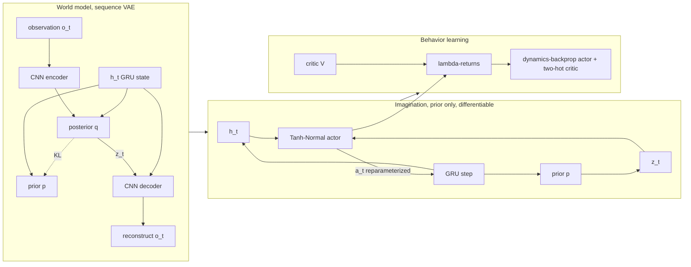

# A12 - world models (RSSM and DreamerV3)

A world model learns the environment's dynamics from observations and then trains a policy on
trajectories imagined inside that model, instead of on millions of real interactions. This
assignment builds the core of DreamerV3: a recurrent state-space model (RSSM) trained as a sequence
variational autoencoder (VAE), and a continuous actor-critic trained entirely on latent rollouts
imagined by that model, with the policy gradient flowing back through the differentiable dynamics
into the action. The notes cover the deterministic-plus-stochastic latent split, categorical latents
with the straight-through estimator, the symlog and two-hot encodings that make one configuration
work across reward scales, the two weighted KL terms with free bits, lambda-returns, and the choice
between a REINFORCE gradient and a dynamics-backprop gradient for the actor.

Build the RSSM cell, the world-model ELBO, and the imagined actor-critic from scratch, then train a
continuous policy on dm_control cartpole-balance from 64x64 pixels. The policy never sees a real
frame during behavior learning; it learns to balance the pole inside imagination and then transfers
to the real environment. The mechanism tests run on CPU in seconds; the full training run needs a
GPU and is a separate multi-hour job.

Required reading before starting:
- Hafner, Lillicrap, Ba, Norouzi 2023, "Mastering Diverse Domains through World Models" (DreamerV3),
  [arXiv:2301.04104](https://arxiv.org/abs/2301.04104).
- Hafner, Lillicrap, Ballas, Norouzi 2019, "Dream to Control: Learning Behaviors by Latent
  Imagination" (Dreamer), [arXiv:1912.01603](https://arxiv.org/abs/1912.01603).
- Hafner, Lillicrap, Fischer, Villegas, Ha, Lee, Davidson 2018, "Learning Latent Dynamics for
  Planning from Pixels" (PlaNet), [arXiv:1811.04551](https://arxiv.org/abs/1811.04551).

## Lecture notes

### Why model-based, and why latent

Model-based reinforcement learning learns a model of the environment's dynamics and uses it to plan
or to train a policy, instead of learning a policy directly from real interactions. The motivation
is sample efficiency: a real robot step is expensive, a simulated step inside a learned model is
cheap. The obstacle for two decades was that learning an accurate dynamics model from
high-dimensional observations such as camera frames is hard, and small per-step errors compound over
a rollout into a useless prediction.

PlaNet (Hafner et al. 2018) made the prediction problem tractable by moving it into a compact latent
space and splitting the latent state into two parts. A deterministic recurrent state $h_t$, carried
by a gated recurrent unit (GRU), holds everything the past determined for certain. A stochastic
latent $z_t$ holds what is still uncertain at step $t$. A purely stochastic recurrence is hard to
optimize because every step's gradient passes through a sample; a purely deterministic one cannot
represent "the agent might be behind either door." Running both in parallel keeps the memory
differentiable and still models uncertainty. This split is the RSSM, the architectural backbone of
the whole Dreamer family.

Dreamer (Hafner et al. 2019) added the second half: train an actor and a critic purely on
trajectories rolled out inside the learned model, with no environment steps during behavior
learning. Because the rollout lives in latent space, no pixel is decoded during policy training, and
thousands of short futures can be imagined per gradient step. Dreamer showed that imagined rollouts
alone are enough to learn competitive policies from images, and that for continuous control the
imagined return can be backpropagated through the differentiable dynamics into the action. That
analytic policy gradient is the center of this assignment.

DreamerV2 (Hafner et al. 2020, "Mastering Atari with Discrete World Models",
[arXiv:2010.02193](https://arxiv.org/abs/2010.02193)) changed the latent from a Gaussian to a set of
categorical distributions and was the first model-based agent to reach human-level Atari. DreamerV3
then made the method work across very different domains (continuous control, Atari, Minecraft, with
rewards ranging from $[0, 1]$ to the hundreds) without per-task tuning. The pieces that let one
configuration generalize are the lesson here: categorical latents with the straight-through
estimator and a uniform mixture (unimix), the symlog transform with two-hot target encoding for
scale invariance, the two separately-weighted KL terms with free bits, and the choice of actor
gradient (a reparameterized dynamics-backprop gradient for continuous actions, REINFORCE for
discrete). DreamerV3 later collected the diamond in Minecraft from scratch, a long-standing
benchmark, which is the result that drew wide attention.

### The four-part loop



The world model is trained on real sequences with the posterior, which sees each frame. Behavior is
trained on imagined sequences with the prior, with no frames and no decoder. The KL between
posterior and prior makes imagination work: it trains the prior to predict what the posterior would
have inferred, so a prior-only rollout stays on the manifold the posterior learned from data. For
continuous control the imagined rollout is kept differentiable end to end, so the gradient of the
imagined return flows back through the dynamics into the action.

### The RSSM cell

Each step runs a deterministic recurrence and a stochastic latent:

$$h_t = \mathrm{GRU}\big(h_{t-1},\ [\,z_{t-1},\ a_{t-1}\,]\big),\qquad
z_t \sim q(z_t \mid h_t, o_t)\ \text{(training)}\quad\text{or}\quad p(z_t \mid h_t)\ \text{(imagination)}.$$

$h_t$ is a deterministic vector. $z_t$ is a set of $n_{\text{cat}}$ categorical variables, each over
$n_{\text{cls}}$ classes, flattened to an $n_{\text{cat}} \cdot n_{\text{cls}}$ one-hot vector. The
prior $p(z_t \mid h_t)$ is an MLP from $h_t$ to the categorical logits; the posterior
$q(z_t \mid h_t, o_t)$ is an MLP from $[h_t, e_t]$, where $e_t$ is the CNN encoding of the
observation $o_t$. The full model state that every predictor conditions on is the concatenation
$[h_t, z_t]$. DreamerV3 uses $n_{\text{cat}} = n_{\text{cls}} = 32$ (1024 latent dimensions). The
action enters the GRU input alongside $z_{t-1}$; for cartpole it is a single continuous force
$a_{t-1} \in [-1, 1]$, and the same cell handles a discrete one-hot action when the task is discrete.

### Categorical latents and the straight-through estimator

Sampling a one-hot from a categorical is not differentiable, so the gradient cannot flow back to the
logits the normal way. The straight-through estimator uses the hard one-hot in the forward pass and
the softmax probabilities in the backward pass:

$$z = \mathrm{onehot}(\text{sample}),\qquad
z_{\text{ST}} = (z - \mathbf{p}).\mathrm{detach}() + \mathbf{p}.$$

The forward value is exactly $z$, because the detached terms cancel the added $\mathbf{p}$, and the
gradient $\partial z_{\text{ST}} / \partial \text{logits}$ equals $\partial \mathbf{p} /
\partial \text{logits}$, the gradient of the probabilities. DreamerV3 adds unimix, a small uniform
mixture that floors every probability so no logit can be driven to $-\infty$ and every class keeps a
little exploration probability:

$$\mathbf{p} = (1 - u)\,\mathrm{softmax}(\text{logits}) + \frac{u}{\text{n}_{\text{cls}}},\qquad u = 0.01.$$

The straight-through gradient flows through this blended $\mathbf{p}$, not the raw softmax. The same
path lets the imagined rollout stay differentiable: $z_t$ carries gradient through the dynamics even
though it is a discrete sample.

### The world-model ELBO

The world model is a sequence VAE. Its objective per sequence is reconstruction plus reward plus
continuation prediction, minus a KL that ties the prior to the posterior:

$$\mathcal{L} = \underbrace{\sum_t \big\| \hat o_t - \mathrm{symlog}(o_t) \big\|^2}_{\text{reconstruction}}
+ \underbrace{\mathcal{L}_{\text{reward}}}_{\text{two-hot CE}}
+ \underbrace{\mathcal{L}_{\text{cont}}}_{\text{Bernoulli BCE}}
+ \mathcal{L}_{\text{KL}}.$$

This KL is not the generic latent-shape regularizer of a $\beta$-VAE for image generation. It trains
the transition prior to be predictive: at imagination time the prior generates $z_t$ with no
observation, so a prior that matches the posterior keeps imagined rollouts realistic.

### Two KL terms, free bits, and weighting

DreamerV3 splits the KL into two separately-weighted terms, each with a stop-gradient
($\mathrm{sg} = \text{detach}$) on the opposite side. This is the DreamerV3 form, not DreamerV2's
single 0.8/0.2 balance:

$$\mathcal{L}_{\text{dyn}} = \max\!\big(1,\ \mathrm{KL}[\,\mathrm{sg}(q)\ \|\ p\,]\big),\qquad
\mathcal{L}_{\text{rep}} = \max\!\big(1,\ \mathrm{KL}[\,q\ \|\ \mathrm{sg}(p)\,]\big),$$

$$\mathcal{L}_{\text{KL}} = \beta_{\text{dyn}}\,\mathcal{L}_{\text{dyn}} + \beta_{\text{rep}}\,\mathcal{L}_{\text{rep}},
\qquad \beta_{\text{dyn}} = 0.5,\ \ \beta_{\text{rep}} = 0.1.$$

The dynamics term moves the prior toward the posterior (stop-gradient on $q$). The representation
term moves the posterior toward the prior (stop-gradient on $p$), which keeps the posterior from
collapsing onto observations the prior can never predict. The $5{:}1$ weight makes the prior chase
the posterior five times faster than the reverse.

Free bits is the $\max(1, \cdot)$ clip. Below 1 nat the KL gradient is zeroed, so the model does not
spend capacity squeezing already-predictable latents and uses it on reconstruction instead. The
categorical KL factorizes over the $n_{\text{cat}}$ heads, so the joint KL is the sum of the per-head
KLs; the free-bits clip is applied to that single summed scalar per term (1 nat for the whole term),
not per head. Clipping per head would set the floor at $n_{\text{cat}}$ nats and over-regularize.

### symlog and two-hot encoding

These two transforms make one fixed configuration work across reward scales. symlog compresses large
magnitudes while staying near the identity around zero, with an exact inverse symexp:

$$\mathrm{symlog}(x) = \mathrm{sign}(x)\,\ln(|x| + 1),\qquad
\mathrm{symexp}(x) = \mathrm{sign}(x)\,(e^{|x|} - 1).$$

Reconstruction targets are pushed through symlog before the squared error, so a bright pixel and a
dim pixel contribute on comparable scales.

Two-hot encoding turns scalar regression (reward, value) into classification over a fixed set of 255
bins, which a cross-entropy loss handles without exploding on an outlier the way squared error does.
The bins sit in symlog space, $\text{bins} = \mathrm{linspace}(-20, 20, 255)$. To encode a target
$y$, push it through symlog and split $\mathrm{symlog}(y)$ across the two bins it falls between, with
weights linear in the distance to each:

$$b_i \le \mathrm{symlog}(y) \le b_{i+1},\qquad
w_{i+1} = \frac{\mathrm{symlog}(y) - b_i}{b_{i+1} - b_i},\quad w_i = 1 - w_{i+1}.$$

To decode a predicted bin distribution, take the expectation over the bins and apply symexp once:

$$\hat y = \mathrm{symexp}\!\Big(\textstyle\sum_k \mathbf{p}_k\, b_k\Big).$$

The round-trip is exact for a clean two-hot label, because its expectation lands at
$\mathrm{symlog}(y)$ and $\mathrm{symexp}(\mathrm{symlog}(y)) = y$. Keeping the bins in symlog space
also keeps the decode bounded. If the bins were placed at $\mathrm{symexp}(\mathrm{linspace}(-20, 20,
255))$ in value space, the outer buckets would sit at $\mathrm{symexp}(20) \approx 4.85 \times 10^8$,
and any small softmax tail mass landing there would dominate the expectation and blow up the decoded
reward. This matches the canonical DreamerV3 implementation, where the bins are
$\mathrm{linspace}(-20, 20, 255)$ and the distribution applies symlog on the way in and symexp on the
way out.

### Imagination

Once the world model is trained, imagination rolls the dynamics forward with the prior only: start
from a real state $(h_0, z_0)$ encoded by the posterior, then for each step sample an action from the
actor, advance $h_t = \mathrm{GRU}(h_{t-1}, [z_{t-1}, a_{t-1}])$, and sample $z_t \sim p(z_t \mid
h_t)$. No decoder runs and no environment is touched; reward and value come from small MLP heads on
$[h_t, z_t]$. Each step is one GRU step, one categorical sample, and a couple of MLP evaluations, so
imagining a batch of short rollouts is cheap.

One alignment detail matters. The reward of action $a_t$ is read from the post-action state
$s_{t+1} = (h_{t+1}, z_{t+1})$, not the pre-action state $s_t$. The reward for taking $a_t$ is a
consequence of where the action lands the agent, so the reward head is evaluated on the state after
the GRU step.

### Actor-critic in imagination

The actor $\pi(a \mid h, z)$ and critic $V(h, z)$ train on imagined rollouts. The critic regresses
lambda-returns, a mix of n-step returns that trades bias against variance. DreamerV3 bootstraps on
the next-state value $V_{t+1}$:

$$R_t = r_t + \gamma\, c_t \big((1 - \lambda)\,V_{t+1} + \lambda\, R_{t+1}\big),\qquad R_H = V_H,$$

with $\gamma = 0.997$, $\lambda = 0.95$. The continuation flag $c_t$ (zero at an episode end) zeros
both the bootstrap and the recursion tail at termination. The critic outputs a two-hot distribution
over the 255 bins and is regressed onto the detached lambda-returns with the two-hot cross-entropy.
To stabilize the moving target, the critic is pulled toward a slow exponential moving average (EMA)
copy of its own weights, not a separate frozen target network.

### Dynamics backprop vs REINFORCE

There are two ways to turn an imagined return into a policy gradient.

REINFORCE, the score-function estimator, treats the return as a fixed weight on the log-probability
of the sampled action:

$$\nabla_\theta\, \mathbb{E}[R] = \mathbb{E}\big[\,R\,\nabla_\theta \log \pi_\theta(a)\,\big].$$

It needs no differentiable model and works on any environment. The cost is variance. The estimator
only sees how the return correlates with the chance of an action; if the return barely changes with
the action, the signal is buried in noise.

Dynamics backprop, the reparameterized or pathwise estimator, uses the fact that the world model is
differentiable. Write the action as a reparameterized sample $a = \tanh(\mu_\theta + \sigma_\theta\,
\varepsilon)$, $\varepsilon \sim \mathcal{N}(0, 1)$, and roll the imagined return through the
dynamics that the action drives. The gradient is then the analytic derivative of the return:

$$\nabla_\theta\, \mathbb{E}[R] = \mathbb{E}\Big[\,\nabla_\theta R\big(a(\theta, \varepsilon)\big)\,\Big],$$

with the gradient flowing $R \to V, r \to (h_{t+1}, z_{t+1}) \to a_t \to (\mu_\theta, \sigma_\theta)$.
This is dense and low-variance because it uses the model's own sensitivity of the return to the
action rather than a correlation between the action and its return.

DreamerV3 uses REINFORCE for discrete actions and the reparameterized dynamics-backprop gradient for
continuous actions, because the score-function estimator's variance is too high for continuous
control. cartpole-balance is the case that separates the two: the reward is near-flat in the action
over a short horizon (a balanced pole earns about 1 per step regardless of a small force
difference), so the score-function gradient is mostly noise while dynamics backprop gets a usable
analytic gradient.

The continuous actor is a Tanh-Normal policy. The actor MLP outputs $(\mu, \log\sigma)$ for the 1-D
force; an action is $a = \tanh(\mu + \sigma\,\varepsilon)$, so $a$ is bounded in $(-1, 1)$ and the
gradient flows through $a$ into $(\mu, \log\sigma)$. The log-std is clamped to a floor of $\log(0.1)$
so the policy keeps a little exploration noise and cannot collapse to a delta. The loss is the
negative normalized return plus an entropy bonus:

$$\mathcal{L}_\pi = -\,\frac{\mathbb{E}[R]}{\max(1, S)} - \eta\, \mathbb{E}[\mathcal{H}(\pi)],$$

with no log-prob and no detached advantage, because the return itself is differentiable through the
dynamics. $S$ is an EMA (decay 0.99) of the 5th-to-95th-percentile spread of returns, and dividing
by $\max(1, S)$ keeps the gradient scale invariant to the reward magnitude, so the entropy
coefficient $\eta = 10^{-4}$ does not have to be retuned per task.

### Where this goes next

The world-model-then-plan-in-latent-space framing reappears in embodied AI and
vision-language-action (VLA) models, the topic of the capstone. DreamerV4 (Hafner, Yan, Lillicrap
2025, "Training Agents Inside of Scalable World Models",
[arXiv:2509.24527](https://arxiv.org/abs/2509.24527)) replaces the GRU-based RSSM with a transformer
plus flow-matching dynamics trained on offline video, which is where the RSSM lineage goes once it is
scaled. A second branch operates directly in pixel and video space: GAIA (Wayve, driving), Genie and
Genie 2 (DeepMind, interactive worlds), and DIAMOND (Alonso et al. 2024,
[arXiv:2405.12399](https://arxiv.org/abs/2405.12399), a diffusion world model in observation space).
These scale with data and model size and generate pixel-level output, optimized for visual fidelity
rather than control efficiency, and they need billions of parameters and large video corpora. A
third position is V-JEPA (Bardes et al. 2024, [arXiv:2404.08471](https://arxiv.org/abs/2404.08471)),
which learns dynamics by predicting future latent features and discards reconstruction entirely
(LeCun's argument that a good world model should predict in feature space, not pixel space). The
RSSM keeps reconstruction as a training signal to ground the latent in observations; JEPA-style
models drop it. A compact latent, fast imagination, and an explicit reward model are what make the
RSSM the buildable core here, and what let a policy query "what happens if I take action $a$" - the
interface a world model for control needs.

## The assignment

Implement the RSSM cell, the world-model ELBO, and the imagined actor-critic; the CNN
encoder/decoder, the network bodies, the collect-fit-imagine training loop, the dm_control
environment wrapper, and the visualization script are provided. The docstrings in each file give the
signatures, shapes, and index conventions (length-$T$ arrays, the action-as-float convention, the
state layout); read those in the files. This section says which file maps to which concept from the
notes.

### Files to modify

`nets.py` carries the scalar-target encodings and the categorical sampler. Implement `symlog` /
`symexp` (the scale-invariant transform), `twohot_encode` / `twohot_decode` (the two-hot encoding
over symlog-space bins), and `categorical_sample` (the unimix blend plus the straight-through
estimate).

`rssm.py` is the RSSM cell. Implement `forward_h` (the GRU recurrence, one-hotting an integer action
and passing a continuous $(B, 1)$ float through unchanged), `prior` (the transition prior head), and
`posterior` (the observation-conditioned head). These three are the deterministic-plus-stochastic
latent split from the notes.

`world_model.py` is the sequence-VAE objective. Implement `kl_loss` (the two-term DreamerV3 KL with
free bits on the summed-over-heads scalar) and `WorldModel.loss` (the ELBO assembly: reconstruction
against `symlog(obs)`, the two-hot reward loss, the Bernoulli continuation loss, and the KL).

`actor_critic.py` is behavior learning in imagination. Implement `compute_lambda_returns` (the
backward recursion bootstrapping on $V_{t+1}$), `critic_loss` (two-hot regression onto the detached
returns), `imagine_dynamics` (the differentiable prior-only rollout that reads the reward of $a_t$
from the post-action state and keeps the whole graph attached, with no `no_grad`), and
`actor_loss_dynbackprop` (the negative normalized return minus the entropy bonus, with no log-prob).
The discrete `Actor` and its REINFORCE `actor_loss` stay in the file as the labeled contrast that
motivates the continuous gradient.

### Running and validating

Activate the environment (`conda activate nanovision`), then:

```
make test     A=a12_world_models   # run the tests against the top-level files (the ones with holes)
make verify   A=a12_world_models   # run the same tests against the reference solution/
make viz      A=a12_world_models   # render the figures from the reference solution
make viz-mine A=a12_world_models   # render the figures from your own code (once the holes are filled)
```

`make test` is the command to run while working. It runs the suite in
`assignments/a12_world_models/tests/` against the top-level files and goes from red (the holes raise
`NotImplementedError`) to green as they are filled in. `make verify` runs the identical suite against
the reference answer key in `solution/`: it sets `NANOVISION_IMPL=solution`, so the tests import the
reference instead of the top-level files. `make verify` is green from the start, so it shows the
target and confirms the tests and environment work before anything changes. The goal is to bring
`make test` to the same green as `make verify`.

The suite checks the symlog inverse and the two-hot round-trip; the straight-through gradient
matching the blended-prob gradient and the unimix floor; the cell, observe, encoder/decoder, and
continuous-actor sample shapes; a float64 gradcheck on a single RSSM step, the categorical KL, and
the lambda-returns; an exact hand-computed 3-step return including a $c_t = 0$ termination; the
free-bits clamp value and that the floor is 1 nat on the summed KL (not $n_{\text{cat}}$ nats) and
that doubling one $\beta$ doubles only that side's gradient; the Tanh-Normal sample in $(-1, 1)$ with
a nonzero reparameterized gradient and the $\log(0.1)$ log-std floor; that the imagined return has a
nonzero gradient with respect to the actor parameters through the dynamics; an overfit where
reconstruction MSE drops below 0.05 within 400 steps while each summed KL term settles near the
1-nat floor; that the prior rollout is finite, calls no decoder, and depends on the action; and the
dm_control wrapper resetting, stepping, and rendering $(3, 64, 64)$ (skipped when dm_control is
absent). dm_control / MuJoCo is a heavy optional dependency isolated to `env.py` and `viz.py` with
lazy imports, so the graded mechanism tests run on CPU without it.

`make viz` renders from the reference solution, so it works on a fresh checkout before any holes are
filled and shows the target figures. `make viz-mine` runs the same script against the top-level code,
which is the way to eyeball whether a finished implementation behaves. Both write PNGs to `out/`
rather than opening a window: the plots use matplotlib's headless Agg backend, so the commands behave
the same over SSH, in WSL, and in CI with no display, and the figures are viewable inline in VSCode.
Add `SHOW=1` (for example `make viz-mine A=a12_world_models SHOW=1`) to also open interactive windows
when a display is available. The figures are `training_curves.png` (greedy real-env return against
the random and optimal lines), `replay_vs_recon.png` (real frames over the symexp reconstruction),
`imagination_filmstrip.png` (a decoded prior-only rollout under the trained actor), and
`policy_transfer.png` (the dynamics-backprop-vs-REINFORCE contrast).

The viz and the full training run need a CUDA GPU and a working MuJoCo GL backend (`MUJOCO_GL=egl`).
They also need dm_control, which is not in `environment.yml` by default because it is heavy and the
graded tests skip it; install it with `pip install dm_control` (or uncomment the `dm_control` line in
`environment.yml`) before running viz or training.
The full collect-fit-imagine run is a documented multi-hour job: about 400 iterations, roughly 100
updates each, about 1-2 hours on a single 12GB GPU. It is not run in CI. A healthy world-model curve
shows reconstruction falling fast in the first iterations (measured around 0.001 MSE) while the KL
terms hold near the 1-nat free-bits floor; a KL that runs away to tens of nats or collapses to 0
signals a sign error in the dynamics or representation term.

What you should see when you run this. The reference run trained the continuous dynamics-backprop
actor on dm_control cartpole-balance from 64x64 pixels on a single 12GB GPU, against an optimal
return of about 500, with the random policy at about 214. Evaluated greedily across episodes, the
continuous actor reaches a real-env return above 300, best around 350-375 across seeds. The policy is
trained purely on imagined rollouts and then run in the real environment, so this is the
imagination-to-real transfer the "Dream to Control" paper reports. A discrete REINFORCE actor on the
same task collapses to around 135, below the random baseline, which is the collapse the
dynamics-backprop section predicts on a near-flat continuous-control reward. These numbers vary with
seed and training length. The toy reaches "clearly beats random and balances the pole," not
"optimal," and that gap is a scale and compute artifact: the reference run is a small model trained
for a couple of hours on one GPU, where DreamerV3 at full scale uses a larger model, longer training,
and a much larger replay buffer to push cartpole to the ceiling. What this build demonstrates is that
a continuous policy learned entirely inside the imagined world model transfers to the real cartpole
and clears the random baseline without collapse, and that the discrete REINFORCE gradient does not on
this near-flat reward.

## Further reading

- PlaNet, [arXiv:1811.04551](https://arxiv.org/abs/1811.04551) - introduces the RSSM and the latent
  sequence-VAE objective. Read before Dreamer.
- Dreamer, [arXiv:1912.01603](https://arxiv.org/abs/1912.01603) - adds the actor-critic trained by
  latent imagination, including the dynamics-backprop gradient for continuous control.
- DreamerV2, [arXiv:2010.02193](https://arxiv.org/abs/2010.02193) - categorical latents and KL
  balancing; first model-based agent at human-level Atari.
- DreamerV3, [arXiv:2301.04104](https://arxiv.org/abs/2301.04104) - the build target. symlog,
  two-hot, free bits, the two weighted KL terms, unimix, and REINFORCE-or-dynamics-backprop by action
  type, one configuration across domains.
- DIAMOND, [arXiv:2405.12399](https://arxiv.org/abs/2405.12399) - replaces the RSSM latent with a
  diffusion model in observation space; a contrast showing pixel-space diffusion world models are
  competitive on Atari 100k.
- DreamerV4, [arXiv:2509.24527](https://arxiv.org/abs/2509.24527) - where the RSSM lineage goes: a
  transformer plus flow-matching dynamics trained on offline video, then fine-tuned with RL.
- V-JEPA, [arXiv:2404.08471](https://arxiv.org/abs/2404.08471) - the reconstruction-free contrast:
  learn dynamics by predicting future latent features instead of reconstructing frames.
