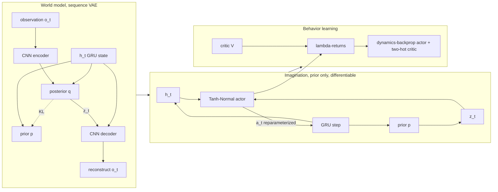

# A12 - world models (RSSM and DreamerV3)

You build the core of a latent-control world model: a recurrent state-space model (RSSM) trained
as a sequence variational autoencoder (VAE), then an actor-critic trained entirely on trajectories
imagined inside that model. The target is DreamerV3 ([Hafner et al., 2023, arXiv:2301.04104](https://arxiv.org/abs/2301.04104),
"Mastering Diverse Domains through World Models"), the latent-dynamics model that reaches strong
performance across many control tasks with one fixed hyperparameter set. The task is
dm_control cartpole-balance from 64x64 pixels: a continuous 1-D force, a dense reward, and a policy
that learns to balance the pole purely from imagined rollouts, then transfers to the real
environment.

## Motivation

Model-based reinforcement learning learns a model of the environment's dynamics and uses it to
plan or to train a policy, instead of learning a policy directly from millions of real
interactions. The promise is sample efficiency: a real robot step is expensive, a simulated step
inside a learned model is cheap. The obstacle for two decades was that learning an accurate
dynamics model from high-dimensional observations (camera frames) is hard, and small per-step
errors compound over a rollout into a useless prediction.

PlaNet ([Hafner et al., 2018, arXiv:1811.04551](https://arxiv.org/abs/1811.04551), "Learning
Latent Dynamics for Planning from Pixels") made the prediction problem tractable by moving it into
a compact latent space and splitting the latent state into two parts. A deterministic recurrent
state $h_t$, carried by a gated recurrent unit (GRU), holds everything the past determined for
sure. A stochastic latent $z_t$ holds what is still uncertain at step $t$. A purely stochastic
recurrence is hard to optimize because every step's gradient passes through a sample; a purely
deterministic one cannot represent "the agent might be behind either door." Running both in
parallel keeps the memory differentiable and still models uncertainty. This split is the RSSM, and
it is the architectural backbone of the whole Dreamer family.

Dreamer ([Hafner et al., 2019, arXiv:1912.01603](https://arxiv.org/abs/1912.01603), "Dream to
Control: Learning Behaviors by Latent Imagination") added the second half: train an actor and a
critic purely on trajectories rolled out inside the learned model, with no environment steps
during behavior learning. Because the rollout lives in latent space, you never decode a pixel
during policy training, and you can imagine thousands of short futures per gradient step. Dreamer
showed that imagined rollouts alone are enough to learn competitive policies from images, and that
for continuous control you can backpropagate the imagined return through the differentiable
dynamics into the action. This assignment centers on that analytic policy gradient.

DreamerV2 ([Hafner et al., 2020, arXiv:2010.02193](https://arxiv.org/abs/2010.02193), "Mastering
Atari with Discrete World Models") changed the latent from a Gaussian to a set of categorical
distributions and was the first model-based agent to reach human-level Atari. DreamerV3 then made
the method work across very different domains (continuous control, Atari, Minecraft, with rewards
ranging from $[0, 1]$ to the hundreds) without per-task tuning. The contributions that made one
configuration generalize are the lesson of this assignment: categorical latents with the
straight-through estimator and a uniform mixture (unimix), the symlog transform with two-hot target
encoding for scale invariance, the two separately-weighted KL terms with free bits, and the choice
of actor gradient (a reparameterized dynamics-backprop gradient for continuous actions, REINFORCE
for discrete). DreamerV3 later collected the diamond in Minecraft from scratch, a long-standing
benchmark, which is the result that drew wide attention.

Where this feeds later work: the world-model-then-plan-in-latent-space framing reappears in
embodied AI and vision-language-action (VLA) models, the topic of the capstone. DreamerV4
([Hafner, Yan, Lillicrap, 2025, arXiv:2509.24527](https://arxiv.org/abs/2509.24527), "Training
Agents Inside of Scalable World Models") replaces the GRU-based RSSM with a transformer plus
flow-matching dynamics trained on offline video, which is where the RSSM lineage goes once you
scale it. The transformer and the flow-matching objective are both prerequisites for
reading that paper.

## The four-part loop



The world model is trained on real sequences with the posterior (it sees each frame). Behavior is
trained on imagined sequences with the prior (no frames, no decoder). The KL between posterior and
prior lets imagination work: it trains the prior to predict what the posterior would have inferred,
so a prior-only rollout stays on the manifold the posterior learned from data. For continuous
control the imagined rollout is kept differentiable end to end, so the gradient of the imagined
return flows back through the dynamics into the action.

## Background

### The RSSM cell

Each step runs a deterministic recurrence and a stochastic latent:

$$h_t = \mathrm{GRU}\big(h_{t-1},\ [\,z_{t-1},\ a_{t-1}\,]\big),\qquad
z_t \sim q(z_t \mid h_t, o_t)\ \text{(training)}\quad\text{or}\quad p(z_t \mid h_t)\ \text{(imagination)}.$$

$h_t$ is a vector of width `h_dim`. $z_t$ is a set of `n_cat` categorical variables, each over
`n_cls` classes, flattened to a `n_cat * n_cls` one-hot vector. The prior $p(z_t \mid h_t)$ is an
MLP from $h_t$ to the categorical logits; the posterior $q(z_t \mid h_t, o_t)$ is an MLP from
$[h_t, e_t]$ where $e_t$ is the CNN encoding of $o_t$. The full model state every predictor
conditions on is the concatenation $[h_t, z_t]$. This build uses `n_cat = n_cls = 32` (1024 latent
dimensions) and `h_dim = 512`, the DreamerV3 sizing. The action enters the GRU input alongside
$z_{t-1}$; for cartpole it is the single continuous force $a_{t-1} \in [-1, 1]$, passed as a $(B, 1)$
float (the same `forward_h` one-hots an integer action if you pass one, so the cell handles both
discrete and continuous control).

### Categorical latents and the straight-through estimator

Sampling a one-hot from a categorical is not differentiable, so the gradient cannot flow back to
the logits the normal way. The straight-through estimator uses the hard one-hot in the forward
pass and the softmax probabilities in the backward pass:

$$z = \mathrm{onehot}(\text{sample}) ,\qquad
z_{\text{ST}} = (z - \mathbf{p}).\mathrm{detach}() + \mathbf{p}.$$

The forward value is exactly $z$ (the detached terms cancel the $\mathbf{p}$), and the gradient
$\partial z_{\text{ST}} / \partial \text{logits}$ equals $\partial \mathbf{p} / \partial
\text{logits}$, the gradient of the probabilities. DreamerV3 adds unimix, a small uniform mixture
that floors every probability so no logit can be driven to $-\infty$ and every class keeps a little
exploration probability:

$$\mathbf{p} = (1 - \text{unimix})\,\mathrm{softmax}(\text{logits}) + \frac{\text{unimix}}{\text{n\_cls}},\qquad \text{unimix} = 0.01.$$

The straight-through gradient flows through this blended $\mathbf{p}$, not the raw softmax. The
sampler exposes a greedy (argmax) path used by the gradient and shape tests so the graph is
deterministic; training samples with `torch.multinomial` under a fixed seed. This straight-through
path also lets the imagined rollout stay differentiable: the latent $z_t$ carries gradient
through the dynamics even though it is a discrete sample.

### The world-model ELBO

The world model is a sequence VAE. The objective per sequence is reconstruction plus reward plus
continuation prediction, minus a KL that ties the prior to the posterior:

$$\mathcal{L} = \underbrace{\sum_t \big\| \hat o_t - \mathrm{symlog}(o_t) \big\|^2}_{\text{reconstruction}}
+ \underbrace{\mathcal{L}_{\text{reward}}}_{\text{two-hot CE}}
+ \underbrace{\mathcal{L}_{\text{cont}}}_{\text{Bernoulli BCE}}
+ \mathcal{L}_{\text{KL}}.$$

The KL is not a generic latent-shape regularizer as in a $\beta$-VAE for image generation. It
trains the transition prior to be predictive: at imagination time the prior generates $z_t$ with no
observation, so a prior that matches the posterior keeps imagined rollouts realistic.

### Two KL terms, free bits, and weighting

DreamerV3 splits the KL into two separately-weighted terms, each with a stop-gradient
($\mathrm{sg} = \text{detach}$) on the opposite side. This is the DreamerV3 form, not DreamerV2's
single 0.8/0.2 balance:

$$\mathcal{L}_{\text{dyn}} = \max\!\big(1,\ \mathrm{KL}[\,\mathrm{sg}(q)\ \|\ p\,]\big),\qquad
\mathcal{L}_{\text{rep}} = \max\!\big(1,\ \mathrm{KL}[\,q\ \|\ \mathrm{sg}(p)\,]\big),$$

$$\mathcal{L}_{\text{KL}} = \beta_{\text{dyn}}\,\mathcal{L}_{\text{dyn}} + \beta_{\text{rep}}\,\mathcal{L}_{\text{rep}},
\qquad \beta_{\text{dyn}} = 0.5,\ \ \beta_{\text{rep}} = 0.1.$$

The dynamics term moves the prior toward the posterior (stop-gradient on $q$). The representation
term moves the posterior toward the prior (stop-gradient on $p$), which keeps the posterior from
collapsing onto observations the prior can never predict. The $5{:}1$ weight makes the prior chase
the posterior five times faster than the reverse.

Free bits is the $\max(1, \cdot)$ clip. Below 1 nat the KL gradient is zeroed, so the model does
not waste capacity squeezing already-predictable latents and spends it on reconstruction instead.
The categorical KL factorizes over the `n_cat` heads, so the joint KL is the sum of per-head KLs;
the free-bits clip is applied to that single summed scalar per term (1 nat for the whole term),
not per head. Clipping per head would set the floor at `n_cat` nats and over-regularize.

### symlog and two-hot encoding

These two transforms make one fixed configuration work across reward scales. symlog compresses
large magnitudes while staying near the identity around zero, with an exact inverse symexp:

$$\mathrm{symlog}(x) = \mathrm{sign}(x)\,\ln(|x| + 1),\qquad
\mathrm{symexp}(x) = \mathrm{sign}(x)\,(e^{|x|} - 1).$$

Reconstruction targets are pushed through symlog before the MSE, so a bright pixel and a dim pixel
contribute on comparable scales.

Two-hot encoding turns scalar regression (reward, value) into classification over a fixed set of
255 bins, which a cross-entropy loss handles without exploding on an outlier the way squared error
does. The bins sit in symlog space, $\text{bins} = \mathrm{linspace}(-20, 20, 255)$. To encode a
target $y$, push it through symlog and split $\mathrm{symlog}(y)$ across the two bins it falls
between, with weights linear in the distance to each:

$$b_i \le \mathrm{symlog}(y) \le b_{i+1},\qquad
w_{i+1} = \frac{\mathrm{symlog}(y) - b_i}{b_{i+1} - b_i},\quad w_i = 1 - w_{i+1}.$$

To decode a predicted bin distribution, take the expectation over the bins and apply symexp once:

$$\hat y = \mathrm{symexp}\!\Big(\textstyle\sum_k \mathbf{p}_k\, b_k\Big).$$

The round-trip is exact for a clean two-hot label, because its expectation lands at
$\mathrm{symlog}(y)$ and $\mathrm{symexp}(\mathrm{symlog}(y)) = y$. Keeping the bins in symlog space
also keeps the decode bounded. If the bins were placed at $\mathrm{symexp}(\mathrm{linspace}(-20,
20, 255))$ in value space, the outer buckets would sit at $\mathrm{symexp}(20) \approx 4.85 \times
10^8$, and any small softmax tail mass landing there would dominate the expectation and blow up the
decoded reward. The build measured exactly that failure on the value-space variant (decoded rewards
in the hundreds of thousands, imagined returns near $10^6$); the symlog-space bins keep decoded
rewards $O(1)$. This matches the canonical DreamerV3 implementation, where the bins are
`linspace(-20, 20, 255)` and the distribution applies symlog on the way in and symexp on the way
out.

### Imagination

Once the world model is trained, imagination rolls the dynamics forward with the prior only:
start from a real state $(h_0, z_0)$ encoded by the posterior, then for each step sample an action
from the actor, advance $h_t = \mathrm{GRU}(h_{t-1}, [z_{t-1}, a_{t-1}])$, and sample $z_t \sim
p(z_t \mid h_t)$. No decoder runs and no environment is touched; reward and value come from small
MLP heads on $[h_t, z_t]$. Each step is one GRU step, one categorical sample, and a couple of MLP
evaluations, so imagining a batch of horizon-8 rollouts is cheap.

One alignment detail matters: the reward of action $a_t$ is read from the post-action state
$s_{t+1} = (h_{t+1}, z_{t+1})$, not the pre-action state $s_t$. The reward for taking $a_t$ is a
consequence of where you land, so the reward head is evaluated on the state after the GRU step. The
build measured that reading the reward from $s_t$ instead breaks the credit assignment for the
continuous actor.

### Actor-critic in imagination

The actor $\pi(a \mid h, z)$ and critic $V(h, z)$ train on imagined rollouts. The critic regresses
lambda-returns, a mix of n-step returns that trades bias against variance. DreamerV3 bootstraps on
the next-state value $V_{t+1}$:

$$R_t = r_t + \gamma\, c_t \big((1 - \lambda)\,V_{t+1} + \lambda\, R_{t+1}\big),\qquad R_H = V_H,$$

with $\gamma = 0.997$, $\lambda = 0.95$. The continuation flag $c_t$ (zero at an episode end) zeros
both the bootstrap and the recursion tail at termination. The critic outputs a two-hot distribution
over the 255 bins and is regressed onto the (detached) lambda-returns with the two-hot
cross-entropy. To stabilize the moving target, the critic is pulled toward a slow exponential
moving average (EMA) copy of its own weights, not a separate frozen target network.

### Dynamics backprop vs REINFORCE

There are two ways to turn an imagined return into a policy gradient.

REINFORCE (the score-function estimator) treats the return as a fixed weight on the log-probability
of the sampled action:

$$\nabla_\theta\, \mathbb{E}[R] = \mathbb{E}\big[\,R\,\nabla_\theta \log \pi_\theta(a)\,\big].$$

It needs no differentiable model: you can use it on any environment. The cost is variance. The
estimator only sees how the return correlates with the chance of an action; if the return barely
changes with the action, the signal is buried in noise.

Dynamics backprop (the reparameterized / pathwise estimator) uses the fact that the world model is
differentiable. Write the action as a reparameterized sample $a = \tanh(\mu_\theta + \sigma_\theta\,
\varepsilon)$, $\varepsilon \sim \mathcal{N}(0, 1)$, and roll the imagined return through the
dynamics that the action drives. Then the gradient is the analytic derivative of the return:

$$\nabla_\theta\, \mathbb{E}[R] = \mathbb{E}\Big[\,\nabla_\theta R\big(a(\theta, \varepsilon)\big)\,\Big],$$

with the gradient flowing $R \to V, r \to (h_{t+1}, z_{t+1}) \to a_t \to (\mu_\theta,
\sigma_\theta)$. This is dense and low-variance because it uses the model's own sensitivity of the
return to the action rather than a correlation between the action and its return.

DreamerV3 uses REINFORCE for discrete actions and the reparameterized dynamics-backprop gradient for
continuous actions. cartpole-balance is exactly the case that separates them: the reward is near-flat
in the action over a short horizon (a balanced pole earns about 1 per step regardless of a small
force difference), so REINFORCE chases critic noise and the policy collapses, while dynamics backprop
gets a usable analytic gradient. The measured contrast on this build is in the results below: discrete
REINFORCE drove the greedy return to about 135 (below the random baseline of about 214), and the
continuous dynamics-backprop actor reached a greedy return above 300.

The continuous actor is a Tanh-Normal policy. The actor MLP outputs $(\mu, \log\sigma)$ for the 1-D
force; an action is $a = \tanh(\mu + \sigma\,\varepsilon)$, so $a$ is bounded in $(-1, 1)$ and the
gradient flows through $a$ into $(\mu, \log\sigma)$. $\log\sigma$ is clamped to a floor of
$\log(0.1)$ so the policy keeps a little exploration noise and cannot collapse to a delta. The loss
is just the negative normalized return plus an entropy bonus:

$$\mathcal{L}_\pi = -\,\frac{\mathbb{E}[R]}{\max(1, S)} - \eta\, \mathbb{E}[\mathcal{H}(\pi)],$$

with no log-prob and no detached advantage, because the return itself is differentiable through the
dynamics. $S$ is an EMA (decay 0.99) of the 5th-to-95th-percentile spread of returns, and dividing
by $\max(1, S)$ keeps the gradient scale invariant to the reward magnitude, so the entropy
coefficient $\eta = 10^{-4}$ does not have to be retuned per task. The discrete Categorical actor
and its REINFORCE loss stay in `actor_critic.py` as the labeled contrast that motivates the
continuous gradient.

## The environment

`env.py` wraps dm_control cartpole-balance ([DeepMind Control Suite](https://github.com/google-deepmind/dm_control)).
The pole starts near upright; the dense reward is in $[0, 1]$ (1 when balanced), there is no early
termination, and an episode is 1000 environment steps. The action is a single force in $[-1, 1]$,
which the Tanh-Normal actor already emits in range. An `action_repeat` of 2 applies each force for 2
environment steps and sums the reward, so one episode is about 500 agent steps; the random-policy
return is about 214 and the optimal return is about 500. An observation is rendered from camera 0 at
64x64 and returned as a $(3, 64, 64)$ float32 image in $[0, 1]$.

dm_control / MuJoCo is a heavy optional dependency. All of its imports live inside `env.py` and
`viz.py` (imported lazily), so the graded mechanism tests run on CPU without it. The environment
smoke test imports dm_control through `pytest.importorskip` and skips cleanly when it is missing.

The encoder is four stride-2 convolutions (channels 32/64/128/256) taking 64x64 down to 4x4, then a
linear to the 1024-wide embedding; the decoder mirrors it. The recurrent eval policy carries the
RSSM state across the real episode: reset to the zero initial state, and at each step advance $h$
with the previous action, take the posterior from the encoded current frame, and act.

## What you'll implement

- `nets.py`: `symlog` / `symexp`, `twohot_encode` / `twohot_decode` over symlog-space bins, and the
  straight-through `categorical_sample` with unimix.
- `rssm.py`: the RSSM cell's `forward_h` (GRU recurrence), `prior`, and `posterior`.
- `world_model.py`: `kl_loss` (the two-term DreamerV3 KL with free bits and weighting) and the
  `loss` ELBO assembly.
- `actor_critic.py`: `compute_lambda_returns`, the two-hot `critic_loss`, the differentiable
  `imagine_dynamics` rollout, and the dynamics-backprop `actor_loss_dynbackprop`.

The CNN encoder/decoder, the `observe` loop, the `ContActor` and critic network bodies, the return
normalizer, and the collect-fit-imagine training loop in `_train.py` are provided.

## Tasks

1. `symlog` / `symexp` (file: `nets.py`). Exact inverses; the building block for scale-invariant
   targets.
2. `twohot_encode` / `twohot_decode` (file: `nets.py`). Encode through symlog onto
   `linspace(-20, 20, 255)`; decode is symexp of the bin expectation. Exact round-trip.
3. `categorical_sample` (file: `nets.py`). Blend softmax with unimix, draw a one-hot, return the
   straight-through estimate and the blended probs.
4. `RSSMCell.forward_h` / `prior` / `posterior` (file: `rssm.py`). The GRU recurrence and the two
   categorical heads. `forward_h` one-hots an integer action and passes a continuous $(B, 1)$ float
   through unchanged.
5. `kl_loss` (file: `world_model.py`). Two weighted KL terms, free bits on the summed-over-heads KL.
6. `WorldModel.loss` (file: `world_model.py`). Encode, observe, decode, predict reward and
   continuation, add the KL.
7. `compute_lambda_returns` (file: `actor_critic.py`). The backward recursion bootstrapping on
   $V_{t+1}$.
8. `critic_loss` (file: `actor_critic.py`). Two-hot return regression onto the detached
   lambda-returns.
9. `imagine_dynamics` (file: `actor_critic.py`). The differentiable prior rollout: sample the
   reparameterized action, step the GRU, sample the prior, collect pre- and post-action states,
   decode the reward of $a_t$ from the post-action state, and compute differentiable lambda-returns.
   No `no_grad` anywhere in the rollout - the gradient must reach the actor through the dynamics.
10. `actor_loss_dynbackprop` (file: `actor_critic.py`). The negative normalized return minus the
    entropy bonus, with no log-prob (the return carries the gradient).

## How to verify

Run with the env's python; solution mode must be fully green, default mode fails at the holes.

```
NANOVISION_IMPL=solution python -m pytest assignments/a12_world_models/tests
```

Run order:

1. `test_symlog_twohot.py` - symexp inverts symlog to 1e-6; two-hot round-trip exact to 1e-5; the
   label has two nonzero entries summing to 1; the two-hot loss is minimized at matching logits.
2. `test_straight_through.py` - forward sample is one-hot; the straight-through gradient equals the
   blended-prob gradient; every probability is at least `unimix / n_cls`.
3. `test_shapes.py` - cell, observe, encoder/decoder, and the continuous actor sample shapes.
4. `test_gradcheck.py` - float64 gradcheck on a single RSSM step, the categorical KL, and the
   lambda-returns, all on the greedy path.
5. `test_lambda_returns.py` - exact match to a hand-computed 3-step return, including a
   $c_t = 0$ termination case.
6. `test_kl_balancing.py` - free-bits clamp value and zero gradient below the floor; the floor is 1
   nat on the summed KL (not `n_cat` nats); doubling $\beta_{\text{dyn}}$ doubles the prior gradient
   and leaves the posterior gradient untouched (and vice versa).
7. `test_cont_actor.py` - the Tanh-Normal sample is in $(-1, 1)$; it carries a nonzero gradient to
   the actor parameters (reparameterized); the log-std respects the $\log(0.1)$ floor.
8. `test_imagine_differentiable.py` - the imagined return has a nonzero gradient w.r.t. the actor
   parameters through the dynamics. This guards the dynamics-backprop path: a gradient-exists check,
   not a convergence assert.
9. `test_overfit_world_model.py` - reconstruction MSE drops below 0.05 within 400 steps and each
   summed KL term settles in a loose band around the 1-nat floor.
10. `test_imagination.py` - the prior rollout is finite and calls no decoder; the imagined next
    state depends on the action (the GRU reads it).
11. `test_env_smoke.py` - the dm_control wrapper resets, steps, and renders $(3, 64, 64)$; skipped
    when dm_control is unavailable.

The unit suite asserts only exact oracles, shape contracts, and gradient-exists checks. The headline
RL claim (a policy trained in imagination balancing the cartpole) is measured in `viz.py` and
reported below with statistics, not pinned into a test.

## Compute notes

Every mechanism test runs on CPU in seconds (the gradcheck and overfit tests use shrunk configs).
The graded suite does not need a GPU or dm_control. `viz.py` and the full training run do: they need
a CUDA GPU and a working MuJoCo GL backend (`MUJOCO_GL=egl`).

The full collect-fit-imagine run is a documented multi-hour job: about 400 iterations, ~100 updates
each, ~1-2 hours on a single 12GB GPU. It is not run in CI. A healthy world-model curve shows
reconstruction falling fast in the first iterations (measured ~0.001 MSE) while the KL terms hold
near the 1-nat free-bits floor; a KL that runs away to tens of nats or collapses to 0 signals a sign
error in the dynamics or representation term.

### Measured transfer

The reference run trained the continuous dynamics-backprop actor on dm_control cartpole-balance from
64x64 pixels on a single 12GB GPU. The numbers, against a max return of about 500:

- Random policy: about 214.
- Continuous dynamics-backprop actor (this build): greedy real-env return above 300, best about 350,
  evaluated greedily across episodes. The policy is trained purely on imagined rollouts and then run
  in the real environment, so this is imagination-to-real transfer (the "Dream to Control" result).
- Discrete REINFORCE on the same task: about 135, below the random baseline. This is the collapse
  that motivates the continuous dynamics-backprop gradient.
- Optimal: about 500.

The toy reaches "clearly beats random and balances the pole," not "optimal." That gap is a scale and
compute artifact, not the mechanism failing: the reference run is a small model trained for a couple
of hours on one GPU, where DreamerV3 at full scale uses a larger model, longer training, and a much
larger replay buffer to push cartpole to the ceiling. The result this build demonstrates is that a
continuous policy learned entirely inside the imagined world model transfers to the real cartpole and
clears the random baseline without collapse, and that the discrete REINFORCE gradient does not on
this near-flat reward.

`viz.py` writes four figures to `out/`: the greedy-return learning curve against the random and
optimal lines, a real-vs-reconstruction panel, an imagined prior-only filmstrip under the trained
actor, and the dynamics-backprop-vs-REINFORCE contrast bar chart.

## Stretch goals

1. Swap the greedy training sampler for `torch.multinomial` and watch the straight-through gradient
   test still pass (the estimator is identical; only the draw changes).
2. Replace the categorical latent with a Gaussian and a reparameterized sample, and compare
   reconstruction. This is the DreamerV1 latent; DreamerV2 found categoricals better.
3. Add the discrete REINFORCE actor back into the training loop (discretize the force into a few
   bins) and reproduce the collapse the README reports, as a controlled contrast.
4. Lengthen the imagination horizon and watch the early imagined returns inflate from the untrained
   critic bootstrap, then settle as the critic learns.

## Further reading

- PlaNet, [arXiv:1811.04551](https://arxiv.org/abs/1811.04551) - introduces the RSSM and the
  latent sequence-VAE objective. Read before Dreamer.
- Dreamer (V1), [arXiv:1912.01603](https://arxiv.org/abs/1912.01603) - adds the actor-critic trained
  by latent imagination, including the dynamics-backprop gradient for continuous control.
- DreamerV2, [arXiv:2010.02193](https://arxiv.org/abs/2010.02193) - categorical latents and
  KL balancing; first model-based agent at human-level Atari.
- DreamerV3, [arXiv:2301.04104](https://arxiv.org/abs/2301.04104) - the build target. symlog,
  two-hot, free bits, the two weighted KL terms, unimix, and REINFORCE-or-dynamics-backprop by
  action type, one configuration across domains.
- DIAMOND, [arXiv:2405.12399](https://arxiv.org/abs/2405.12399) - replaces the RSSM latent with a
  diffusion model in observation space; a contrast showing pixel-space diffusion world models are
  competitive on Atari 100k.
- DreamerV4, [arXiv:2509.24527](https://arxiv.org/abs/2509.24527) - where the RSSM lineage goes: a
  transformer plus flow-matching dynamics trained on offline video, then fine-tuned with RL.
- V-JEPA, [arXiv:2404.08471](https://arxiv.org/abs/2404.08471) - the reconstruction-free contrast:
  learn dynamics by predicting future latent features instead of reconstructing frames.

### The pixel-space and prediction-only branches

The RSSM is a latent-control world model: a compact latent, fast imagination, an explicit reward
model, optimized for planning. A second branch operating in pixel/video space grew in 2023-2025 -
GAIA (Wayve, driving), Genie and Genie 2 (DeepMind, interactive 2D and 3D worlds), DIAMOND
(diffusion world model for Atari), and DreamerV4 (latent video diffusion for Minecraft). These
scale with data and model size and generate pixel-level output, optimized for visual fidelity and
generalization rather than control efficiency. They need billions of parameters and large video
corpora that exceed a 12 GB GPU, which is why the RSSM, not a video model, is the buildable core.

V-JEPA is a third position: learn dynamics by predicting future embeddings and discard
reconstruction entirely (LeCun's argument that a good world model should predict in feature space,
not pixel space). The RSSM keeps reconstruction as a training signal to ground the latent in
observations; JEPA-style models drop it. The contrast is the cleanest way to place the RSSM. A
related debate is whether large video generators such as Sora are "world simulators": they produce
plausible video but do not maintain a queryable causal state, so they cannot reliably answer "what
happens if I take action $a$." A world model for control needs that interface; the RSSM provides it.
