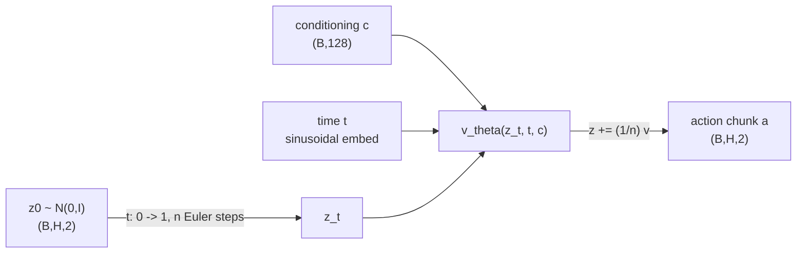
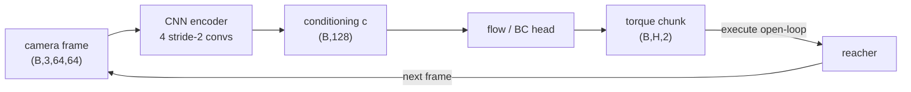

# A13 - vision-language-action capstone (flow-matching action head from pixels)

A vision-language-action (VLA) model takes camera images and a language instruction and outputs robot
actions. The pattern that defines the 2023-2026 generation wires a pretrained perception/language
backbone to a dedicated action decoder: the backbone interprets the scene and instruction, the
decoder turns that understanding into temporally coherent continuous motor commands. This capstone
builds the perception-to-action path on a simulated robot, a 2-link reacher controlled from a 64x64
camera image with no access to joint angles or the target position. A convolutional encoder turns the
frame into a conditioning vector, and a conditional flow-matching (CFM) action head, behavior-cloned
from filtered expert demonstrations, generates the joint-torque chunk that drives the finger to the
target. The notes cover the two families of action decoder, behavior cloning and compounding error,
action chunking, the multimodal motivation for a generative head, and diffusion versus flow matching.

Build the flow-matching action head, the behavior-cloning baseline with action chunking, and a DDPM
head as the diffusion contrast, then run a policy that reads only pixels and reaches the target far
more often than a random-torque policy. The action head is the one from pi0 (Black et al. 2024), the
first flow-matching VLA at production scale; here the encoder stands in for pi0's VLM backbone and the
flow head is the action expert. Everything is small enough to collect demos and train in minutes, so
the mechanism is the focus, not the scale.

Required reading before starting:
- Black et al. 2024, "$\pi_0$: A Vision-Language-Action Flow Model for General Robot Control" (pi0),
  [arXiv:2410.24164](https://arxiv.org/abs/2410.24164).
- Zhao et al. 2023, "Learning Fine-Grained Bimanual Manipulation with Low-Cost Hardware" (ACT),
  [arXiv:2304.13705](https://arxiv.org/abs/2304.13705).
- Chi et al. 2023, "Diffusion Policy: Visuomotor Policy Learning via Action Diffusion",
  [arXiv:2303.04137](https://arxiv.org/abs/2303.04137).

## Lecture notes

### What a vision-language-action model is

A VLA takes a pretrained vision-language model (VLM), which already grounds objects and instructions
in internet-scale images and text, and attaches an action decoder. The two train together on robot
demonstration data. The VLM interprets the scene and instruction; the decoder turns that
understanding into motor commands.

Why split the model this way instead of having the VLM emit actions directly? A VLM produces discrete
text tokens one at a time. That is the right tool for reasoning over language and a poor tool for
continuous control. Robot actions are correlated across time, must be smooth, and are issued at
50-100 Hz. A purpose-built action decoder lets the backbone interpret the scene while the decoder
generates temporally coherent continuous trajectories.

On the reacher, the conditioning vector $c$ comes from a CNN encoder applied to the camera frame
instead of from a VLM. The encoder stands in for the VLM backbone of a full VLA; the action head is
the same action expert.

Two classes of action decoder split the field, and the contrast is a core lesson here.

The first class discretizes actions into tokens. RT-2 (Brohan et al. 2023,
[arXiv:2307.15818](https://arxiv.org/abs/2307.15818)) and OpenVLA (Kim et al. 2024,
[arXiv:2406.09246](https://arxiv.org/abs/2406.09246)) bin each continuous actuator value into one of
about 256 levels, append those bins to the language model's vocabulary, and generate them with the
same autoregressive loop that generates text. This is simple to attach to any VLM and inherits the
language model's pretraining, at the cost of quantization error, sequential (non-parallel) decoding,
and trouble with fine motions.

The second class generates raw continuous actions with a small generative model conditioned on the
backbone's output. Diffusion Policy (Chi et al. 2023) used a denoising diffusion probabilistic model
(DDPM); ACT (Zhao et al. 2023) used a conditional variational autoencoder; pi0 used flow matching.
There is no discretization, full action precision, and parallel decoding of a whole chunk. As of 2025
this is the dominant approach for contact-rich and dexterous manipulation, and the field has
converged on flow matching over diffusion for the action head because it trains by plain regression
and integrates in a handful of steps.

### Behavior cloning and compounding error

The training objective is behavior cloning (BC): treat expert demonstrations as supervised data and
train the policy to predict the expert action given the observation. The demonstrations come from an
analytic expert with privileged access to the joint state and the target position; it solves inverse
kinematics for the target and applies a proportional-derivative (PD) controller in joint space. The
learned policy gets none of that, only the rendered frame, so it must recover from pixels what the
expert read off the state.

Naive single-step BC is brittle on fine manipulation. At inference, a small prediction error moves
the robot into a state the demonstrations never visited, where the next prediction is worse, and the
error compounds. Action chunking is the standard mitigation.

### Action chunking

Action chunking, from ACT (Zhao et al. 2023), has the policy predict a sequence of $H$ future actions
(a chunk) and execute the whole chunk before re-querying. The decision frequency drops by a factor of
$H$, the policy commits to an internally consistent segment instead of re-deciding under accumulated
drift, and the distributional shift shrinks. ACT reported that chunking reduces compounding error,
and chunked action heads became standard because of it.

ACT also introduced temporal ensembling, an inference trick that blends overlapping chunks from
consecutive queries with exponential weighting to smooth chunk boundaries. It is optional and can
hurt: pi0 found it detrimental on their evaluation and dropped it, executing chunks open-loop.

Chunking turns a per-step action sequence into overlapping $H$-step windows used as training targets.
Because the windows overlap, the de-chunk inverse must take the full first chunk and then the last
action of each subsequent chunk; that last action is the one new step each window introduced, so the
reconstruction is exact. Receding-horizon execution runs chunks back to back from starts $0, H, 2H,
\dots$, with the last start clamped so the final chunk does not run past the sequence end.

### Why a generative action head instead of plain regression

A regressor trained with mean squared error converges to the conditional mean action
$\mathbb{E}[a \mid c]$. When several distinct expert actions are valid from one observation, so the
conditional distribution $p(a \mid c)$ is multimodal, the mean is a point between the modes that the
expert never takes. A generative head models the distribution and samples one coherent mode. This is
the standard motivation for a generative action head.

### Diffusion versus flow matching as the action head

Both frame action generation as transporting a Gaussian sample to the action distribution; they
differ in the path and the training objective.

A diffusion model (DDPM, Ho et al. 2020, [arXiv:2006.11239](https://arxiv.org/abs/2006.11239)) adds
noise over $T$ steps along a fixed Markov chain and learns to reverse it one step at a time.
Inference runs the $T$-step reverse chain, which is slow. Diffusion Policy showed a DDPM denoiser
conditioned on images produces stable multimodal action distributions and made diffusion a serious
action head.

Flow matching (Lipman et al. 2022, [arXiv:2210.02747](https://arxiv.org/abs/2210.02747)) learns a
velocity field that moves samples along straight-line paths from a Gaussian prior to the data. The
training objective is plain regression on the velocity, with no noise schedule. Inference integrates
an ordinary differential equation (ODE) with as few as 5-10 steps. pi0 used conditional flow matching
as the action head in the first large VLA at production scale, and the 2025-2026 literature has
largely moved to flow matching for its training simplicity and few-step inference.

### Conditional flow matching

The convention matches the course's flow-matching topic: $t = 0$ is noise $z_0 \sim \mathcal{N}(0,
I)$, $t = 1$ is the demonstrated action chunk $a$. The straight-line path between them and its
velocity are

$$z_t = (1 - t)\,z_0 + t\,a, \qquad v = \frac{\mathrm{d}z_t}{\mathrm{d}t} = a - z_0.$$

The velocity target $a - z_0$ is constant in $t$: it does not change as one moves along the path. A
target that depends on $t$ is wrong. The network $v_\theta(z_t, t, c)$ regresses onto this target:

$$\mathcal{L}_{\text{CFM}} = \mathbb{E}_{z_0 \sim \mathcal{N}(0,I),\; t \sim U(0,1)}
\left\lVert v_\theta\big((1-t)z_0 + t\,a,\; t,\; c\big) - (a - z_0) \right\rVert^2.$$

The expectation is over fresh $z_0$ and $t$ each step; the loss is unweighted velocity regression. At
inference, integrate the ODE $\mathrm{d}z/\mathrm{d}t = v_\theta(z, t, c)$ from $z \sim \mathcal{N}(0,
I)$ at $t = 0$ to $t = 1$ with $n$ forward-Euler steps:

$$z \leftarrow z + \tfrac{1}{n}\,v_\theta(z, t, c), \qquad t = 0, \tfrac{1}{n}, \tfrac{2}{n}, \dots$$



The flow loss does not reach zero by construction. The target is $a - z_0$, but near $t = 1$ the input
$z_t$ collapses onto $a$ and the network cannot recover $z_0$ from it, so a residual remains where
different $z_0$ map to nearly the same $z_t$. This is the same irreducible residual the linear-path
CFM loss carries in the course's flow-matching topic.

### The DDPM contrast

The DDPM head uses the epsilon-prediction objective from the course's diffusion topic, re-conditioned
on $c$. With cumulative signal level $\bar\alpha_t$ from a linear schedule, sample an integer $t$ and
noise $\varepsilon \sim \mathcal{N}(0, I)$, form the noised chunk $a_t = \sqrt{\bar\alpha_t}\,a +
\sqrt{1 - \bar\alpha_t}\,\varepsilon$, and regress $\varepsilon_\theta(a_t, t, c)$ onto $\varepsilon$
by MSE. Sampling runs the ancestral reverse chain from $t = T-1$ down to $0$, recovering the posterior
mean at each step and adding Gaussian noise everywhere except the last step. RDT-1B (Liu et al. 2024,
[arXiv:2410.07864](https://arxiv.org/abs/2410.07864)) is a diffusion transformer for bimanual
manipulation; it is a reading pointer, not the plain DDPM denoiser used here.

### The reacher and the analytic expert

The reacher is a 2-link arm in the plane; both links have length $L_0 = L_1 = 0.12$. The action is a
2D joint torque $(\tau_{\text{shoulder}}, \tau_{\text{wrist}})$ clipped to $[-1, 1]$. The reward is 1
while the finger overlaps the small target and 0 otherwise; a reach is a step with reward above 0.5.
The conditioning observation is the 64x64 RGB frame from the fixed overhead camera, normalized to
$[0, 1]$ and laid out channel-first as $(3, 64, 64)$. The learned policy sees only this image.

The expert is analytic and privileged. Given the target world position $(t_x, t_y)$ it solves the
2-link inverse kinematics for the joint angles (elbow-down branch),

$$\theta_2 = \arccos\!\left(\frac{r^2 - L_0^2 - L_1^2}{2 L_0 L_1}\right), \qquad
\theta_1 = \operatorname{atan2}(t_y, t_x) - \operatorname{atan2}\!\big(L_1 \sin\theta_2,\; L_0 + L_1 \cos\theta_2\big),$$

with $r = \lVert (t_x, t_y) \rVert$ clamped to the workspace, then drives the joints with a PD law on
the wrapped angle error,

$$\tau = \operatorname{clip}\big(k_p\,(\theta^\star - \theta) - k_d\,\dot\theta,\; -1,\; 1\big),
\qquad k_p = 12,\; k_d = 0.8.$$

Demonstrations are filtered: the expert runs on consecutive random seeds, only episodes that reach
the target are kept, each truncated at the reach step, until enough successful demos are gathered.
Behavior cloning sees clean successful trajectories.

### The image encoder as conditioning

The action heads read a conditioning vector $c$ of fixed width and do not care where it comes from.
On the reacher, $c$ is the output of a CNN encoder applied to the frame:

$$c = \operatorname{Encoder}(\text{obs}), \qquad \text{obs} \in \mathbb{R}^{(B,\,3,\,64,\,64)}, \quad
c \in \mathbb{R}^{(B,\,128)}.$$

The encoder is four stride-2 convolutions (channel widths 32, 64, 128, 256) taking 64x64 down to 4x4,
then a linear projection of the flattened features to a 128-wide embedding. It is the same 64x64
pixel encoder used in the world-models assignment, here producing the conditioning vector rather than
a latent state. The encoder and the action head train together end to end under behavior cloning,
with one optimizer over both; there is no separate representation-learning step. In a full-scale VLA
the conditioning would come from a ViT/CLIP-style vision encoder and a VLM text interface; here it is
the CNN embedding of the camera frame so the system trains in minutes.



### How this capstone reuses the rest of the course

The action head is the generative model from the diffusion and flow-matching topics, re-conditioned
on a perception embedding in place of a class label. The CFM interpolant, the velocity target, and
the Euler ODE sampler are the same machinery from the flow-matching assignment; the DDPM head is the
epsilon-prediction objective and the ancestral sampler from the diffusion assignment. The image
encoder is the four-conv 64x64 pixel encoder from the world-models assignment.

## The assignment

Implement the flow-matching head, the behavior-cloning baseline with action chunking, and the DDPM
head; the network bodies, the sinusoidal time embedding, the noise schedule, the CNN encoder, the
reacher wrapper with the analytic expert, the training loops, and the visualizations are provided.
The docstrings in each file give the signatures, shapes, and conventions; read those in the files.
This section says which file maps to which concept from the notes. The heads condition on a vector of
width `cond_in`; on the reacher the encoder's 128-wide embedding is that width.

### Files to modify

`flow.py` is the flow-matching head, the build target. Implement `cfm_target` (the straight-path
interpolant and the constant velocity target), `flow_loss` (the velocity-regression loss), and
`flow_sample` (the Euler ODE integrator from noise at $t = 0$ to the action at $t = 1$).

`bc.py` is the behavior-cloning baseline and the chunking utilities. Implement `bc_loss` (the plain
regression loss, the compounding-error baseline), and `chunk_actions` / `de_chunk` /
`receding_horizon_indices` (the overlapping chunking, its exact inverse, and the open-loop start
indices from the action-chunking section).

`ddpm.py` is the diffusion contrast. Implement `ddpm_loss` (the epsilon-prediction loss) and
`ddpm_sample` (the ancestral reverse chain), re-conditioned on $c$.

### Running and validating

Activate the environment (`conda activate nanovision`), then:

```
make test     A=a13_vla   # run the tests against the top-level files (the ones with holes)
make verify   A=a13_vla   # run the same tests against the reference solution/
make viz      A=a13_vla   # render the figures from the reference solution
make viz-mine A=a13_vla   # render the figures from your own code (once the holes are filled)
```

`make test` is the command to run while working. It runs the suite in `assignments/a13_vla/tests/`
against the top-level files and goes from red (the holes raise `NotImplementedError`) to green as they
are filled in. `make verify` runs the identical suite against the reference answer key in `solution/`:
it sets `NANOVISION_IMPL=solution`, so the tests import the reference instead of the top-level files.
`make verify` is green from the start, so it shows the target and confirms the tests and environment
work before anything changes. The goal is to bring `make test` to the same green as `make verify`.

The suite checks the interpolant endpoints and the t-independent velocity target; that a constant
velocity field integrates from $z_0$ to the target exactly at any step count (the integrator wiring,
no training); that `de_chunk(chunk_actions(x))` reconstructs $x$ exactly and the receding-horizon
indices cover the sequence with no duplicates; the encoder giving $(B, 128)$ and the heads' forward
and `flow_sample` giving $(B, H, 2)$ with the image-to-chunk path composing; a float64 gradcheck of
`cfm_target` and the flow network in the loss; the BC loss overfitting one batch to near zero; the
flow loss dropping to a small fraction of its untrained value with a loose secondary bound on
`flow_sample` reconstruction; and the reacher wrapper resetting, stepping, and rendering (skipped when
dm_control is absent). dm_control is isolated to `env.py` and `viz.py`; the only test that imports it
skips via `pytest.importorskip("dm_control")`, so the graded mechanism tests run on CPU without the
robot library. The reach-success and chunk-size numbers are not unit tests, because rollout success
is init- and seed-sensitive; they live in the visualizations and below.

`make viz` renders from the reference solution, so it works on a fresh checkout before any holes are
filled and shows the target figures. `make viz-mine` runs the same script against the top-level code,
which is the way to eyeball a finished implementation. The figures need dm_control with headless
rendering (`MUJOCO_GL=egl`). Both write PNGs to `out/` using matplotlib's headless Agg backend, so the
commands behave the same over SSH, in WSL, and in CI with no display, and the figures are viewable
inline in VSCode. Add `SHOW=1` (for example `make viz-mine A=a13_vla SHOW=1`) to also open interactive
windows when a display is available. The figures are `reacher_rollouts.png` (the flow and BC policies
reaching from pixels against the random floor), `chunk_ablation.png` (the BC chunk-size sweep),
`multimodal.png` (the point-mass goal-hidden side-demo), and `flow_path.png` (the ODE path from noise
to the torque chunk).

What you should see when you run this. The mechanism tests run on CPU in seconds. Demo collection
runs the simulator and renders, so it is the slow part, about 130 seconds to gather 200 filtered
successful demos (roughly 270 episodes at a 75% expert reach rate). Training a flow or BC head with
its encoder is about 10-15 seconds on an RTX 4080; a 48-episode rollout in the simulator is about 30
seconds; the full visualization run is a few minutes. Everything fits well under 12GB. A healthy
`flow_loss` curve drops from about 2.3 to a floor near 0.18 and stays there; a flat curve that never
leaves about 2 means the target or the conditioning is wrong, not that training is slow.

The headline result is that a flow policy reading only 64x64 pixels reaches the target far more often
than a random-torque policy. The reference run measured, over 48 rollout episodes:

| policy (from pixels) | reach success |
| --- | --- |
| flow head, $H = 4$ | 0.75 |
| BC regressor, $H = 4$ | 0.75 |
| random torque | 0.06-0.07 |


The flow head and the deterministic BC regressor match here. The reason is specific to this task: the
image fixes the target, so from a given frame the expert action is essentially determined and $p(a
\mid \text{image})$ is unimodal, where the conditional mean a regressor learns is the correct action.
This is a measurement of this toy, not a flow-over-regression claim from pixels.

The reference chunk-size sweep on this reacher measured (mean over 2 seeds, 48 episodes each):

| chunk size $H$ | BC reach success |
| --- | --- |
| 1 | 0.78 |
| 4 | 0.74 |
| 8 | 0.62 |


On this small reacher the sweep does not rise with $H$, and the reason is specific to the setup, not a
contradiction of ACT. The episodes are short (about 20 steps), the demos are filtered to clean
successes, and the policy re-queries every chunk, so single-step BC already stays close to the
demonstrated path and reaches at 0.78. Longer chunks also lose late-episode training windows and
commit longer open-loop, which costs accuracy here. Chunking pays off in ACT's compounding-error
regime of long horizons and contact-rich dynamics where a single-step policy drifts, and a 2D reacher
with 20-step episodes is too forgiving to show it. Treat these numbers as a measurement of this toy,
not as evidence about the chunking literature.

The reacher cannot show the generative-versus-regression lesson, because the image fixes the target
and $p(a \mid \text{image})$ is unimodal. A retained 2D point-mass side-demo isolates it. A point mass
in the unit square moves toward one of four goals; in the goal-hidden mode the conditioning carries
only the state, so from a fixed state the demonstrated action points to any of the four goals and $p(a
\mid c)$ is multimodal. From the center state the reference run measured the BC regressor's predicted
action collapsing toward the origin (magnitude about 0.001, the average of four opposing directions),
while the flow-head samples spread out (per-component standard deviation about 0.015) and cluster on
the four diagonal goal directions.


The flow-matching ODE path on the reacher, for one image conditioning, transports the Gaussian sample
to the torque chunk over the 10 Euler steps:


These toy numbers demonstrate that a flow head reaches from pixels and that a flow head learns a
conditional action distribution; they do not predict pi0-scale manipulation behavior. A 2-link
reacher and a four-goal point mass are mechanism isolators, not evidence about the VLA literature.

## Further reading

- ACT / ALOHA, [Zhao et al. 2023](https://arxiv.org/abs/2304.13705) - action chunking with a CVAE
  head; the source of the chunking idea and temporal ensembling.
- Diffusion Policy, [Chi et al. 2023](https://arxiv.org/abs/2303.04137) - the DDPM action head that
  made diffusion a serious option.
- pi0, [Black et al. 2024](https://arxiv.org/abs/2410.24164) - the flow-matching VLA at production
  scale; the head built here.
- OpenVLA, [Kim et al. 2024](https://arxiv.org/abs/2406.09246) - the open-source discretized-token
  VLA, the other branch of the field.
- OpenVLA-OFT, [Kim et al. 2025](https://arxiv.org/abs/2502.19645) - a same-backbone ablation showing
  the action-head design dominates the outcome; adds chunking and a continuous head for a large
  throughput and success gain.
- Octo, [Octo team 2024](https://arxiv.org/abs/2405.12213) - the diffusion-head generalist policy
  between Diffusion Policy and pi0 in the lineage.
- Open X-Embodiment, [Padalkar et al. 2023](https://arxiv.org/abs/2310.08864) - the pooled
  cross-embodiment dataset behind the data scaling of recent VLAs.
- Flow Matching for Generative Modeling, [Lipman et al. 2022](https://arxiv.org/abs/2210.02747) - the
  CFM objective the action head reuses.
