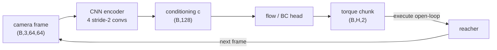
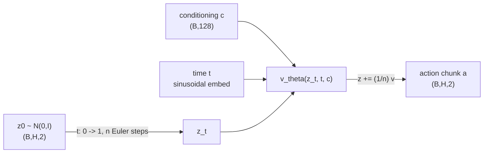
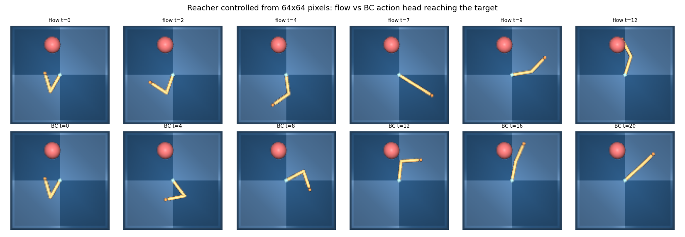
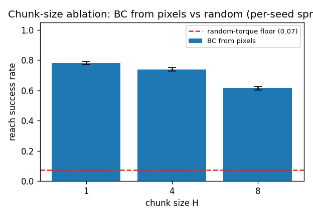
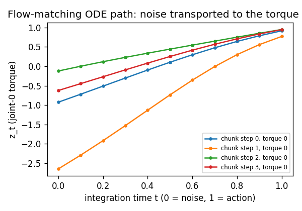

# A13 - Vision-language-action capstone (flow-matching action head from pixels)

This is the last assignment. It maps camera pixels to robot actions: a 2-link reacher
([dm_control](https://github.com/google-deepmind/dm_control) `reacher` easy) controlled from a
64x64 RGB image, with no access to joint angles or the target position. A convolutional encoder
turns the frame into a conditioning vector, and a conditional flow-matching (CFM) action head,
behavior-cloned from filtered expert demonstrations, generates the joint-torque chunk that drives
the finger to the target. The action head is the one from pi0
([Black et al. 2024](https://arxiv.org/abs/2410.24164)), the first flow-matching vision-language-action
(VLA) model at production scale. Everything is small enough to collect demos and train in minutes,
so the mechanism is the focus, not the scale.

## Motivation

### What a vision-language-action model is, and the problem it answers

A vision-language-action model takes camera images and a language instruction and outputs robot
actions. The pattern that defines the 2023-2026 generation: take a pretrained vision-language model
(VLM), which already grounds objects and instructions in internet-scale images and text, and attach
a dedicated action decoder. The two train together on robot demonstration data. The VLM interprets
the scene and instruction; the decoder turns that understanding into motor commands.

Why split the model this way instead of having the VLM emit actions directly? A VLM produces
discrete text tokens one at a time. That is the right tool for reasoning over language and a poor
tool for continuous control. Robot actions are correlated across time, must be smooth, and are
issued at 50-100 Hz. A purpose-built action decoder lets the backbone interpret the scene and the
decoder generate temporally coherent continuous trajectories.

This assignment builds the perception-to-action path on a real (simulated) robot. The reacher gives
you the part a state-vector toy hides: the policy reads pixels. A CNN encoder maps the 64x64 frame
to an embedding, and the action head conditions on that embedding instead of on privileged state.
The encoder stands in for the VLM backbone of a full VLA; the flow head is the action expert.

Two classes of action decoder split the field, and the contrast is a core lesson here.

The first class discretizes actions into tokens. RT-2
([Brohan et al. 2023](https://arxiv.org/abs/2307.15818)) and OpenVLA
([Kim et al. 2024](https://arxiv.org/abs/2406.09246)) bin each continuous actuator value into one of
~256 levels, append those bins to the language model's vocabulary, and generate them with the same
autoregressive loop that generates text. This is simple to attach to any VLM and inherits the
language model's pretraining, at the cost of quantization error, sequential (non-parallel) decoding,
and trouble with fine motions.

The second class generates raw continuous actions with a small generative model conditioned on the
backbone's output. Diffusion Policy ([Chi et al. 2023](https://arxiv.org/abs/2303.04137)) used a
denoising diffusion probabilistic model (DDPM); ACT ([Zhao et al. 2023](https://arxiv.org/abs/2304.13705))
used a conditional variational autoencoder; pi0 used flow matching. No discretization, full action
precision, parallel decoding of a whole chunk. As of 2025 this is the dominant approach for
contact-rich and dexterous manipulation, and the field has converged on flow matching over diffusion
for the action head because it trains by plain regression and integrates in a handful of steps.

### Behavior cloning and compounding error

The training objective is behavior cloning (BC): treat expert demonstrations as supervised data and
train the policy to predict the expert action given the observation. The demonstrations come from an
analytic expert with privileged access to the joint state and the target position: it solves inverse
kinematics for the target and applies a proportional-derivative (PD) controller in joint space. The
learned policy gets none of that, only the rendered frame, so it must recover from pixels what the
expert read off the state.

Naive single-step BC is brittle on fine manipulation. At inference, a small prediction error moves
the robot into a state the demonstrations never visited, where the next prediction is worse, and the
error compounds. Action chunking is the standard mitigation, and you implement it.

### Action chunking

Action chunking, from ACT ([Zhao et al. 2023](https://arxiv.org/abs/2304.13705)), has the policy
predict a sequence of $H$ future actions (a chunk) and execute the whole chunk before re-querying.
The decision frequency drops by a factor of $H$, the policy commits to an internally consistent
segment instead of re-deciding under accumulated drift, and the distributional shift shrinks. ACT
reported that chunking reduces compounding error, and chunked action heads became standard because of
it. You measure rollout reach success for chunk sizes $H \in \{1, 4, 8\}$ on the reacher; the
chunk-size effect on a small, clean-demo task is discussed under [Measured results](#measured-results).

ACT also introduced temporal ensembling, an inference trick that blends overlapping chunks from
consecutive queries with exponential weighting to smooth chunk boundaries. It is optional and can
hurt: pi0 found it detrimental on their evaluation and dropped it, executing chunks open-loop. You
execute chunks open-loop here for the same reason.

### Why a generative action head instead of plain regression

A regressor trained with mean squared error converges to the conditional mean action
$\mathbb{E}[a \mid c]$. When several distinct expert actions are valid from one observation, so the
conditional distribution $p(a \mid c)$ is multimodal, the mean is a point between the modes that the
expert never takes. A generative head models the distribution and samples one coherent mode.

The reacher from pixels does not isolate this effect: the image fixes the target, so from a given
frame the expert action is essentially determined and $p(a \mid \text{image})$ is unimodal. To show
the multimodal failure cleanly, this assignment keeps a small self-contained 2D point-mass side-demo
(in `viz.py` and the [point-mass multimodal side-demo](#point-mass-multimodal-side-demo) section
below) where the goal is hidden from the conditioning while it still varies across episodes. There a
unimodal regressor averages the modes and aims nowhere, while the flow head samples a goal direction.
That is the standard motivation for a generative action head, kept as a side-demo because pixels
cannot hide the goal.

### Diffusion versus flow matching as the action head

Both frame action generation as transporting a Gaussian sample to the action distribution; they
differ in the path and the training objective.

A diffusion model (DDPM, [Ho et al. 2020](https://arxiv.org/abs/2006.11239)) adds noise over $T$
steps along a fixed Markov chain and learns to reverse it one step at a time. Inference runs the
$T$-step reverse chain, which is slow. Diffusion Policy showed a DDPM denoiser conditioned on images
produces stable multimodal action distributions and made diffusion a serious action head.

Flow matching ([Lipman et al. 2022](https://arxiv.org/abs/2210.02747)) learns a velocity field that
moves samples along straight-line paths from a Gaussian prior to the data. The training objective is
plain regression on the velocity, with no noise schedule. Inference integrates an ordinary
differential equation (ODE) with as few as 5-10 steps. pi0 used conditional flow matching as the
action head in the first large VLA at production scale, and the 2025-2026 literature has largely
moved to flow matching for its training simplicity and few-step inference. You build the flow head as
the target and a DDPM head as the labeled contrast.

### How this capstone reuses the rest of the course

The action head is the generative model from the diffusion and flow-matching topics, re-conditioned
on a perception embedding in place of a class label. The CFM interpolant, the velocity target, and
the Euler ODE sampler are the same machinery from the flow-matching assignment; the DDPM head is the
epsilon-prediction objective and the ancestral sampler from the diffusion assignment. The image
encoder is the four-conv 64x64 pixel encoder from the world-models assignment, here producing the
conditioning vector rather than a latent state. In a full-scale VLA the conditioning would come from
a ViT/CLIP-style vision encoder and a VLM text interface built earlier in the course; here it is the
CNN embedding of the camera frame so the system trains in minutes. A stretch goal closes the loop to
the VLM text encoder, and another conditions the head on a learned latent from the world-models
assignment, the model-based flavor of a VLA.

## Background

### The reacher and the analytic expert

The reacher is a 2-link arm in the plane; both links have length $L_0 = L_1 = 0.12$. The action is a
2D joint torque $(\tau_{\text{shoulder}}, \tau_{\text{wrist}})$ clipped to $[-1, 1]$. The reward is 1
while the finger overlaps the small target and 0 otherwise; a reach is a step with reward above 0.5.
The conditioning observation is the 64x64 RGB frame rendered from the fixed overhead camera,
normalized to $[0, 1]$ and laid out channel-first as $(3, 64, 64)$. The learned policy sees only this
image.

The expert is analytic and privileged. Given the target world position $(t_x, t_y)$ it solves the
2-link inverse kinematics for the joint angles (elbow-down branch),

$$\theta_2 = \arccos\!\left(\frac{r^2 - L_0^2 - L_1^2}{2 L_0 L_1}\right), \qquad
\theta_1 = \operatorname{atan2}(t_y, t_x) - \operatorname{atan2}\!\big(L_1 \sin\theta_2,\; L_0 + L_1 \cos\theta_2\big),$$

with $r = \lVert (t_x, t_y) \rVert$ clamped to the workspace, then drives the joints with a PD law on
the wrapped angle error,

$$\tau = \operatorname{clip}\big(k_p\,(\theta^\star - \theta) - k_d\,\dot\theta,\; -1,\; 1\big),
\qquad k_p = 12,\; k_d = 0.8.$$

Demos are filtered: the expert runs on consecutive random seeds, only episodes that reach the target
are kept, each truncated at the reach step, until enough successful demos are gathered. Behavior
cloning sees clean successful trajectories. The analytic expert reaches on roughly 75-83% of seeds in
about 20 steps; the rest are discarded.

### The image encoder as conditioning

The action heads read a conditioning vector $c$ of fixed width and do not care where it comes from.
On the reacher, $c$ is the output of a CNN encoder applied to the frame:

$$c = \operatorname{Encoder}(\text{obs}), \qquad \text{obs} \in \mathbb{R}^{(B,\,3,\,64,\,64)}, \quad
c \in \mathbb{R}^{(B,\,128)}.$$

The encoder is four stride-2 convolutions (channel widths 32, 64, 128, 256) taking 64x64 down to
4x4, then a linear projection of the flattened features to `embed_dim = 128`. It is the DreamerV3
64x64 pixel encoder reused from the world-models assignment. The encoder and the action head train
together end to end under behavior cloning, with one optimizer over both; there is no separate
representation-learning step.



### Conditional flow matching

The convention matches the flow-matching assignment: $t = 0$ is noise $z_0 \sim \mathcal{N}(0, I)$,
$t = 1$ is the demonstrated action chunk $a$. The straight-line path between them and its velocity
are

$$z_t = (1 - t)\,z_0 + t\,a, \qquad v = \frac{\mathrm{d}z_t}{\mathrm{d}t} = a - z_0.$$

The velocity target $a - z_0$ is constant in $t$: it does not change as you move along the path. A
target that depends on $t$ is wrong, and a test asserts the t-independence. The network
$v_\theta(z_t, t, c)$ regresses onto this target:

$$\mathcal{L}_{\text{CFM}} = \mathbb{E}_{z_0 \sim \mathcal{N}(0,I),\; t \sim U(0,1)}
\left\lVert v_\theta\big((1-t)z_0 + t\,a,\; t,\; c\big) - (a - z_0) \right\rVert^2.$$

The expectation is over fresh $z_0$ and $t$ each step; the loss is unweighted velocity regression.
At inference, integrate the ODE $\mathrm{d}z/\mathrm{d}t = v_\theta(z, t, c)$ from $z \sim
\mathcal{N}(0, I)$ at $t = 0$ to $t = 1$ with $n$ forward-Euler steps:

$$z \leftarrow z + \tfrac{1}{n}\,v_\theta(z, t, c), \qquad t = 0, \tfrac{1}{n}, \tfrac{2}{n}, \dots$$

The default is $n = 10$. Starting at $t = 1$ instead of $t = 0$, or using the wrong step size, is the
likely bug; the constant-field oracle test catches it.



### Action chunking and its inverse

From a per-step action sequence $(B, T, 2)$, `chunk_actions` builds overlapping $H$-step windows
$(B, T-H+1, H, 2)$ used as training targets. The windows overlap, so the de-chunk inverse must be
defined: take the full first chunk, then the last action of each subsequent chunk. Chunk $i+1$'s last
action is the one new step that window introduced, so this reconstructs the original $(B, T, 2)$
sequence exactly. Receding-horizon execution runs chunks back to back from starts $0, H, 2H, \dots$,
with the last start clamped to $T - H$.

### The DDPM contrast

The DDPM head uses the epsilon-prediction objective from the diffusion assignment, re-conditioned on
$c$. With cumulative signal level $\bar\alpha_t$ from a linear schedule, sample an integer $t$ and
noise $\varepsilon \sim \mathcal{N}(0, I)$, form the noised chunk
$a_t = \sqrt{\bar\alpha_t}\,a + \sqrt{1 - \bar\alpha_t}\,\varepsilon$, and regress
$\varepsilon_\theta(a_t, t, c)$ onto $\varepsilon$ by MSE. Sampling runs the ancestral reverse chain
from $t = T-1$ down to $0$. RDT-1B ([Liu et al. 2024](https://arxiv.org/abs/2410.07864)) is a
diffusion transformer for bimanual manipulation; it is a reading pointer, not flow matching, and is
not what this plain DDPM denoiser implements.

Shapes throughout: $a$, $z_0$, $z_t$, $a_t$ are $(B, H, 2)$; $t$ is $(B, 1, 1)$ for the flow head and
$(B,)$ integer for the DDPM head; the conditioning $c$ is $(B, 128)$ from the encoder (or
$(B, \text{cond\_in})$ in general); chunks are $(B, T-H+1, H, 2)$.

## What you'll implement

- `cfm_target` and `flow_loss` and `flow_sample` in `flow.py` - the CFM interpolant, the velocity
  regression loss, and the Euler ODE sampler.
- `bc_loss`, `chunk_actions`, `de_chunk`, `receding_horizon_indices` in `bc.py` - the behavior
  cloning loss and action chunking with its inverse.
- `ddpm_loss` and `ddpm_sample` in `ddpm.py` - the epsilon-prediction loss and the ancestral reverse
  chain (the diffusion contrast).

The network bodies (the velocity MLP, the BC MLP, the DDPM MLP), the sinusoidal time embedding, the
noise schedule, the CNN encoder (`nets.py`), the reacher wrapper and analytic expert (`env.py`), the
training loops, and the visualizations are provided. The flow/BC/DDPM heads condition on a vector of
width `cond_in`; the encoder's `embed_dim` is that width on the reacher.

## Tasks

1. `cfm_target(a_chunk, z0, t)` in `flow.py`: return $z_t = (1-t)z_0 + t\,a$ and the constant target
   $a - z_0$. Shapes $(B, H, 2)$ with $t$ broadcast from $(B, 1, 1)$.
2. `flow_loss(head, a_chunk, c)` in `flow.py`: sample $z_0$ and $t$, build $(z_t, v)$ with
   `cfm_target`, predict $v_\theta$, return MSE.
3. `flow_sample(head, c, H, n_steps)` in `flow.py`: Euler-integrate from $z \sim \mathcal{N}(0,I)$ at
   $t=0$ to $t=1$, return the action chunk.
4. `bc_loss(policy, a_chunk, c)` in `bc.py`: MSE between `policy(c)` and the demonstrated chunk.
5. `chunk_actions`, `de_chunk`, `receding_horizon_indices` in `bc.py`: overlapping chunking, the
   specified inverse, and the open-loop start indices.
6. `ddpm_loss` and `ddpm_sample` in `ddpm.py`: the epsilon-prediction loss and the ancestral reverse
   chain.

## How to verify

The mechanism tests run on CPU in seconds and do not need `dm_control`. Run the suite:

```
NANOVISION_IMPL=solution python -m pytest assignments/a13_vla/tests
```

Without `NANOVISION_IMPL=solution` the suite fails cleanly at the holes (NotImplementedError); the
forbidden-imports scan passes in both modes. `dm_control` is isolated to `env.py` and `viz.py`: the
only test that imports it (`test_env_smoke.py`) skips via `pytest.importorskip("dm_control")`, so the
graded mechanism tests run without the robot library. Run order, simplest first:

1. `test_cfm_target.py` - the interpolant endpoints and the t-independent velocity target.
2. `test_flow_sample_ode.py` - a constant velocity field integrates from $z_0$ to $a^\star$ exactly
   at any step count, checking the integrator wiring without training.
3. `test_chunking.py` - `de_chunk(chunk_actions(x))` reconstructs $x$ exactly; the receding-horizon
   indices cover the sequence with no duplicates.
4. `test_shapes.py` - the encoder gives $(B, 128)$, the three heads' forward and `flow_sample` give
   $(B, H, 2)$, and the image-to-chunk path composes.
5. `test_gradcheck.py` - float64 gradcheck of `cfm_target` and the flow network in the loss.
6. `test_overfit_bc.py` - the BC loss overfits one batch to near zero.
7. `test_overfit_flow.py` - the flow loss drops to a small fraction of its untrained value; a loose
   secondary bound on `flow_sample` reconstruction.
8. `test_forbidden_imports.py` - the static scan for robot/diffusion/flow libraries and bare
   cross-assignment imports in the head files.
9. `test_env_smoke.py` (needs `dm_control` and `MUJOCO_GL=egl`) - reset/step/render shapes, that the
   analytic expert reaches on some seeds, and that demo collection filters and pads correctly.

The flow loss does not reach zero. The target is $a - z_0$, but near $t = 1$ the input $z_t$
collapses onto $a$ and the network cannot recover $z_0$ from it, so a residual remains where
different $z_0$ map to nearly the same $z_t$. Measured at the test seed: the loss falls from ~2.3 to
~0.18 (ratio ~0.08), and the test asserts the ratio, not a near-zero floor. This is the same
irreducible residual the linear-path CFM loss carries in the flow-matching assignment, not a stuck
run.

The reach-success and chunk-size numbers live in `viz.py` and below, not in a unit test. Rollout
success is init- and seed-sensitive; pinning a success-rate ordering into pytest would be a fragile
test. The unit suite asserts only exact oracles and implementation-independent overfit bounds.

## Compute notes

The mechanism tests run on CPU in seconds (the overfit loops are 300-1000 steps). Demo collection
runs the simulator and renders, so it is the slow part: about 130 seconds to gather 200 filtered
successful demos (roughly 270 episodes at a ~75% expert reach rate). Training a flow or BC head with
its encoder is ~10-15 seconds on an RTX 4080; a rollout of 48 episodes in the simulator is ~30
seconds. The full `viz.py` run (demos, the rollout panel, the chunk ablation over a couple of seeds,
the flow path, the point-mass side-demo) is a few minutes. Everything fits well under 12GB.

Run the figures with headless rendering:

```
MUJOCO_GL=egl python -m assignments.a13_vla.viz
```

A healthy `flow_loss` curve drops from ~2.3 to a floor near ~0.18 and stays there; a flat curve that
never leaves ~2 means the target or the conditioning is wrong, not that training is slow.

### Measured results

The headline verification: a flow policy reading only 64x64 pixels reaches the target far more often
than a random-torque policy. When you run the verification you should expect BC and flow from pixels
to reach well above the random floor. The reference run measured, over 48 rollout episodes:

| policy (from pixels) | reach success |
| --- | --- |
| flow head, $H = 4$ | 0.75 |
| BC regressor, $H = 4$ | 0.75 |
| random torque | 0.06-0.07 |



Action chunking reduces compounding error: this is the result ACT
([Zhao et al. 2023](https://arxiv.org/abs/2304.13705)) reported and the reason chunked policies
became standard. The effect is largest when single-step BC drifts off the demonstrated manifold. The
reference chunk-size sweep on this reacher measured (mean over 2 seeds, 48 episodes each, against the
random floor):

| chunk size $H$ | BC reach success |
| --- | --- |
| 1 | 0.78 |
| 4 | 0.74 |
| 8 | 0.62 |



On this small reacher the sweep does not rise with $H$, and the reason is specific to the setup, not
a contradiction of ACT. The episodes are short (about 20 steps), the demos are filtered to clean
successes, and the policy re-queries every chunk, so single-step BC already stays close to the
demonstrated path and reaches at 0.78. Longer chunks also lose late-episode training windows (the
valid-chunk count falls as $H$ grows) and commit longer open-loop, which costs accuracy here.
Chunking pays off in ACT's compounding-error regime (long horizons and contact-rich dynamics where a
single-step policy drifts), and a 2D reacher with 20-step episodes is too forgiving to show it. Treat
these numbers as a measurement of this toy, not as evidence about the chunking literature.

### Point-mass multimodal side-demo

The reacher cannot show the generative-vs-regression lesson, because the image fixes the target and
$p(a \mid \text{image})$ is unimodal. The retained 2D point-mass side-demo isolates it. A point mass
in the unit square moves toward one of four goals; in the goal-hidden mode the conditioning carries
only the state, so from a fixed state the demonstrated action points to any of the four goals and
$p(a \mid c)$ is multimodal. A regressor trained with MSE averages the four directions and aims
nowhere; the flow head samples one direction.

When you run the goal-hidden panel you should expect to see this directly. From the center state the
BC regressor's predicted action collapses toward the origin (the reference run measured magnitude
~0.001, the average of four opposing directions), while the flow-head samples spread out (reference
per-component standard deviation ~0.015), clustering on the four diagonal goal directions.


The flow-matching ODE path on the reacher, for one image conditioning, transports the Gaussian sample
to the torque chunk over the 10 Euler steps:



These toy numbers demonstrate that a flow head reaches from pixels and that a flow head learns a
conditional action distribution; they do not predict pi0-scale manipulation behavior. A 2-link
reacher and a four-goal point mass are mechanism isolators, not evidence about the VLA literature.

## Stretch goals

1. Language conditioning: pass a goal phrase ("reach the target") through a frozen small text encoder
   and a linear projector, concatenate it with the image embedding, and train only the head and the
   projector. This closes the loop to the VLM text interface without a full-scale VLM.
2. Temporal ensembling: blend overlapping chunks from consecutive queries with exponential weighting
   and compare to open-loop execution. pi0 found ensembling detrimental and dropped it; check whether
   the toy agrees.
3. A harder reacher: switch to `reacher` `hard` (smaller target) or add observation noise, where
   single-step BC drifts more and the chunk-size effect should reappear.
4. World-model-conditioned VLA: condition the action head on a learned latent from the world-models
   assignment (the DreamerV3-style model-based flavor) instead of the CNN embedding.

## Further reading

- ACT / ALOHA, [Zhao et al. 2023](https://arxiv.org/abs/2304.13705), "Learning Fine-Grained Bimanual
  Manipulation with Low-Cost Hardware" - action chunking with a CVAE head; the source of the chunking
  idea and temporal ensembling.
- Diffusion Policy, [Chi et al. 2023](https://arxiv.org/abs/2303.04137), "Diffusion Policy: Visuomotor
  Policy Learning via Action Diffusion" - the DDPM action head that made diffusion a serious option.
- pi0, [Black et al. 2024](https://arxiv.org/abs/2410.24164), "$\pi_0$: A Vision-Language-Action Flow
  Model for General Robot Control" - the flow-matching VLA at production scale; the head built here.
- OpenVLA, [Kim et al. 2024](https://arxiv.org/abs/2406.09246), "OpenVLA: An Open-Source
  Vision-Language-Action Model" - the open-source discretized-token VLA, the other branch of the field.
- OpenVLA-OFT, [Kim et al. 2025](https://arxiv.org/abs/2502.19645) - a same-backbone ablation showing
  the action-head design dominates the outcome; adds chunking and a continuous head for a large
  throughput and success gain.
- Octo, [Octo team 2024](https://arxiv.org/abs/2405.12213) - the diffusion-head generalist policy
  between Diffusion Policy and pi0 in the lineage.
- Open X-Embodiment, [Padalkar et al. 2023](https://arxiv.org/abs/2310.08864) - the pooled
  cross-embodiment dataset behind the data scaling of recent VLAs.
- Flow Matching for Generative Modeling, [Lipman et al. 2022](https://arxiv.org/abs/2210.02747) - the
  CFM objective the action head reuses.
