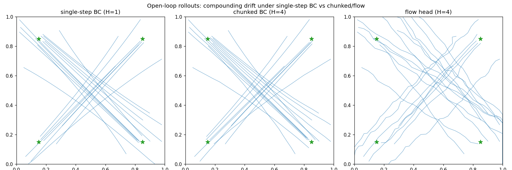

# A13 - Vision-language-action capstone (flow-matching action head)

This is the last assignment. It wires the course together: a conditioning vector from a
perception/language backbone feeds a generative action head trained by behavior cloning on
scripted demonstrations. The build target is the conditional flow-matching (CFM) action head from
pi0 ([Black et al. 2024](https://arxiv.org/abs/2410.24164)), the first flow-matching
vision-language-action (VLA) model deployed at production scale. Everything runs on a 2D point-mass
reacher small enough to train in seconds on CPU and read by eye, so the mechanism is the focus, not
the scale.

## Motivation

### What a vision-language-action model is, and the problem it answers

A vision-language-action model takes camera images and a language instruction and outputs robot
actions. The architectural pattern that defines the 2023-2026 generation: take a pretrained
vision-language model (VLM), which already grounds objects and instructions in internet-scale
images and text, and attach a dedicated action decoder. The two are trained together on robot
demonstration data. The VLM interprets the scene and instruction; the decoder turns that
understanding into motor commands.

Why split the model this way instead of having the VLM emit actions directly? A VLM produces
discrete text tokens one at a time. That is the right tool for reasoning over language, and a poor
tool for continuous control. Robot actions are correlated across time, must be smooth, and are
issued at 50-100 Hz. A purpose-built action decoder lets the backbone do what it is good at
(interpret the scene) and the decoder do what it is good at (generate temporally coherent
continuous trajectories).

Two classes of action decoder split the field, and the contrast is a core lesson here.

The first class discretizes actions into tokens. RT-2
([Brohan et al. 2023](https://arxiv.org/abs/2307.15818)) and OpenVLA
([Kim et al. 2024](https://arxiv.org/abs/2406.09246)) bin each continuous actuator value into one
of ~256 levels, append those bins to the language model's vocabulary, and generate them with the
same autoregressive loop that generates text. This is simple to bolt onto any VLM and inherits the
language model's pretraining, at the cost of quantization error, sequential (non-parallel) decoding,
and trouble with fine motions.

The second class generates raw continuous actions with a small generative model conditioned on the
backbone's output. Diffusion Policy ([Chi et al. 2023](https://arxiv.org/abs/2303.04137)) used a
denoising diffusion probabilistic model (DDPM); ACT ([Zhao et al. 2023](https://arxiv.org/abs/2304.13705))
used a conditional variational autoencoder; pi0 used flow matching. No discretization, full action
precision, parallel decoding of a whole chunk. As of 2025 this is the dominant approach for
contact-rich and dexterous manipulation, and the field has converged on flow matching over diffusion
for the action head because it trains by plain regression and integrates in a handful of steps.

### Behavior cloning and compounding error

The training objective throughout is behavior cloning (BC): treat the expert demonstrations as
supervised data and train the policy to predict the expert action given the observation. Naive
single-step BC is brittle on fine manipulation. At inference, a small prediction error moves the
robot into a state the demonstrations never visited, where the next prediction is worse, and the
error compounds. The point-mass reacher reproduces this: a single-step policy re-decides every step,
drifts off the demonstrated path, and overshoots. Two mitigations follow, and you implement both.

### Action chunking

Action chunking, from ACT ([Zhao et al. 2023](https://arxiv.org/abs/2304.13705)), has the policy
predict a sequence of $H$ future actions (a chunk) and execute the whole chunk before re-querying.
The decision frequency drops by a factor of $H$, the policy commits to an internally consistent
segment instead of re-deciding under accumulated drift, and the distributional shift shrinks. The
single-step-vs-chunk ablation is the assessment vehicle: you measure rollout success for chunk sizes
$H \in \{1, 4, 16\}$ and see it rise with $H$.

ACT also introduced temporal ensembling, an inference trick that blends overlapping chunks from
consecutive queries with exponential weighting to smooth chunk boundaries. It is optional and can
hurt: pi0 found it detrimental on their evaluation and dropped it, executing chunks open-loop. You
execute chunks open-loop here for the same reason.

### Why a generative action head instead of plain regression

A regressor trained with mean squared error converges to the conditional mean action $E[a \mid c]$.
When several distinct expert actions are valid from one observation - the conditional distribution
$p(a \mid c)$ is multimodal - the mean is a point between the modes that the expert never takes. A
generative head models the distribution and samples one coherent mode.

This toy exposes the effect in a controlled way through two conditioning modes. With the goal
visible in the conditioning ($p(a \mid c)$ unimodal), the mean is the correct expert action and BC
matches the flow head; the lesson there is compounding error and chunking, not a generative win.
With the goal hidden from the conditioning while it still varies across episodes ($p(a \mid c)$
multimodal across the four goals), BC averages the modes and aims nowhere, while the flow head
samples a goal direction. This mode-averaging of a unimodal regressor on a multimodal target is the
standard motivation for a generative action head. When you run the goal-hidden panel you should
expect to see it directly: from the center state the BC regressor's predicted action collapses
toward the origin (the reference run measured magnitude ~0.002, the average of four opposing
directions), while the flow-head samples spread out (reference per-component standard deviation
~0.021), clustering on the four diagonal goal directions.


### Diffusion versus flow matching as the action head

Both frame action generation as transporting a Gaussian sample to the action distribution; they
differ in the path and the training objective.

A diffusion model (DDPM, [Ho et al. 2020](https://arxiv.org/abs/2006.11239)) adds noise over $T$
steps along a fixed Markov chain and learns to reverse it one step at a time. Inference runs the
$T$-step reverse chain, which is slow. Diffusion Policy showed a DDPM denoiser conditioned on images
produces stable multimodal action distributions, and made diffusion a serious action head.

Flow matching ([Lipman et al. 2022](https://arxiv.org/abs/2210.02747)) learns a velocity field that
moves samples along straight-line paths from a Gaussian prior to the data. The training objective is
plain regression on the velocity, no noise schedule. Inference integrates an ordinary differential
equation (ODE) with as few as 5-10 steps. pi0 used conditional flow matching as the action head in
the first large VLA at production scale, and the 2025-2026 literature has largely moved to flow
matching for its training simplicity and few-step inference. You build the flow head as the target
and a DDPM head as the labeled contrast.

### How this capstone reuses the rest of the course

The action head is the generative model from the diffusion and flow-matching topics, re-conditioned
on robot state in place of a class label. The CFM interpolant, the velocity target, and the Euler
ODE sampler are the same machinery from the flow-matching assignment; the DDPM head is the
epsilon-prediction objective and the ancestral sampler from the diffusion assignment. In a
full-scale VLA the conditioning vector would come from a ViT/CLIP-style vision encoder and a VLM
text interface built earlier in the course; here it is the raw 2D state plus a goal encoding so the
tests stay instant. A stretch goal closes the loop to the VLM text encoder, and another conditions
the head on a learned latent from the world-models assignment, the model-based flavor of a VLA.

## Background

### The point-mass reacher

A point mass lives in the unit square $[0,1]^2$. The action is a velocity $a = (v_x, v_y)$ clipped
to $[-v_{\max}, v_{\max}]$ with $v_{\max} = 0.05$, and a step is
$p \leftarrow \mathrm{clip}(p + a, 0, 1)$. Each episode picks one of four goals (the corners, inset
to 0.15/0.85) and starts on the far side of the square. The scripted expert moves straight toward
its goal at speed $v_{\max}$ with small jitter and stops within $\varepsilon = 0.05$. At $v_{\max} =
0.05$ an episode is ~20 steps, long enough that a chunk of $H = 16$ fits inside one trajectory.

The conditioning vector $c$ is the state $p$ concatenated with a goal encoding. In the
goal-conditioned mode the encoding is a one-hot of the four goals; in the goal-dropped mode the
encoding is zeroed so the policy sees only the state, with the conditioning width held fixed across
modes. Success is the fraction of rollouts ending within $\varepsilon$ of the goal; the straight-line
expert reaches 100% and is the ceiling.

### Conditional flow matching

The convention matches the flow-matching assignment: $t = 0$ is noise $z_0 \sim \mathcal{N}(0, I)$,
$t = 1$ is the demonstrated action chunk $a$. The straight-line path between them and its velocity
are

$$z_t = (1 - t)\,z_0 + t\,a, \qquad v = \frac{\mathrm{d}z_t}{\mathrm{d}t} = a - z_0.$$

The velocity target $a - z_0$ is constant in $t$ - it does not change as you move along the path. A
target that depends on $t$ is wrong, and a test asserts the t-independence. The network
$v_\theta(z_t, t, c)$ regresses onto this target:

$$\mathcal{L}_{\text{CFM}} = \mathbb{E}_{z_0 \sim \mathcal{N}(0,I),\; t \sim U(0,1)}
\left\lVert v_\theta\big((1-t)z_0 + t\,a,\; t,\; c\big) - (a - z_0) \right\rVert^2.$$

The expectation is over fresh $z_0$ and $t$ each step; the loss is unweighted velocity regression.
At inference, integrate the ODE $\mathrm{d}z/\mathrm{d}t = v_\theta(z, t, c)$ from $z \sim
\mathcal{N}(0, I)$ at $t = 0$ to $t = 1$ with $n$ forward-Euler steps:

$$z \leftarrow z + \tfrac{1}{n}\,v_\theta(z, t, c), \qquad t = 0, \tfrac{1}{n}, \tfrac{2}{n}, \dots$$

The default is $n = 10$. Starting at $t = 1$ instead of $t = 0$, or using the wrong step size, is
the likely bug; the constant-field oracle test catches it.


### Action chunking and its inverse

From a per-step action sequence $(B, T, 2)$, `chunk_actions` builds overlapping $H$-step windows
$(B, T-H+1, H, 2)$ used as training targets. The windows overlap, so the de-chunk inverse must be
defined: take the full first chunk, then the last action of each subsequent chunk. Chunk $i+1$'s
last action is the one new step that window introduced, so this reconstructs the original $(B, T, 2)$
sequence exactly. Receding-horizon execution runs chunks back to back from starts $0, H, 2H, \dots$,
with the last start clamped to $T - H$.

### The DDPM contrast

The DDPM head uses the epsilon-prediction objective from the diffusion assignment, re-conditioned on
$c$. With cumulative signal level $\bar\alpha_t$ from a linear schedule, sample an integer $t$ and
noise $\varepsilon \sim \mathcal{N}(0, I)$, form the noised chunk
$a_t = \sqrt{\bar\alpha_t}\,a + \sqrt{1 - \bar\alpha_t}\,\varepsilon$, and regress
$\varepsilon_\theta(a_t, t, c)$ onto $\varepsilon$ by MSE. Sampling runs the ancestral reverse chain
from $t = T-1$ down to $0$. RDT-1B ([Liu et al. 2024](https://arxiv.org/abs/2410.07864)) is a
diffusion transformer for bimanual manipulation; it is a reading pointer, not flow matching, and is
not what this plain DDPM denoiser implements.

Shapes throughout: $a$, $z_0$, $z_t$, $a_t$ are $(B, H, 2)$; $t$ is $(B, 1, 1)$ for the flow head
and $(B,)$ integer for the DDPM head; $c$ is $(B, \text{cond\_in})$; chunks are $(B, T-H+1, H, 2)$.

## What you'll implement

- `cfm_target` and `flow_loss` and `flow_sample` in `flow.py` - the CFM interpolant, the velocity
  regression loss, and the Euler ODE sampler.
- `bc_loss`, `chunk_actions`, `de_chunk`, `receding_horizon_indices` in `bc.py` - the behavior
  cloning loss and action chunking with its inverse.
- `ddpm_loss` and `ddpm_sample` in `ddpm.py` - the epsilon-prediction loss and the ancestral reverse
  chain (the diffusion contrast).

The network bodies (the velocity MLP, the BC MLP, the DDPM MLP), the sinusoidal time embedding, the
noise schedule, the environment, the training loops, and the visualizations are provided.

## Tasks

1. `cfm_target(a_chunk, z0, t)` in `flow.py`: return $z_t = (1-t)z_0 + t\,a$ and the constant target
   $a - z_0$. Shapes $(B, H, 2)$ with $t$ broadcast from $(B, 1, 1)$.
2. `flow_loss(head, a_chunk, c)` in `flow.py`: sample $z_0$ and $t$, build $(z_t, v)$ with
   `cfm_target`, predict $v_\theta$, return MSE.
3. `flow_sample(head, c, H, n_steps)` in `flow.py`: Euler-integrate from $z \sim \mathcal{N}(0,I)$ at
   $t=0$ to $t=1$, return the action chunk.
4. `bc_loss(policy, a_chunk, c)` in `bc.py`: MSE between `policy(c)` and the demonstrated chunk.
5. `chunk_actions`, `de_chunk`, `receding_horizon_indices` in `bc.py`: overlapping chunking, the
   specified inverse, and the open-loop start indices.
6. `ddpm_loss` and `ddpm_sample` in `ddpm.py`: the epsilon-prediction loss and the ancestral reverse
   chain.

## How to verify

Run the suite (CPU, seconds):

```
NANOVISION_IMPL=solution python -m pytest assignments/a13_vla/tests
```

Without `NANOVISION_IMPL=solution` the suite fails cleanly at the holes (NotImplementedError); the
forbidden-imports scan passes in both modes. Run order, simplest first:

1. `test_cfm_target.py` - the interpolant endpoints and the t-independent velocity target.
2. `test_flow_sample_ode.py` - a constant velocity field integrates from $z_0$ to $a^\star$ exactly
   at any step count, checking the integrator wiring without training.
3. `test_chunking.py` - `de_chunk(chunk_actions(x))` reconstructs $x$ exactly; the receding-horizon
   indices cover the sequence with no duplicates.
4. `test_shapes.py` - the three heads' forward and `flow_sample` give $(B, H, 2)$.
5. `test_gradcheck.py` - float64 gradcheck of `cfm_target` and the flow network in the loss.
6. `test_overfit_bc.py` - the BC loss overfits one batch to near zero.
7. `test_overfit_flow.py` - the flow loss drops to a small fraction of its untrained value; a loose
   secondary bound on `flow_sample` reconstruction.
8. `test_forbidden_imports.py` - the static scan for robot/diffusion/flow libraries and bare
   cross-assignment imports.

The flow loss does not reach zero. The target is $a - z_0$, but near $t = 1$ the input $z_t$
collapses onto $a$ and the network cannot recover $z_0$ from it, so a residual remains where
different $z_0$ map to nearly the same $z_t$. Measured at the test seed: the loss falls from ~2.32 to
~0.18 (ratio ~0.08), and the test asserts the ratio, not a near-zero floor. This is the same
irreducible residual the linear-path CFM loss carries in the flow-matching assignment, not a stuck
run.

The headline ablation lives in `viz.py` and below, not in a unit test. Rollout success under
compounding error is init- and seed-sensitive; pinning a success-rate ordering into pytest would be
a fragile test. The unit suite asserts only exact oracles and implementation-independent overfit
bounds.

## Compute notes

Everything fits well under 12GB. The tests run on CPU in seconds; the overfit loops are 300-500
steps. `viz.py` uses the GPU when present through `nanovision.determinism.default_device` and trains
~10 small heads for the five panels, a few minutes on an RTX 4080. Run it with

```
python -m assignments.a13_vla.viz
```

A healthy `flow_loss` curve drops from ~2.3 to a floor near ~0.18 and stays there; a flat curve that
never leaves ~2 means the target or the conditioning is wrong, not that training is slow.

### Measured results

Action chunking reduces compounding error, the result ACT reported and the reason chunked policies
became standard. When you run the ablation you should expect behavior-cloning rollout success to rise
with chunk size. The reference run measured (mean over seeds 0-2, against the straight-line expert
ceiling at 1.0):

| chunk size $H$ | rollout success |
| --- | --- |
| 1 | 0.93 |
| 4 | 0.97 |
| 16 | 1.00 |


The single-step policy drifts and overshoots; the chunked policy commits to consistent segments and
reaches the goal. The rollout figure shows the drift directly.



The flow head's reconstruction error on the training chunks versus Euler steps, measured on the
trained sampler:

| Euler steps | reconstruction MAE |
| --- | --- |
| 1 | 0.067 |
| 2 | 0.025 |
| 5 | 0.013 |
| 10 | 0.010 |

The trained sampler is only approximately step-count-invariant: it degrades at 1-2 steps because the
learned field is not literally constant along a trajectory. Only the analytic constant-field oracle
in `test_flow_sample_ode.py` is exactly step-count-invariant.

In the goal-conditioned mode $p(a \mid c)$ is unimodal, so deterministic BC matches or beats the
flow head on rollout success; the flow head's sampling noise is pure downside there (measured flow
0.23, DDPM 0.27 at matched training, both below deterministic BC). The flow head's value shows in
the goal-dropped multimodal mode, where the regressor averages the modes and the flow head samples
them. These toy numbers demonstrate that chunking reduces compounding error and that a flow head
learns a conditional action distribution; they do not predict pi0-scale manipulation behavior, and a
2D point-mass with a four-goal one-hot is a mechanism isolator, not evidence about the VLA
literature.

## Stretch goals

1. Language conditioning: pass the goal phrase ("top-right corner") through a frozen small text
   encoder and a linear projector into $c$, train only the flow head and the projector. This closes
   the loop to the VLM text interface without a full-scale VLM.
2. Temporal ensembling: blend overlapping chunks from consecutive queries with exponential weighting
   and compare to open-loop execution. pi0 found ensembling detrimental and dropped it; check whether
   the toy agrees.
3. Image observations: render the state to a small image and condition the flow head on a
   ViT/CLIP-style encoder instead of the raw 2D state.
4. World-model-conditioned VLA: condition the action head on a learned latent from the world-models
   assignment (the DreamerV3-style model-based flavor) instead of the raw state.

## Further reading

- ACT / ALOHA, [Zhao et al. 2023](https://arxiv.org/abs/2304.13705) - action chunking with a CVAE
  head; the source of the chunking idea and temporal ensembling.
- Diffusion Policy, [Chi et al. 2023](https://arxiv.org/abs/2303.04137) - the DDPM action head that
  made diffusion a serious option.
- pi0, [Black et al. 2024](https://arxiv.org/abs/2410.24164) - the flow-matching VLA at production
  scale; the head built here.
- OpenVLA, [Kim et al. 2024](https://arxiv.org/abs/2406.09246) - the open-source discretized-token
  VLA, the other branch of the field.
- OpenVLA-OFT, [Kim et al. 2025](https://arxiv.org/abs/2502.19645) - a same-backbone ablation
  ("Fine-Tuning Vision-Language-Action Models: Optimizing Speed and Success") showing the action-head
  design dominates the outcome; adds chunking and a continuous head for a large throughput and
  success gain.
- FAST, [Pertsch et al. 2025](https://arxiv.org/abs/2501.09747) - a DCT-plus-BPE action tokenizer
  that matches flow-matching performance at less training time; the discrete branch is not dead.
- Octo, [Octo team 2024](https://arxiv.org/abs/2405.12213) - the diffusion-head generalist policy
  between Diffusion Policy and pi0 in the lineage.
- Open X-Embodiment, [Padalkar et al. 2023](https://arxiv.org/abs/2310.08864) and DROID,
  [Khazatsky et al. 2024](https://arxiv.org/abs/2403.12945) - the pooled cross-embodiment dataset and
  the single-robot in-the-wild diversity dataset; three data lessons (pooled scale, environment
  diversity, pi0's proprietary hours).
- Flow Matching for Generative Modeling, [Lipman et al. 2022](https://arxiv.org/abs/2210.02747) - the
  CFM objective the action head reuses.
