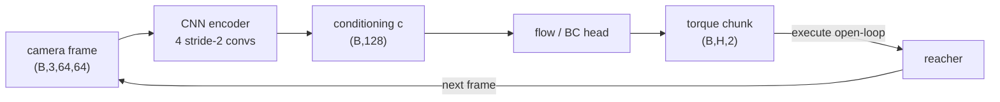
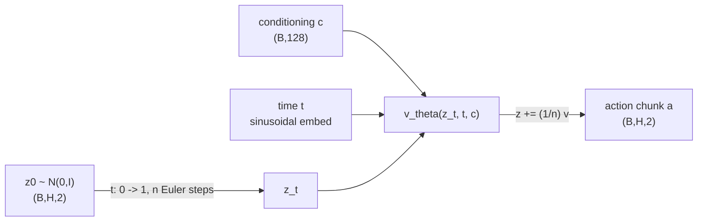
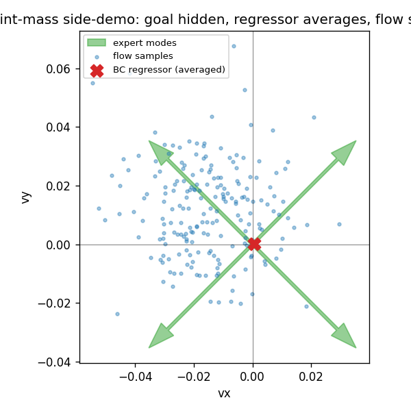

# A13 - vision-language-action capstone (flow-matching action head from pixels)

A vision-language-action (VLA) model takes camera images and a language instruction and outputs
robot actions. The pattern that defines the 2023-2026 generation wires a pretrained
perception/language backbone to a dedicated action decoder: the backbone interprets the scene and
instruction, the decoder turns that understanding into continuous motor commands that vary smoothly
from one step to the next. This capstone builds the perception-to-action path on a simulated robot,
a 2-link reacher controlled from a 64x64 camera image with no access to joint angles or the target
position. A convolutional encoder turns the frame into a conditioning vector, and a conditional
flow-matching (CFM) action head, behavior-cloned from filtered expert demonstrations, generates the
joint-torque chunk that drives the finger to the target.

The notes start with the vocabulary the rest of them depend on (the imitation-learning terms, and
what pretraining and a vision-language model are), then describe the robot task and the image
encoder, then work through behavior cloning and why it drifts, action chunking, the two families of
action decoder, why the decoder is generative rather than a regressor, and finally diffusion and
flow matching as the two ways to build such a decoder.

Build the flow-matching action head, the behavior-cloning baseline with action chunking, and a DDPM
head as the diffusion contrast, then run a policy that reads only pixels and reaches the target far
more often than a random-torque policy. The action head is the one from pi0 (Black et al. 2024), the
first flow-matching VLA at production scale; here the encoder stands in for pi0's VLM backbone and
the flow head is the action expert. Everything is small enough to collect demos and train in
minutes, so the mechanism is the focus, not the scale.

Required reading before starting:
- Black et al. 2024, "$\pi_0$: A Vision-Language-Action Flow Model for General Robot Control" (pi0),
  [arXiv:2410.24164](https://arxiv.org/abs/2410.24164).
- Zhao et al. 2023, "Learning Fine-Grained Bimanual Manipulation with Low-Cost Hardware" (ACT),
  [arXiv:2304.13705](https://arxiv.org/abs/2304.13705).
- Chi et al. 2023, "Diffusion Policy: Visuomotor Policy Learning via Action Diffusion",
  [arXiv:2303.04137](https://arxiv.org/abs/2303.04137).

## Lecture notes

### The vocabulary of imitation learning

The reacher is a DeepMind Control Suite task, the same simulator family as the cartpole the world
model learned to balance, and the surrounding vocabulary carries over. An *environment* is the
simulated system; it advances one discrete step when handed an *action* and returns a scalar
*reward* along with whatever the *observation* is. A run from a reset until the environment
terminates or a step cap is hit is an *episode*. A *policy* is the controller, a map from the
observation to an action. Running a policy in the environment for one episode is a *rollout*.

Reinforcement learning searches for a policy that maximizes accumulated reward by trying actions and
keeping what pays. None of that happens in this capstone. The reward here is a success detector and
nothing more: it is 1 on the steps where the finger overlaps the target and 0 otherwise, and it is
read after the fact to score a rollout. It never enters a loss and is never maximized.

The training signal comes from *demonstrations*. A demonstration is one recorded episode of a
different controller, the *expert*, driving the same system: the observations the learner would have
seen, paired with the actions the expert took. *Imitation learning* is the family of methods that
fit a policy to demonstrations. Its simplest member, and the only one used here, is *behavior
cloning*: treat the (observation, action) pairs as a supervised regression dataset and fit the
policy to them under a squared-error loss. No reward appears in that loss, and the environment is
not touched during training.

Two properties of the expert used here matter later. It is *privileged*: it reads the true joint
angles, joint velocities, and target position out of the simulator, none of which the learner gets.
And it is *scripted*, a hand-written controller rather than a learned one, so demonstrations cost
only simulator time. Both properties are ordinary in the VLA literature, where demonstrations
normally come from a human teleoperating the arm and the same asymmetry holds: the demonstrator sees
the whole workspace with their own eyes, the policy sees a camera feed.

### Pretraining, tokens, and vision-language models

*Pretraining* is training a large network on a large generic corpus, under an objective that needs
no hand-applied labels, and then reusing the resulting weights as the starting point for a much
smaller fit on the task actually wanted. The reused part is the *backbone*; the small task-specific
piece attached to its output is a *head*. This pays off because the task-specific dataset is tiny
compared with the pretraining corpus, so the backbone supplies representations the task data could
never have produced on its own.

A language model works on *tokens*. Text is chopped into a fixed vocabulary of subword pieces, each
piece is an integer index, and the model is trained to predict the next index given all the previous
ones. Generation is *autoregressive*: sample one token, append it to the sequence, feed the extended
sequence back in, sample the next. Every token costs one full forward pass through the network, and
the passes cannot be run in parallel, because each input contains the previous output.

A *vision-language model* (VLM) attaches an image path to that decoder, through the visual-token
interface covered in the VLM notes: a vision encoder turns the image into a sequence of vectors, a
connector maps those vectors into the language model's embedding space, and the decoder consumes
them as if they were text tokens. Trained on image-caption and instruction data, the result
*grounds* language in pixels, meaning the model ties words to the image content they name rather
than to text statistics alone. Asked about "the red block on the left", its answer depends on the
image region that phrase picks out. That grounding is the property a robot policy wants, because an
instruction like "pick up the red block" is useless unless "red block" resolves to a location in the
current frame.

### What a vision-language-action model is

A VLA takes a pretrained VLM and attaches an action decoder. The two train together on robot
demonstration data. The VLM interprets the scene and instruction; the decoder turns that
understanding into motor commands.

Why split the model this way instead of having the VLM emit actions directly? Text generation is
discrete, sequential, and slow, and robot control is none of those. Robot actions are real-valued,
correlated in time, must be smooth enough not to jerk the hardware, and are issued at 50-100 Hz. A
purpose-built action decoder lets the backbone do the interpretation while the decoder produces
continuous trajectories in one shot.

In pi0 that decoder is called the *action expert*: a second, smaller set of transformer weights
attached to the backbone, which reads the backbone's features and outputs continuous action chunks.
Backbone and action expert are trained jointly on robot data, so "expert" here names a component of
the network, not the demonstrator. (The scripted controller that produces this assignment's
demonstrations is also called an expert, and the two uses are unrelated. Where the distinction
matters below, the scripted controller is called the analytic expert.)

On the reacher, the conditioning vector $c$ that the action head reads comes from a CNN encoder
applied to the camera frame instead of from a VLM. The encoder stands in for the VLM backbone; the
action head is the same object as pi0's action expert.

### The reacher and the analytic expert

The reacher is a 2-link arm in the plane; both links have length $L_0 = L_1 = 0.12$. The action is a
2D joint torque $(\tau_{\text{shoulder}}, \tau_{\text{wrist}})$ clipped to $[-1, 1]$. The reward is
1 while the finger overlaps the small target and 0 otherwise; a reach is a step with reward above
0.5. The conditioning observation is the 64x64 RGB frame from the fixed overhead camera, normalized
to $[0, 1]$ and laid out channel-first as $(3, 64, 64)$. The learned policy sees only this image, so
it has to recover from pixels both where the arm is and where the target is.

The analytic expert reads the target world position $(g_x, g_y)$ and the joint state straight out of
the simulator. It solves the 2-link inverse kinematics for the joint angles that would put the
finger on the target,

$$\theta_2 = \arccos\!\left(\frac{r^2 - L_0^2 - L_1^2}{2 L_0 L_1}\right), \qquad
\theta_1 = \operatorname{atan2}(g_y, g_x) - \operatorname{atan2}\!\big(L_1 \sin\theta_2,\; L_0 + L_1 \cos\theta_2\big),$$

with $r = \lVert (g_x, g_y) \rVert$ clamped into the workspace $[0.002,\, L_0 + L_1 - 0.002]$ and
the cosine clamped to $[-1, 1]$ so the arccos is always defined. Since $\arccos$ returns a value in
$[0, \pi]$, this picks one of the two mirror-image solutions consistently. Call the resulting pair
$\theta^\star = (\theta_1, \theta_2)$. The expert then drives the joints to $\theta^\star$ with a
proportional-derivative law on the wrapped angle error,

$$\tau = \operatorname{clip}\big(k_p\,(\theta^\star - \theta) - k_d\,\dot\theta,\; -1,\; 1\big),
\qquad k_p = 12,\; k_d = 0.8,$$

where the error is wrapped into $(-\pi, \pi]$ so the joint always turns the short way round. Nothing
in this expert is learned, and nothing in it is available to the policy.

Demonstrations are filtered. The analytic expert runs on consecutive random seeds; only episodes
that reach the target are kept, and each kept episode is truncated at the step where the reach
happened. Collection stops once enough successful episodes have accumulated. Behavior cloning
therefore sees clean successful trajectories and never sees a failure, which is the normal setup
with human demonstrations too and which has consequences taken up under compounding error below.

### The image encoder as conditioning

The action heads read a conditioning vector $c$ of fixed width and do not care where it comes from.
On the reacher, $c$ is the output of a CNN encoder applied to the frame:

$$c = \operatorname{Encoder}(\text{obs}), \qquad \text{obs} \in \mathbb{R}^{(B,\,3,\,64,\,64)}, \quad
c \in \mathbb{R}^{(B,\,128)}.$$

The encoder is four convolutions, each with stride 2, so each one halves the spatial resolution
while raising the channel count: $64 \to 32 \to 16 \to 8 \to 4$ pixels on a side, with channel
widths 32, 64, 128, 256. The result is a $256 \times 4 \times 4$ block of features, which is
flattened to a 4096-vector and passed through a single linear layer to give the 128-wide
*embedding*. Embedding here means only that: a fixed-width real vector standing in for a variable,
high-dimensional input, whose coordinates carry no assigned individual meaning and are whatever the
training objective made useful. It is the same 64x64 pixel encoder the world model used, producing a
conditioning vector here rather than a latent state.

Encoder and action head train together end to end, meaning the gradient of the action-prediction
loss flows back through the head into the encoder's convolution weights, with one optimizer covering
both sets of parameters. There is no separate representation-learning stage: nothing tells the
encoder what a target or a finger is, and the only pressure shaping it is that the action head has
to predict expert torques from its output.

In a full-scale VLA the conditioning would instead come from a pretrained vision transformer, often
one trained by contrastive image-text matching in the style of CLIP, feeding a language decoder.
Here it is a small CNN on the camera frame so the whole system trains in minutes.



### Behavior cloning and compounding error

Behavior cloning flattens the demonstrations into a pile of (observation, action) pairs and fits a
network to them by least squares. That is all the training loop does. It is supervised learning, and
it inherits supervised learning's one guarantee: low error on data drawn from the same distribution
as the training set.

That guarantee is exactly what a controller cannot rely on. The training observations were produced
by the *expert's* closed loop. The test observations are produced by the *learner's* closed loop,
and those two loops visit different states as soon as their actions differ at all. This mismatch
between the input distribution at training time and at test time is called *covariate shift*, and
unlike the usual train/test gap it is self-inflicted: the policy's own errors are what move the
input distribution.

The mechanism is a familiar one to anyone who has watched an open-loop trajectory drift. At step $k$
the policy's torque is slightly wrong. The arm arrives at step $k+1$ in a configuration a little off
the demonstrated path, so the camera frame is a little unlike anything in the training set, so the
next prediction is a little worse than the last one, which puts the arm further off at step $k+2$.
Errors accumulate rather than cancel, because each one changes the input to the next decision. The
filtering makes this sharper: demonstrations are truncated at the reach and failures are thrown
away, so the training set contains no examples of recovering from a bad configuration. The policy
has never been shown what to do once it is off the path.

Ross et al. (2011), introducing DAgger, made the horizon dependence explicit. Their analysis shows
that a behavior-cloned policy with per-step error $\varepsilon$ can accumulate cost growing like
$\varepsilon T^2$ over a $T$-step episode, against $\varepsilon T$ if the policy were accurate on
its own state distribution, with the extra factor of $T$ coming from exactly the drift above.
DAgger's fix is to run the learner, ask the expert to label the states the learner actually visited,
and retrain, repeating until the two distributions agree. That needs an expert available on demand
for relabeling, which a human teleoperator is not. The VLA line took a different route.

### Action chunking

Action chunking, from ACT (Zhao et al. 2023), has the policy predict a sequence of $H$ future
actions (a *chunk*) and execute the whole chunk before looking at a new observation. Anyone who has
written a model-predictive controller will recognize the shape: solve for a short plan, execute a
prefix of it, re-solve. The difference is that there is no model and no online optimization here.
One forward pass of the network emits the whole plan, and with $H$ actions executed per query the
plan is executed in full rather than only its first step.

Three things change. The number of decisions per episode drops by a factor of $H$, so there are $H$
times fewer opportunities for an error to feed into the next input. Within a chunk the policy
commits to a segment that was produced in one shot and is internally consistent, instead of
re-deciding at every step under whatever drift has accumulated. And the number of steps over which
covariate shift can compound is effectively $T/H$ rather than $T$, which is the quantity that
entered the horizon bound above. ACT reported that chunking reduces compounding error, and chunked
action heads became standard because of it.

ACT also introduced *temporal ensembling*, which is optional and not used here. If chunks are
queried every step rather than every $H$ steps, then at any given step several past queries have
each predicted an action for that step, made from $0, 1, 2, \dots$ steps of stale observation.
Temporal ensembling averages them with a weight $w_i \propto \exp(-m\,i)$ on the prediction made $i$
queries ago, so recent predictions dominate and the executed torque changes smoothly instead of
jumping at chunk boundaries. The constant $m$ sets how fast old predictions are discounted. It can
hurt: pi0 found it detrimental on their evaluation and dropped it, executing chunks open-loop, as
this assignment does.

Chunking turns a per-step action sequence into overlapping windows used as training targets. Given a
demonstration of $T$ steps, the window starting at step $i$ holds actions $i, i+1, \dots, i+H-1$, so
there are $T - H + 1$ windows, and each window is paired with the frame observed at its first step.
Consecutive windows overlap in $H-1$ actions, which makes the representation redundant, so the
inverse has to be defined rather than guessed: take the full first window, then the last action of
each subsequent window. That last action is the one new step each window introduced, so the
reconstruction is exact. With $T = 6$ and $H = 3$ the windows are $(0,1,2), (1,2,3), (2,3,4),
(3,4,5)$, and the inverse reads off $0,1,2$ from the first, then $3, 4, 5$ as the last entries of
the remaining three.

Execution uses a different set of windows. Running chunks back to back means starting them at $0, H,
2H, \dots$, and the last start is clamped to $T - H$ so the final chunk does not run past the end of
the sequence. With $T = 7$ and $H = 4$ the starts are $0$ and $3$: the second chunk is pulled back
by one step and re-covers step 3, which is the price of not running off the end. Clamping can make
the last two starts identical, and the duplicate is dropped.

### Discretized action tokens

The first of the two families of action decoder makes actions look like text. Each continuous
actuator value is quantized into one of about 256 bins, each bin is assigned a token in the language
model's vocabulary, and the tokens are generated with the same autoregressive loop that generates
text. RT-2 (Brohan et al. 2023, [arXiv:2307.15818](https://arxiv.org/abs/2307.15818)) and OpenVLA
(Kim et al. 2024, [arXiv:2406.09246](https://arxiv.org/abs/2406.09246)) both work this way.

The appeal is that no new machinery is needed: any VLM can emit actions the moment its vocabulary
has action tokens in it, and the whole pretrained next-token apparatus is inherited unchanged. Three
costs come with it. Quantization error is fixed by the bin width; 256 bins over a normalized $[-1,
1]$ range give a resolution of $2/256 \approx 0.008$, and no amount of training buys anything finer,
which shows up on motions that need fine positioning. Decoding is sequential, one forward pass per
number: a 7-actuator arm emitting a 50-step chunk costs 350 passes, so real-time control at 50 Hz
becomes an engineering problem. And nothing in the token representation says that neighboring bins
are nearby values, so the model has to learn the ordering of its own action alphabet from data.

### Continuous action heads

The second family generates raw continuous actions with a small generative model conditioned on the
backbone's output. There is no discretization, so no quantization floor; the whole chunk comes out
of one parallel decode rather than $H \times D$ sequential passes. As of 2025 this is the dominant
approach for contact-rich and dexterous manipulation.

Three constructions have been used, and they are the three generative-modeling families the course
has covered.

ACT used a *conditional variational autoencoder* (CVAE). Two networks train together: an encoder
that sees both the conditioning $c$ and the demonstrated chunk $a$ and outputs the mean and variance
of a Gaussian over a small vector $z$ called the latent code, and a decoder that sees $c$ and $z$
and reconstructs $a$. The loss is reconstruction error plus a Kullback-Leibler penalty pulling the
encoder's Gaussian toward the standard normal, the same evidence lower bound the world model's
representation is trained with. The latent $z$ absorbs whatever the conditioning does not determine,
which for demonstration data is which of several valid ways of doing the task this particular run
took. At test time the encoder is discarded, $z$ is drawn from the standard normal, and the decoder
turns it into a chunk. Its weakness is the standard variational-autoencoder one: the KL weight
trades reconstruction sharpness against how well the latent actually matches the prior it will be
sampled from, and the balance has to be tuned.

Diffusion Policy (Chi et al. 2023) used a denoising diffusion probabilistic model (DDPM), and pi0
used flow matching. Both are covered below, after the question of why the head needs to be
generative at all.

The field has largely converged on flow matching over diffusion for the action head, for two reasons
that the sections below make concrete: it trains by plain regression with no noise schedule to
choose, and it produces a sample in a handful of integration steps rather than a long chain.

### Why a generative action head instead of a regressor

Suppose the head is a plain network $f$ trained to minimize $\mathbb{E}\lVert a - f(c)\rVert^2$ over
the demonstration set. Add and subtract the conditional mean inside the square and expand:

$$\mathbb{E}\big\lVert a - f(c)\big\rVert^2
= \mathbb{E}\big\lVert a - \mathbb{E}[a \mid c]\big\rVert^2
+ \mathbb{E}\big\lVert \mathbb{E}[a \mid c] - f(c)\big\rVert^2.$$

The cross term vanishes: condition on $c$ first, and the second factor is fixed while the first has
conditional mean zero. The first term on the right does not involve $f$ at all, so minimizing over
$f$ minimizes only the second, and the minimizer is $f(c) = \mathbb{E}[a \mid c]$. Least squares
returns the conditional mean and nothing else. This is the same fact that makes a least-squares
estimator recover the noise-free conditional mean of a noisy measurement, with the noise leaving an
irreducible floor.

That is the right answer when the conditioning determines the action. It is the wrong answer when it
does not. A conditional distribution $p(a \mid c)$ is *multimodal* when its probability mass sits in
several separated lumps, each a *mode*, with low probability between them. The mean of such a
distribution lands in the gap, and the gap is where no expert ever acted.

The point-mass side-demo makes this concrete with numbers that follow from the setup. A point mass
in the unit square is driven toward one of four goals at the corners $(0.15, 0.15)$, $(0.85, 0.15)$,
$(0.15, 0.85)$, $(0.85, 0.85)$, at speed $v_{\max} = 0.05$ per step. In the goal-hidden mode the
conditioning carries only the position, not which goal this run is heading for. From the center
$(0.5, 0.5)$ the demonstrated action is one of four vectors of length $0.05$ pointing along the
diagonals, so each mode has components $\pm 0.05/\sqrt{2} \approx \pm 0.035$. Their average is
exactly the zero vector, an action that moves the point mass nowhere. A regressor trained on that
data can do no better; it is fitting the mean, and the mean is zero.

A generative head avoids this by not producing a single number. It produces a *sample* from a
learned conditional distribution: draw a random seed, push it through the head, get one chunk. Draw
again, get a different chunk. The head is trained so that the distribution of those samples matches
$p(a \mid c)$, so each individual sample lands on a mode and drives toward one goal, and the
averaging never happens because no average is ever formed.

### Generative models as transport from noise

Both remaining heads rest on one idea. Sampling from a complicated distribution is hard; sampling
from $\mathcal{N}(0, I)$ is a call to a random number generator. So learn a map that carries the
easy distribution onto the hard one, and sample by drawing noise and pushing it through the map. If
$z \sim \mathcal{N}(0, I)$ and $G$ is the map, training has to make the distribution of $G(z)$ match
the data. Conditioning is one more argument, $G(z, c)$: one map per conditioning vector, all sharing
weights.

Neither construction learns $G$ in one shot. Both build it as an integration over an artificial time
axis: start at the noise sample and take many small steps until arriving at a data sample. Diffusion
takes stochastic steps along a chain of noise levels fixed in advance; flow matching takes
deterministic steps along a learned velocity field. Training in both cases fits a network that says
what one small step should be.

That artificial time is not the robot's time, and the two appear in the same tensors here, so it is
worth pinning down. A chunk is an array of shape $(H, 2)$: index $h = 0, \dots, H-1$ is robot time,
$H$ consecutive control steps. The generation variable $t$ is a separate axis along which the whole
$(H, 2)$ array is transported as a single point, all $2H$ numbers at once. With $H = 4$ that means
the head treats the chunk as one 8-dimensional point and moves it from noise to data, so the chunk's
steps are produced jointly and are consistent with each other by construction.

### Diffusion as an action head

A diffusion model (DDPM, Ho et al. 2020, [arXiv:2006.11239](https://arxiv.org/abs/2006.11239)) fixes
the forward direction in advance and learns only the reverse. The forward direction destroys a chunk
by adding Gaussian noise in $N$ stages. Because a sum of Gaussians is Gaussian, the whole forward
process collapses into one closed form: with a *cumulative signal level* $\bar\alpha_t$ decreasing
from near 1 to near 0 as the integer stage $t$ runs from $0$ to $N-1$,

$$a_t = \sqrt{\bar\alpha_t}\,a + \sqrt{1 - \bar\alpha_t}\,\varepsilon, \qquad
\varepsilon \sim \mathcal{N}(0, I),$$

so $\bar\alpha_t$ is the fraction of the chunk's variance still carried by the signal at stage $t$.
The schedule $\bar\alpha_t$ is built by picking per-stage noise increments $\beta_t$ and taking
$\bar\alpha_t = \prod_{s \le t}(1 - \beta_s)$; the code uses $\beta$ linear from $10^{-4}$ to $2
\times 10^{-2}$ over $N = 50$ stages. Note that $t$ here is an integer stage index, not the
continuous $[0, 1]$ time of the flow section below.

Training is a regression, and the target is the noise. Sample a stage $t$ uniformly, sample
$\varepsilon$, build $a_t$ by the formula above, and fit $\varepsilon_\theta(a_t, t, c)$ to
$\varepsilon$ under mean squared error. Predicting the noise rather than the clean chunk is a change
of variable, not of information: knowing $a_t$ and $\varepsilon$ gives the clean-chunk estimate
$\hat a_0 = (a_t - \sqrt{1-\bar\alpha_t}\,\varepsilon_\theta)/\sqrt{\bar\alpha_t}$ immediately. It
is the parameterization that keeps the target unit-scale at every noise level.

Sampling runs the reverse chain from $t = N-1$ down to $0$, one stage at a time. At each stage,
recover $\hat a_0$ from the current $a_t$ as above, then take the *ancestral* step, the exact
posterior of the forward process given the current sample and that estimate of the clean chunk:

$$a_{t-1} = \frac{\sqrt{\bar\alpha_{t-1}}\,\beta_t}{1-\bar\alpha_t}\,\hat a_0
          + \frac{\sqrt{\alpha_t}\,(1-\bar\alpha_{t-1})}{1-\bar\alpha_t}\,a_t
          + \sqrt{\tilde\beta_t}\,z,$$

with $\alpha_t = \bar\alpha_t/\bar\alpha_{t-1}$, $\beta_t = 1-\alpha_t$, posterior variance
$\tilde\beta_t = \frac{1-\bar\alpha_{t-1}}{1-\bar\alpha_t}\,\beta_t$, and $z \sim \mathcal{N}(0,I)$
for $t>0$ with no noise added at $t=0$ (take $\bar\alpha_{-1} := 1$). The mean is a weighted average
of the estimated clean chunk and the current noisy one, with the weights set entirely by the
schedule; the added $z$ makes the reverse process stochastic, so two runs from the same starting
noise give different chunks. This is the same ancestral sampler derived in the diffusion notes, with
the conditioning $c$ carried along as an extra network input.

The cost is visible in the loop: $N$ network evaluations per sample, sequential, because each stage
needs the previous one's output. Diffusion Policy showed that a DDPM denoiser conditioned on images
produces stable multimodal action distributions, which is why diffusion became a serious action head
at all. RDT-1B (Liu et al. 2024, [arXiv:2410.07864](https://arxiv.org/abs/2410.07864)) scaled that
idea up with a transformer denoiser for bimanual manipulation; it is a reading pointer, not the
plain MLP denoiser built here.

One caveat about the toy configuration. With $N = 50$ and $\beta$ linear over the range above,
$\bar\alpha_{N-1} \approx 0.60$, so the forward chain here stops well short of pure noise while the
sampler still starts from $\mathcal{N}(0, I)$. The original DDPM used the same $\beta$ endpoints
over $N = 1000$ stages, where $\bar\alpha_{N-1} \approx 4 \times 10^{-5}$ and the mismatch is
negligible. The head here is a mechanism contrast against flow matching, not a tuned baseline, and
the reacher results below are all from the flow and regression heads.

### Conditional flow matching

Flow matching (Lipman et al. 2022, [arXiv:2210.02747](https://arxiv.org/abs/2210.02747)) replaces
the noise chain with an ordinary differential equation. Define a time-varying velocity field $v(z,
t)$ over the action space, start a point at a Gaussian sample at $t = 0$, and integrate
$\mathrm{d}z/\mathrm{d}t = v(z, t)$ up to $t = 1$. Where the point lands is the generated sample.
Any smooth velocity field defines such a transport; the training problem is finding one whose
endpoints at $t=1$ are distributed like the demonstrated chunks.

The convention matches the course's flow-matching topic: $t = 0$ is noise $z_0 \sim \mathcal{N}(0,
I)$, $t = 1$ is the demonstrated action chunk $a$. Pair each demonstrated chunk with a fresh noise
sample and take the straight line between them as the path that chunk should travel:

$$z_t = (1 - t)\,z_0 + t\,a, \qquad v = \frac{\mathrm{d}z_t}{\mathrm{d}t} = a - z_0.$$

The velocity target $a - z_0$ is constant in $t$: one direction, held for the whole trip. A target
that depends on $t$ is wrong.

The word *conditional* in "conditional flow matching" names the trick that makes this trainable. The
field actually needed is the *marginal* one, the field that transports the whole Gaussian onto the
whole distribution of chunks, and there is no formula for it: many different $(z_0, a)$ pairs pass
through the same point $z_t$ at the same time $t$ with different velocities, and the marginal field
at that point is the average of them, weighted by how likely each pair was to arrive there. What is
available is the *conditional* velocity $a - z_0$, attached to one particular chunk, which is one
line of algebra. Regressing the network on the conditional target recovers the marginal field
anyway, by the conditional-mean fact used above: least squares returns $\mathbb{E}[\,a - z_0 \mid
z_t, t, c\,]$, and that conditional average is exactly the marginal field. The flow-matching notes
carry the derivation; the consequence is that a per-sample target with no formula behind it trains a
network to the field that has one.

So the loss is plain velocity regression, with no noise schedule and no weighting:

$$\mathcal{L}_{\text{CFM}} = \mathbb{E}_{z_0 \sim \mathcal{N}(0,I),\; t \sim U(0,1)}
\left\lVert v_\theta\big((1-t)z_0 + t\,a,\; t,\; c\big) - (a - z_0) \right\rVert^2,$$

with a fresh $z_0$ and a fresh $t$ drawn at every optimization step. The network takes three inputs:
the current point $z_t$ flattened to $2H$ numbers, the time $t$, and the conditioning $c$. The time
enters through a sinusoidal embedding, the same construction as the transformer's positional
encoding, which maps the scalar $t$ to a vector of sines and cosines at a geometric spread of
frequencies. A scalar fed directly into a linear layer gives the network one degree of freedom to
work with; the sinusoidal vector gives it a representation in which both coarse and fine differences
in $t$ are linearly readable.

At inference, integrate the ODE from $z \sim \mathcal{N}(0, I)$ at $t = 0$ to $t = 1$ with $n$
forward-Euler steps:

$$z \leftarrow z + \tfrac{1}{n}\,v_\theta(z, t, c), \qquad t = 0, \tfrac{1}{n}, \tfrac{2}{n}, \dots$$

Straight conditional paths are what make so few steps enough. Forward Euler is exact for a constant
field at any step count, and the learned field is close to constant along a trajectory wherever the
paths do not cross, so $n = 10$ suffices here against the 50 sequential evaluations the DDPM chain
needs. pi0 used conditional flow matching as the action head in the first large VLA at production
scale, and the 2025-2026 literature has largely followed.



### The residual the flow loss keeps

The flow loss does not go to zero, and a training curve that flattens well above zero is not
evidence of a bug. Two effects put a floor under it, and the conditional-mean identity from above
names both.

The best any network can do is $v_\theta = \mathbb{E}[\,a - z_0 \mid z_t, t, c\,]$, and at that
optimum the loss equals the leftover conditional variance $\mathbb{E}\,\mathrm{Var}[\,a - z_0 \mid
z_t, t, c\,]$. Wherever several demonstrated chunks are consistent with the same $(z_t, t, c)$, that
variance is genuinely nonzero and no network removes it. That is the multimodal case, and the
residual there is the same quantity that lets the head produce different samples on different draws.

Even when the conditioning pins down the chunk, a second effect appears near $t = 1$. Inverting the
interpolant gives $z_0 = (z_t - t\,a)/(1-t)$, whose gain grows without bound as $t \to 1$. A finite
network fitted by least squares does not represent an unbounded map, so near $t = 1$ it falls back
toward its best bounded guess and the residual concentrates there. The linear-path CFM loss in the
flow-matching topic carries the same floor for the same reason.

The scale of the floor is checkable rather than mysterious. An untrained network outputs roughly
zero, so the loss starts at the mean square of the target: with unit-scale chunks, $\mathrm{Var}(a)
+ \mathrm{Var}(z_0) = 2$ per component. The fixed-batch overfit test in `tests/test_overfit_flow.py`
measures a start near 2.3 and a floor near 0.18, and asserts the ratio between them rather than a
near-zero final value.

### How this capstone reuses the rest of the course

The action head is the generative model from the diffusion and flow-matching topics, re-conditioned
on a perception embedding in place of a class label. The CFM interpolant, the velocity target, and
the Euler ODE sampler are the same machinery as the flow-matching build; the DDPM head is the
epsilon-prediction objective and the ancestral sampler from the diffusion build. The image encoder
is the four-conv 64x64 pixel encoder from the world model, and the reacher runs in the same DeepMind
Control Suite the world model used. The vision-language backbone this capstone stands in for is the
one built in the VLM notes.

## The assignment

Fill these holes, in order. Each is one `NotImplementedError`; the docstring in each file gives the
signature, shapes, and constraints. All but the two DDPM holes have a matching test (see below).

1. [`cfm_target()`](flow.py) in `flow.py`
2. [`flow_loss()`](flow.py) in `flow.py`
3. [`flow_sample()`](flow.py) in `flow.py`
4. [`bc_loss()`](bc.py) in `bc.py`
5. [`chunk_actions()`](bc.py) in `bc.py`
6. [`de_chunk()`](bc.py) in `bc.py`
7. [`receding_horizon_indices()`](bc.py) in `bc.py`
8. [`ddpm_loss()`](ddpm.py) in `ddpm.py`
9. [`ddpm_sample()`](ddpm.py) in `ddpm.py`

### Running and validating

Activate the environment (`conda activate nanovision`), then:

```
make test     A=a13_vla   # run the tests against the top-level files (the ones with holes)
make verify   A=a13_vla   # run the same tests against the reference solution/
make viz      A=a13_vla   # render the figures from the reference solution
make viz-mine A=a13_vla   # render the figures from your own code (once the holes are filled)
```

`make test` is the command to run while working. It runs the suite in `assignments/a13_vla/tests/`
against the top-level files and goes from red (the holes raise `NotImplementedError`) to green as
they are filled in. `make verify` runs the identical suite against the reference answer key in
`solution/`: it sets `NANOVISION_IMPL=solution`, so the tests import the reference instead of the
top-level files. `make verify` is green from the start, so it shows the target and confirms the
tests and environment work before anything changes. The goal is to bring `make test` to the same
green as `make verify`.

The suite checks the interpolant endpoints and the t-independent velocity target; that a constant
velocity field integrates from $z_0$ to the target exactly at any step count (the integrator wiring,
no training); that `de_chunk(chunk_actions(x))` reconstructs $x$ exactly and the receding-horizon
indices cover the sequence with no duplicates; the encoder giving $(B, 128)$ and the heads' forward
and `flow_sample` giving $(B, H, 2)$ with the image-to-chunk path composing; a float64 gradcheck of
`cfm_target` and the flow network in the loss, where gradcheck compares each analytic gradient
against a finite-difference estimate in double precision and fails if they disagree; the BC loss
overfitting one batch to near zero; the flow loss dropping to a small fraction of its untrained
value with a loose secondary bound on `flow_sample` reconstruction; and the reacher wrapper
resetting, stepping, and rendering plus the demo collector keeping only successful episodes and
padding them with a validity mask (skipped when dm_control is absent). A static scan of the holed
files also rejects prebuilt robot, diffusion, and flow-matching libraries, so the heads are built
from scratch.

Two gaps to know about. The suite checks `DDPMHead`'s forward shape but never calls `ddpm_loss` or
`ddpm_sample`, so nothing turns red if those two holes are wrong; check them against
`solution/ddpm.py` by reading. And the reach-success and chunk-size numbers are not unit tests,
because rollout success is init- and seed-sensitive; they live in the visualizations and below.

dm_control is isolated to `env.py` and `viz.py`; the only test that imports it skips via
`pytest.importorskip("dm_control")`, so the graded mechanism tests run on CPU without the robot
library.

`make viz` renders from the reference solution, so it works on a fresh checkout before any holes are
filled and shows the target figures. `make viz-mine` runs the same script against the top-level
code, which is the way to eyeball a finished implementation. The figures need dm_control with
headless rendering (`MUJOCO_GL=egl`); dm_control is not in `environment.yml` by default because it
is heavy and the graded tests skip it, so install it with `pip install dm_control` (or uncomment the
`dm_control` line in `environment.yml`) before running viz. Both write PNGs to `out/` using
matplotlib's headless Agg backend, so the commands behave the same over SSH, in WSL, and in CI with
no display, and the figures are viewable inline in VSCode. Add `SHOW=1` (for example `make viz-mine
A=a13_vla SHOW=1`) to also open interactive windows when a display is available. The figures are
`reacher_rollouts.png` (the flow and BC policies reaching from pixels against the random floor),
`chunk_ablation.png` (the BC chunk-size sweep), `multimodal.png` (the point-mass goal-hidden
side-demo), and `flow_path.png` (the ODE path from noise to the torque chunk).

What you should see when you run this. The mechanism tests run on CPU in seconds. Demo collection
runs the simulator and renders, so it is the slow part, about 130 seconds to gather 200 filtered
successful demos (roughly 270 episodes at a 75% expert reach rate). Training a flow or BC head with
its encoder is about 10-15 seconds on an RTX 4080; a 48-episode rollout in the simulator is about 30
seconds; the full visualization run is a few minutes. Everything fits well under 12GB. A healthy
`flow_loss` curve drops from about 2.3 to a floor near 0.18 and stays there; a flat curve that never
leaves about 2 means the target or the conditioning is wrong, not that training is slow.

The headline result is that a flow policy reading only 64x64 pixels reaches the target far more
often than a random-torque policy. The reference run measured, over 48 rollout episodes:

| policy (from pixels) | reach success |
| --- | --- |
| flow head, $H = 4$ | 0.75 |
| BC regressor, $H = 4$ | 0.75 |
| random torque | 0.06-0.07 |


The flow head and the deterministic BC regressor match here, for a reason specific to this task. The
image fixes the target, so from a given frame the expert action is essentially determined and $p(a
\mid \text{image})$ is unimodal, where the conditional mean a regressor learns is the correct
action. This is a measurement of this toy, not a flow-over-regression claim from pixels.

The reference chunk-size sweep on this reacher measured (mean over 2 seeds, 48 episodes each):

| chunk size $H$ | BC reach success |
| --- | --- |
| 1 | 0.78 |
| 4 | 0.74 |
| 8 | 0.62 |


On this small reacher the sweep does not rise with $H$, and the reason is specific to the setup, not
a contradiction of ACT. The episodes are short (about 20 steps), the demos are filtered to clean
successes, and the policy re-queries every chunk, so single-step BC already stays close to the
demonstrated path and reaches at 0.78. Longer chunks also lose late-episode training windows and
commit longer open-loop, which costs accuracy here. Chunking pays off in ACT's compounding-error
regime of long horizons and contact-rich dynamics where a single-step policy drifts, and a 2D
reacher with 20-step episodes is too forgiving to show it. Treat these numbers as a measurement of
this toy, not as evidence about the chunking literature.

The reacher cannot show the generative-versus-regression lesson, because the image fixes the target
and $p(a \mid \text{image})$ is unimodal. The 2D point-mass side-demo described above isolates it.
In the goal-hidden mode the conditioning carries only the state, so from a fixed state the
demonstrated action points to any of the four goals and $p(a \mid c)$ is multimodal, with each mode
about $0.035$ per component. From the center state the reference run measured the BC regressor's
predicted action collapsing toward the origin (magnitude about 0.001, the average of four opposing
directions), while the flow-head samples spread out (per-component standard deviation about 0.015)
and cluster on the four diagonal goal directions.



The flow-matching ODE path on the reacher, for one image conditioning, transports the Gaussian
sample to the torque chunk over the 10 Euler steps:


These toy numbers demonstrate that a flow head reaches from pixels and that a flow head learns a
conditional action distribution; they do not predict pi0-scale manipulation behavior. A 2-link
reacher and a four-goal point mass are mechanism isolators, not evidence about the VLA literature.

## Further reading

- ACT / ALOHA, [Zhao et al. 2023](https://arxiv.org/abs/2304.13705) - action chunking with a CVAE
  head; the source of the chunking idea and temporal ensembling.
- DAgger, Ross et al. 2011 - the horizon analysis of behavior cloning and the interactive relabeling
  fix that chunking sidesteps.
- Diffusion Policy, [Chi et al. 2023](https://arxiv.org/abs/2303.04137) - the DDPM action head that
  made diffusion a serious option.
- pi0, [Black et al. 2024](https://arxiv.org/abs/2410.24164) - the flow-matching VLA at production
  scale; the head built here.
- OpenVLA, [Kim et al. 2024](https://arxiv.org/abs/2406.09246) - the open-source discretized-token
  VLA, the other branch of the field.
- OpenVLA-OFT, [Kim et al. 2025](https://arxiv.org/abs/2502.19645) - a same-backbone ablation
  showing the action-head design dominates the outcome; adds chunking and a continuous head for a
  large throughput and success gain.
- Octo, [Octo team 2024](https://arxiv.org/abs/2405.12213) - a generalist policy with a diffusion
  head, trained across many robots, sitting between Diffusion Policy and pi0 in the lineage.
- Open X-Embodiment, [Padalkar et al. 2023](https://arxiv.org/abs/2310.08864) - demonstrations
  pooled across many different robot bodies, the dataset behind the data scaling of recent VLAs.
- Flow Matching for Generative Modeling, [Lipman et al. 2022](https://arxiv.org/abs/2210.02747) -
  the CFM objective the action head reuses.
